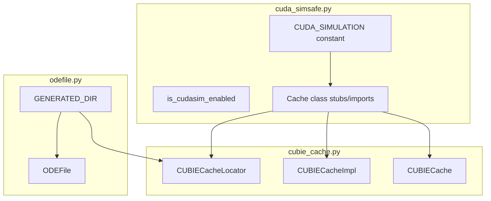
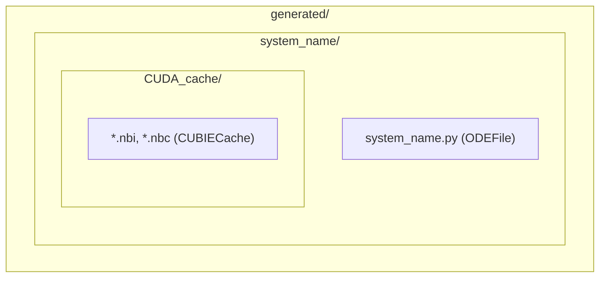

# PR Review Changes - Human Overview

## User Stories

### US1: Consistent CUDA Simulator Import Pattern
**As a** CuBIE maintainer  
**I want** cudasim-conditioned import handling in `cubie_cache.py` moved to `cuda_simsafe.py`  
**So that** the codebase follows a consistent pattern for CUDA simulator compatibility

**Acceptance Criteria:**
- [ ] Import conditionals for numba-cuda caching classes moved from `cubie_cache.py` to `cuda_simsafe.py`
- [ ] `cubie_cache.py` imports from `cuda_simsafe.py` instead of conditionally importing
- [ ] Existing behavior is preserved (caching works in GPU mode, stubs in CUDASIM mode)
- [ ] Tests pass in both CUDASIM and GPU modes

### US2: Unified Generated Directory Structure
**As a** CuBIE developer  
**I want** `ODEFile` to use the same directory structure as `CUBIECacheLocator` (`GENERATED_DIR / system_name`)  
**So that** codegen files and cache files are co-located in the same system directory

**Acceptance Criteria:**
- [ ] `ODEFile` creates files in `GENERATED_DIR / system_name / <filename>.py`
- [ ] Directory structure mirrors `CUBIECacheLocator` pattern
- [ ] Existing tests pass after directory change
- [ ] Generated code files are organized by system name

### US3: CUDAFactory Method Test Coverage
**As a** CuBIE maintainer  
**I want** tests for `config_hash` and `_iter_child_factories` methods in `CUDAFactory.py`  
**So that** these new methods have adequate test coverage

**Acceptance Criteria:**
- [ ] Test for `config_hash` with single factory (no children)
- [ ] Test for `config_hash` with nested child factories
- [ ] Test for `_iter_child_factories` yielding child factories
- [ ] Test for `_iter_child_factories` with no children
- [ ] Test for deterministic ordering of child iteration

### US4: Cache Config Parameter Update
**As a** CuBIE developer  
**I want** tests updated to use `config_hash` instead of `compile_settings` parameter  
**So that** tests reflect the current API where cache configs accept a hash string

**Acceptance Criteria:**
- [ ] `test_cubie_cache.py` tests updated to use `config_hash` parameter
- [ ] No references to `compile_settings` parameter in cache config tests
- [ ] Tests verify cache behavior with the new parameter name

---

## Executive Summary

This plan addresses four PR review items focused on code organization and test coverage:

1. **Import consolidation**: Move CUDA simulator import conditionals from `cubie_cache.py` to `cuda_simsafe.py`, following the established pattern where `cuda_simsafe.py` is the centralized compatibility layer.

2. **Directory structure alignment**: Modify `ODEFile` to use `GENERATED_DIR / system_name` instead of flat `GENERATED_DIR`, aligning with `CUBIECacheLocator`'s directory structure for better organization.

3. **New method tests**: Add test coverage for `config_hash` and `_iter_child_factories` methods in `CUDAFactory.py`.

4. **API update in tests**: Update `test_cubie_cache.py` to use `config_hash` instead of the deprecated `compile_settings` parameter.

---

## Component Relationships

---

## Directory Structure After Changes

---

## Key Technical Decisions

### 1. Import Consolidation Pattern
The `cuda_simsafe.py` module serves as the central compatibility layer for CUDA simulator mode. Moving the conditional imports for numba caching classes maintains this pattern and reduces scattered `is_cudasim_enabled()` checks throughout the codebase.

### 2. Directory Structure
Aligning `ODEFile` with `CUBIECacheLocator` directory structure:
- **Before**: `GENERATED_DIR / {system_name}.py` (flat structure)
- **After**: `GENERATED_DIR / {system_name} / {system_name}.py` (nested structure)

This mirrors how `CUBIECacheLocator` already uses `GENERATED_DIR / system_name / CUDA_cache/`.

### 3. Test Updates
Tests in `test_cubie_cache.py` currently instantiate `CUBIECache` without a `config_hash` parameter, but the class now expects this. Tests need to pass a valid hash string.

---

## Trade-offs Considered

| Option | Pros | Cons | Decision |
|--------|------|------|----------|
| Keep imports in cubie_cache.py | No changes needed | Inconsistent with repo pattern | ❌ Rejected |
| Move imports to cuda_simsafe.py | Consistent pattern, single source of truth | Need to coordinate imports | ✅ Chosen |
| Flat directory for ODEFile | Simpler paths | Inconsistent with cache location | ❌ Rejected |
| Nested directory for ODEFile | Consistent with cache, organized | Slightly longer paths | ✅ Chosen |

---

## Impact on Existing Architecture

- **Minimal**: Changes are isolated to import organization and directory structure
- **No behavioral changes**: All functionality remains the same
- **Test-only impact**: Some existing tests may need path adjustments if they check file locations
- **Backward compatibility**: Not a concern per project guidelines (breaking changes expected during development)
