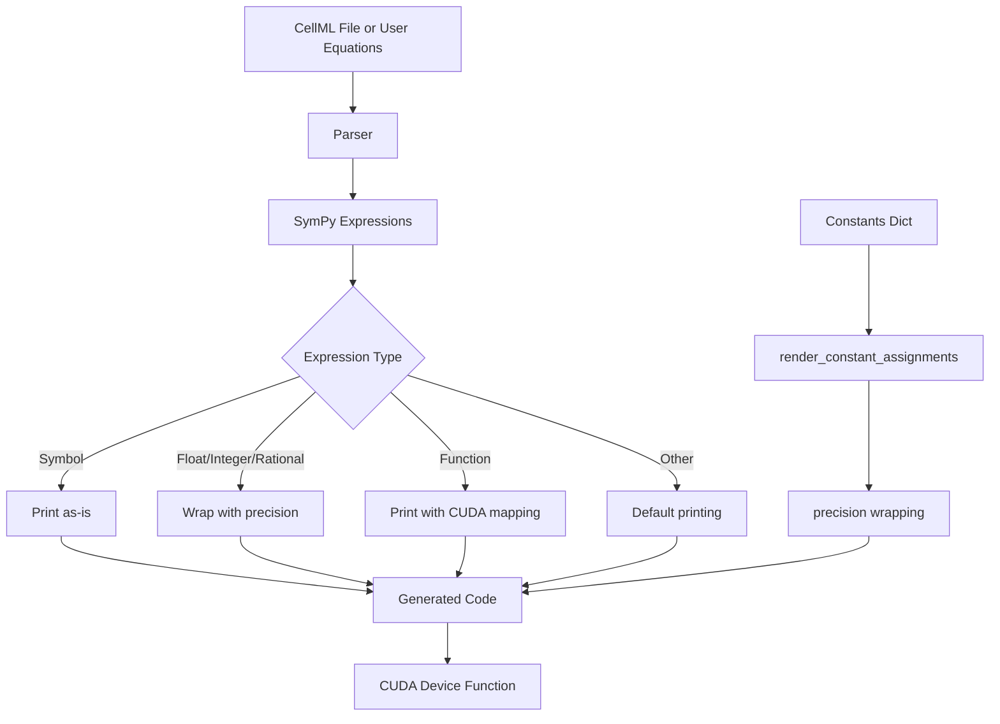
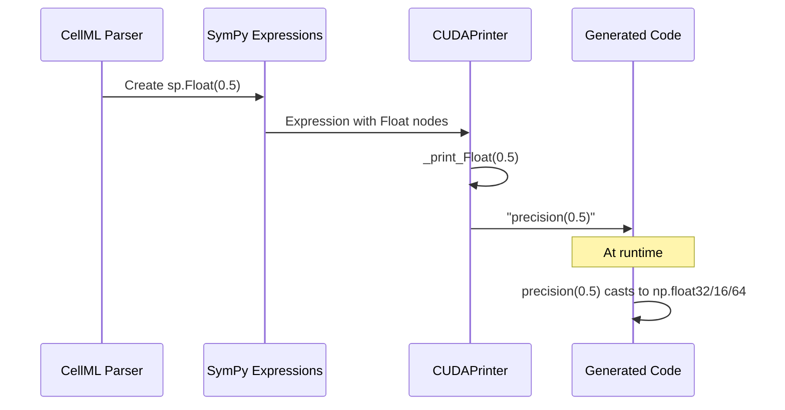

# Precision Wrapping for Numeric Literals in Code Generation

## User Stories

### User Story 1: CellML Import with Correct Precision
**As a** researcher importing CellML models  
**I want** all numeric literals from CellML files to use the correct floating-point precision  
**So that** my GPU simulations maintain numerical consistency and avoid float64 defaults

**Acceptance Criteria:**
- Numeric literals from CellML files (e.g., `0.5`, `2.0`) are wrapped with `precision()` in generated code
- User-supplied ODE equations with magic numbers also get precision wrapping
- The wrapping applies to Float, Integer, and Rational sympy types
- Existing CellML tests continue to pass
- Generated CUDA code compiles and runs without type mismatches

### User Story 2: Consistent Precision in All Generated Code
**As a** CuBIE developer  
**I want** all numeric constants in generated CUDA code to respect the system's precision setting  
**So that** there are no hidden float64 operations that could cause performance or accuracy issues

**Acceptance Criteria:**
- All magic numbers in equations are cast to the appropriate precision
- Constants from the constants dictionary continue to work as before
- No regression in performance or functionality
- The solution works for both CellML imports and direct symbolic ODE definitions

## Overview

### Problem Statement

CellML imports and user-supplied ODE equations often contain numeric literals (magic numbers) embedded directly in the equations. When these are converted to SymPy expressions and then printed to CUDA code, they default to float64 precision. This creates type mismatches when the system is configured for float32 or float16, leading to potential precision inconsistencies and performance degradation.

### Current Behavior

1. CellML files contain numeric literals like `0.5` which cellmlmanip converts to `sp.Float(0.5)`
2. User-supplied equations may contain magic numbers: `"dx = -0.5 * x"`
3. The `CUDAPrinter` class prints these as-is: `"x + 0.5"`, `"2 * y"`, etc.
4. Constants from the constants dictionary ARE wrapped: `precision(constants['a'])`
5. But magic numbers in equations are NOT wrapped

### Proposed Solution

Add print methods to `CUDAPrinter` that intercept numeric types and wrap them with `precision()` calls. This ensures all numeric literals use the correct precision at runtime.

### Architecture Diagram

### Data Flow

### Technical Decisions

**Decision 1: Override _print_Number vs. individual methods**

We'll implement `_print_Float`, `_print_Integer`, and `_print_Rational` separately rather than a single `_print_Number` method. This gives us:
- Fine-grained control if we need type-specific behavior later
- Explicit handling that's easier to understand and test
- Better alignment with SymPy's visitor pattern

**Decision 2: Always wrap, no conditional logic**

All numeric literals will be wrapped unconditionally. This:
- Simplifies implementation (no edge cases)
- Ensures consistency across all code paths
- The `precision()` function is lightweight, so overhead is minimal
- Avoids bugs from missing edge cases

**Decision 3: Use str() for numeric values**

We'll convert the SymPy number to string using `str(expr)` to preserve the exact representation. This avoids:
- Float precision loss from Python float conversion
- Issues with Rational numbers (e.g., `1/2`)
- Maintains SymPy's internal precision handling

### Expected Impact

**Positive:**
- Eliminates hidden float64 operations from magic numbers
- Consistent precision across all generated code
- Fixes precision issues in CellML imports
- No changes needed to user code

**Neutral:**
- Slightly more verbose generated code (wrapped literals)
- Minimal runtime overhead from precision() calls

**Risks:**
- Potential for unexpected behavior if precision() isn't available in scope
  - Mitigated: precision is always passed to factory functions
- Generated code becomes slightly less readable
  - Acceptable: generated code isn't meant to be hand-edited

### Implementation Scope

**Files to Modify:**
- `src/cubie/odesystems/symbolic/codegen/numba_cuda_printer.py` - Add print methods

**Files to Add Tests:**
- `tests/odesystems/symbolic/test_cuda_printer.py` - Unit tests for new methods
- `tests/odesystems/symbolic/test_cellml.py` - Integration tests for CellML

**Files NOT Modified:**
- Parser files - no changes needed, they already create SymPy expressions correctly
- sym_utils.py - render_constant_assignments already works correctly
- Other codegen files - they use CUDAPrinter, changes propagate automatically
