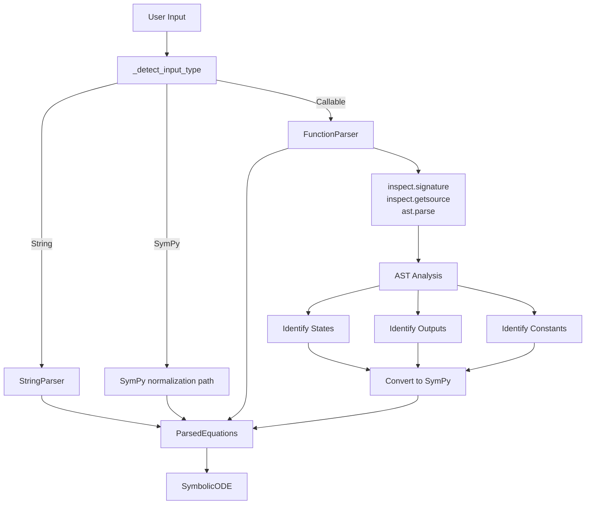

# Python Function Consumption for CuBIE Symbolic Creation

## User Stories

### User Story 1: Basic Function Definition
**As a** CuBIE user familiar with scipy/MATLAB,  
**I want to** define my ODE system using a standard Python function with signature `(t, y)`,  
**So that** I can leverage syntax checking, IDE autocomplete, and familiar patterns.

**Acceptance Criteria:**
- User can pass a Python function `def f(t, y): ...` to `create_ODE_system()`
- Function signature is extracted automatically
- State variables are identified from `y` array/dict access patterns
- The system compiles to CUDA kernels identical to string-based input
- Error messages clearly indicate issues with function structure

### User Story 2: Constants and Parameters
**As a** CuBIE user,  
**I want to** pass constants/parameters as additional arguments to my ODE function,  
**So that** I can organize my model inputs logically.

**Acceptance Criteria:**
- User can define function as `def f(t, y, constants): ...` or `def f(t, y, k, m, ...): ...`
- Constants accessed via dict/attribute access or direct argument names
- User can specify which symbols should be parameters vs constants
- Default values for constants/parameters work as in string parser
- Parameters can be varied in batch sweeps

### User Story 3: Variable Name Inference
**As a** CuBIE user,  
**I want to** use intuitive variable names in my function,  
**So that** my code is readable and self-documenting.

**Acceptance Criteria:**
- State variable names inferred from `y[0]`, `y["velocity"]`, `y.position` patterns
- Output variable names inferred from return statement structure
- Observable calculations supported in function body
- Anonymous intermediate variables work as in string parser

### User Story 4: Error Handling and Validation
**As a** CuBIE user,  
**I want to** receive clear error messages when my function structure is invalid,  
**So that** I can quickly fix issues.

**Acceptance Criteria:**
- Helpful error when function signature doesn't match expected pattern
- Clear indication when state variable access is inconsistent
- Warning when function uses unsupported Python features
- Suggestion to use string interface for complex cases

## Overview

This feature adds Python function consumption to CuBIE's symbolic ODE creation system, providing a scipy.integrate.solve_ivp-compatible interface that many users expect. The implementation creates a new `FunctionParser` alongside the existing `StringParser` (to be renamed), both feeding into the same `SymbolicODE` infrastructure.

### Key Technical Decisions

**1. Parser Architecture**
- Create `FunctionParser` as separate class from string-based parsing
- Rename existing parser to `StringParser` for clarity
- Both parsers output identical `ParsedEquations` and `IndexedBases` structures
- Reuse all existing SymPy codegen infrastructure

**2. Function Signature Convention**
Following scipy.integrate.solve_ivp and MATLAB ode45:
- First argument: `t` (time)
- Second argument: `y` (state vector/dict/object)
- Remaining arguments: constants/parameters (dicts, objects, or scalars)

**3. Variable Identification Strategy**
- **States**: Extract from `y[index]`, `y["name"]`, `y.name` patterns in AST
- **Outputs**: Extract from return statement (list/tuple/dict/array)
- **Constants**: From additional function arguments and their access patterns
- **Observables**: User-specified subset of calculated intermediate values

**4. Integration Point**
Modify `parse_input()` in `parsing/parser.py` to:
- Detect callable input (new type: "function")
- Route to `FunctionParser` when function detected
- Maintain existing behavior for string and sympy inputs

## Architecture Diagrams



```mermaid
flowchart LR
    subgraph "Function Input"
        Func["def f(t, y, constants):<br/>  v = y[0]<br/>  x = y['pos']<br/>  k = constants.damping<br/>  return [dv, dx]"]
    end
    
    subgraph "FunctionParser Processing"
        Sig[Extract Signature:<br/>t, y, constants]
        AST[Parse AST]
        VarID[Identify Variables:<br/>v=y[0], x=y['pos']<br/>k=constants.damping]
        RetID[Identify Returns:<br/>dv, dx]
    end
    
    subgraph "SymPy Conversion"
        SymState[Create State Symbols:<br/>v, pos]
        SymConst[Create Constant Symbols:<br/>damping]
        SymEq[Create Equations:<br/>dv = ..., dpos = ...]
    end
    
    Func --> Sig
    Sig --> AST
    AST --> VarID
    AST --> RetID
    VarID --> SymState
    VarID --> SymConst
    RetID --> SymEq
    
    SymState --> IB[IndexedBases]
    SymConst --> IB
    SymEq --> PE2[ParsedEquations]
```

## Expected Impact

### Positive Impacts
- **User Accessibility**: Familiar interface for scipy/MATLAB users
- **Developer Experience**: IDE autocomplete, syntax checking, debugging
- **Code Quality**: Type hints, docstrings, linting work naturally
- **Testing**: Easier to write unit tests for ODE functions

### Integration Points
- **Minimal Changes to Core**: Only `parse_input()` and addition of new parser
- **Existing Tests**: All existing symbolic tests remain valid
- **Backward Compatibility**: No changes to string/SymPy interfaces

### Trade-offs Considered

**Option 1: Extend StringParser**
- **Pros**: Fewer files, all parsing in one place
- **Cons**: Mixed responsibilities, harder to maintain
- **Decision**: Rejected - violates single responsibility

**Option 2: Create FunctionParser as separate class**
- **Pros**: Clean separation, easier testing, clear responsibilities
- **Cons**: Some code duplication for symbol management
- **Decision**: Chosen - better architecture

**Option 3: Convert function to string then parse**
- **Pros**: Minimal new code
- **Cons**: Loses AST benefits, complex string manipulation, error messages unclear
- **Decision**: Rejected - defeats purpose of accepting functions

## Research Findings

### scipy.integrate.solve_ivp
- Function signature: `fun(t, y)` where `t` is scalar, `y` is ndarray
- Additional arguments via `args` parameter: `fun(t, y, *args)`
- Standard order: time first, state second

### MATLAB ode45
- Function handle signature: `@(t, y)` or `@(t, y, p1, p2, ...)`
- Same convention: time first, state second
- Parameters after state

### Python AST Capabilities
- `inspect.signature()`: Extract function arguments
- `inspect.getsource()`: Get source code
- `ast.parse()`: Parse into AST
- `ast.Subscript`: Detect `y[0]` and `y["name"]` patterns
- `ast.Attribute`: Detect `constants.damping` patterns
- `ast.Return`: Extract return statement structure

### CuBIE Parser Structure
- Current parser in `parsing/parser.py` handles strings and SymPy
- `parse_input()` is main entry point
- Output: `(IndexedBases, symbols_dict, callables_dict, ParsedEquations, hash)`
- `_detect_input_type()` determines input format
- `IndexedBases` from `indexedbasemaps.py` manages symbol categorization
