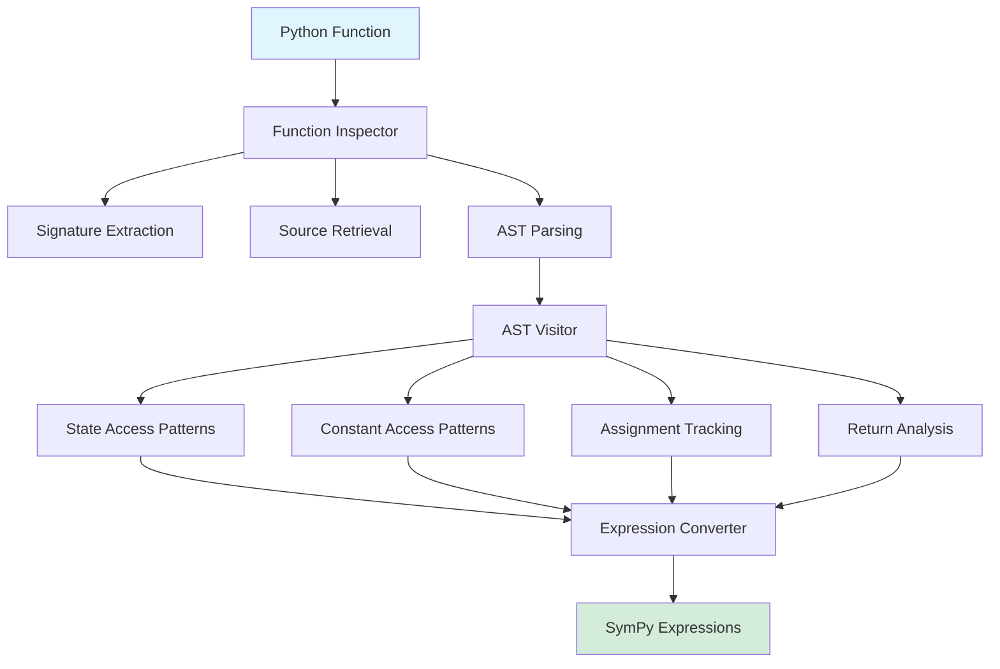
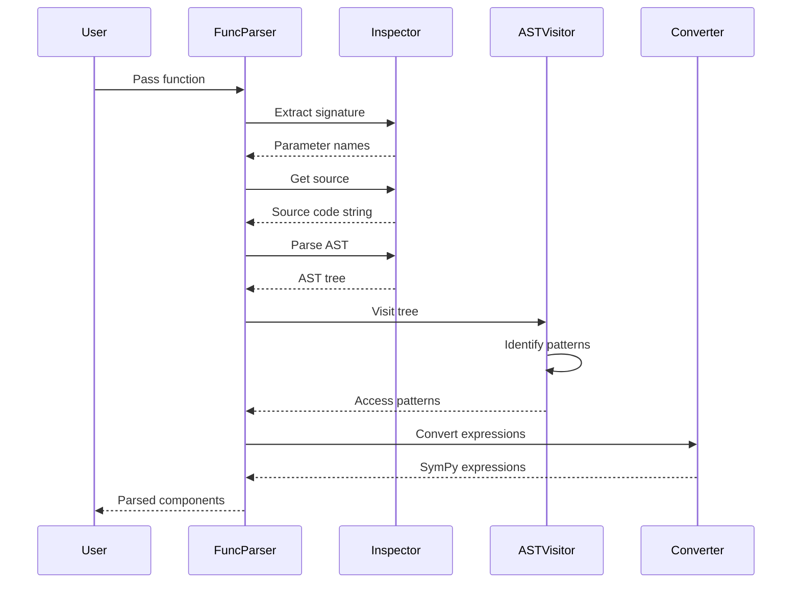

# Section 1: Source Code Interactions - Human Overview

## Purpose

This section covers the extraction and analysis of Python function source code to enable function-based ODE system definition in CuBIE. Users will be able to pass standard Python functions (like those used in scipy.integrate.solve_ivp) instead of string-based equations.

## User Stories for This Section

### User Story: Function Source Extraction
**As a** developer implementing the function parser,  
**I want to** reliably extract function signatures and source code,  
**So that** I can analyze the function structure and convert it to symbolic form.

**Acceptance Criteria:**
- Function signature extraction works for regular functions
- Source code retrieval works for functions defined in files
- Clear error messages for unsupported function types (lambdas, builtins, REPL-defined)
- Parameter names and order are correctly identified

### User Story: AST Analysis
**As a** developer implementing the function parser,  
**I want to** traverse the function AST to identify variable access patterns,  
**So that** I can determine which variables are states, constants, and outputs.

**Acceptance Criteria:**
- Integer subscript patterns detected: `y[0]`, `y[1]`
- String subscript patterns detected: `y["velocity"]`, `constants["mass"]`
- Attribute access patterns detected: `y.position`, `constants.damping`
- Assignment targets and return values correctly identified
- Mixed access patterns raise appropriate errors

### User Story: Expression Conversion
**As a** developer implementing the function parser,  
**I want to** convert Python AST expressions to SymPy symbolic expressions,  
**So that** the function-based input produces identical output to string-based input.

**Acceptance Criteria:**
- Python operators convert to SymPy equivalents
- Mathematical functions (sin, cos, exp, etc.) map correctly
- Variable names substitute with appropriate SymPy symbols
- Conditional expressions convert to Piecewise
- Generated SymPy matches what string parser would produce

## Technical Overview

This section implements the foundational infrastructure for analyzing Python functions. It consists of three main components:

1. **Function Inspection** - Extract metadata using `inspect` module
2. **AST Traversal** - Analyze function body using `ast.NodeVisitor` pattern
3. **Expression Conversion** - Transform Python AST to SymPy expressions

### Component Interaction

### Key Technical Decisions

**Decision 1: Use inspect module for metadata**
- **Rationale**: Standard library, reliable, well-documented
- **Alternative considered**: Manual parsing of function object attributes
- **Why chosen**: inspect.signature() provides parameter information in structured format

**Decision 2: ast.NodeVisitor pattern for traversal**
- **Rationale**: Pythonic, extensible, separates concerns
- **Alternative considered**: Manual recursive AST walking
- **Why chosen**: Visitor pattern is standard for AST analysis, easy to extend

**Decision 3: Separate validation from extraction**
- **Rationale**: Clean separation allows flexible error handling
- **Alternative considered**: Validate while extracting
- **Why chosen**: Makes testing easier, allows partial extraction for error reporting

## Data Flow

## Expected Outputs

This section produces the following components:

1. **FunctionInspector class** - Handles signature and source extraction
2. **OdeAstVisitor class** - Traverses AST and collects patterns  
3. **AstToSympyConverter class** - Converts Python AST to SymPy
4. **Validation utilities** - Check function structure and provide errors

These components will be used by Section 2 (Variable Identification) to build the complete parser.

## Edge Cases to Handle

| Edge Case | Detection | Error Message |
|-----------|-----------|---------------|
| Lambda function | Check `func.__name__ == '<lambda>'` | "Lambda functions not supported. Use def syntax." |
| Builtin function | Try `inspect.getsource()`, catch OSError | "Cannot analyze builtin functions. Use regular Python function." |
| REPL-defined function | Catch OSError from getsource | "Cannot get source for interactive functions. Define in a file or use string input." |
| Method (has self) | Check first param is 'self' | Warning: "First parameter 'self' will be treated as time variable" |
| No return statement | AST visitor finds no Return node | "Function must have a return statement" |
| Mixed subscript types | Both int and str keys on same base | "Inconsistent state access: use either integer or string indexing" |

## Integration Points

### With Existing CuBIE Code

- **IndexedBases** (from `indexedbasemaps.py`) - Will receive inferred variable names
- **ParsedEquations** (from `parser.py`) - Will receive converted equations
- **KNOWN_FUNCTIONS** (from `parser.py`) - Will be used for function call mapping
- **TIME_SYMBOL** (from `parser.py`) - Will be used for time variable

### With Other Sections

- **Section 2 (Variable Identification)** - Will use the extracted access patterns
- **Section 3 (Integration)** - Will use the FunctionParser class created here

## Testing Strategy

### Unit Tests for This Section

1. **Function Inspector Tests**
   - Test signature extraction from various function signatures
   - Test source code retrieval from file-based functions
   - Test error handling for unsupported function types

2. **AST Visitor Tests**
   - Test identification of integer subscripts: `y[0]`, `y[1]`
   - Test identification of string subscripts: `y["name"]`
   - Test identification of attribute access: `y.attr`
   - Test assignment tracking
   - Test return statement parsing

3. **Expression Converter Tests**
   - Test operator conversion: +, -, *, /, **
   - Test function call conversion: sin, cos, exp
   - Test conditional conversion: if-else to Piecewise
   - Test name substitution

4. **Edge Case Tests**
   - Test lambda rejection
   - Test builtin rejection
   - Test REPL function rejection
   - Test missing return error
   - Test mixed access pattern error

All tests should be parameterized where applicable and follow CuBIE testing conventions (use fixtures, no mocks).

## Research Findings

### Python AST Capabilities

From testing and documentation review:

1. **ast.parse()** successfully parses function source into AST tree
2. **ast.NodeVisitor** provides clean pattern for traversal
3. **ast.unparse()** available in Python 3.9+ for debugging (convert AST back to code)
4. **Key node types for ODE parsing**:
   - `ast.Subscript` - Array/dict access like `y[0]` or `y["name"]`
   - `ast.Attribute` - Attribute access like `constants.damping`
   - `ast.Assign` - Variable assignments
   - `ast.Return` - Return statement
   - `ast.BinOp` - Binary operations (+, -, *, /, **)
   - `ast.Call` - Function calls like `sin(x)`
   - `ast.Name` - Variable names

### inspect Module Capabilities

1. **inspect.signature()** - Returns Signature object with parameters dict
2. **inspect.getsource()** - Returns source code string (fails for builtins/REPL)
3. **Parameter.kind** - Indicates POSITIONAL_OR_KEYWORD, VAR_POSITIONAL, etc.
4. **Parameter.default** - Provides default value if present

### scipy.integrate.solve_ivp Convention

Research confirms the standard signature pattern:
- `fun(t, y)` for basic ODEs
- `fun(t, y, *args)` for ODEs with parameters
- Time always first, state always second
- Additional args typically constants/parameters

This aligns perfectly with our planned approach.

## Files to Create

This section will create the following new files in `src/cubie/odesystems/symbolic/parsing/`:

1. `function_inspector.py` - Function metadata extraction
2. `ast_visitor.py` - AST traversal and pattern collection
3. `ast_converter.py` - AST to SymPy expression conversion

These will be imported by `function_parser.py` (created in Section 3).
