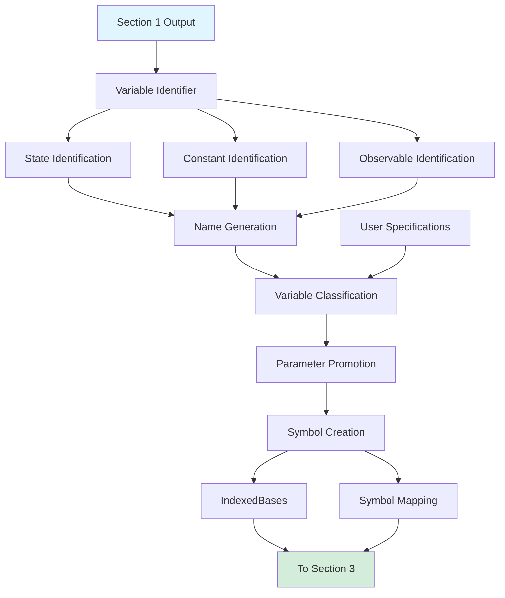
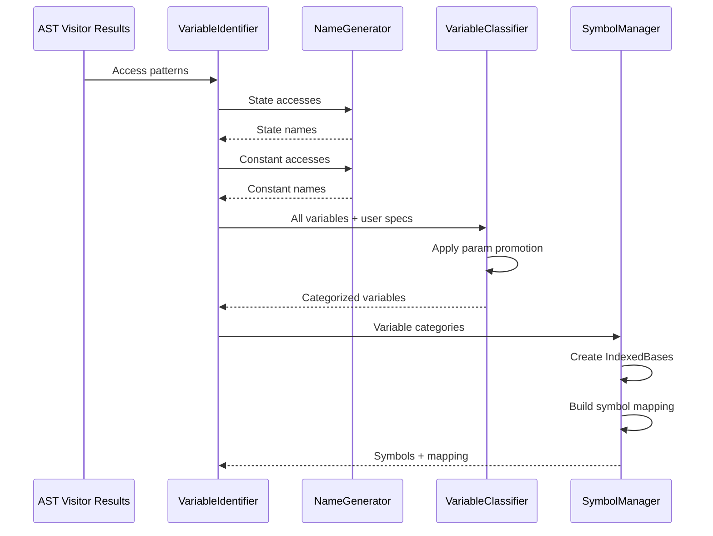

# Section 2: Parsing and Identifying Variables - Human Overview

## Purpose

This section implements the logic for identifying and classifying variables from Python function body analysis. It bridges the AST analysis from Section 1 with the SymPy symbolic representation required by CuBIE's existing infrastructure.

## User Stories for This Section

### User Story: State Variable Inference
**As a** developer implementing the function parser,  
**I want to** automatically infer state variable names from function body access patterns,  
**So that** users don't need to explicitly declare state names when they're obvious.

**Acceptance Criteria:**
- Integer indices `y[0]`, `y[1]` generate names `y_0`, `y_1`
- String keys `y["velocity"]` use key as state name directly
- Attributes `y.position` use attribute as state name
- User can override inferred names with explicit `states` parameter
- Consistent ordering maintained across all processing

### User Story: Constant and Parameter Distinction
**As a** CuBIE user,  
**I want to** specify which function arguments are batchable parameters vs compile-time constants,  
**So that** I can control which values vary across batch runs.

**Acceptance Criteria:**
- All non-state function arguments default to constants
- User can specify `parameters=["k", "m"]` to mark subset as parameters
- User can specify `constants={"g": 9.81}` with defaults
- Parameter promotion works: constant → parameter based on user specification
- Clear error if specified parameter name not found in function

### User Story: Observable Tracking
**As a** CuBIE user,  
**I want to** mark intermediate calculations in my function as observables,  
**So that** they are saved during integration alongside states.

**Acceptance Criteria:**
- User provides `observables=["kinetic_energy", "potential"]`
- Parser finds assignments to these names in function body
- Observable expressions extracted and added to ParsedEquations
- Error if observable name not assigned in function
- Observables can reference states, constants, parameters

### User Story: Symbol Consistency
**As a** developer implementing the function parser,  
**I want to** create SymPy symbols that match the patterns used by the string parser,  
**So that** function-based and string-based systems produce identical output.

**Acceptance Criteria:**
- State symbols use IndexedBase pattern matching string parser
- Parameter/constant symbols created consistently
- Derivative symbols follow `d{name}` convention
- Symbol mapping allows AST→SymPy conversion
- Output IndexedBases structure matches string parser format

## Technical Overview

This section takes the output from Section 1 (access patterns, assignments, return values) and:

1. **Generates variable names** from access patterns
2. **Classifies variables** into states, constants, parameters, observables
3. **Creates SymPy symbols** via IndexedBases
4. **Builds symbol mappings** for expression conversion
5. **Validates consistency** between inferred and user-specified variables

### Architecture



### Data Flow Through Variable Identification



## Key Technical Decisions

**Decision 1: Separate name generation from classification**
- **Rationale**: Names must be inferred before knowing if they're parameters or constants
- **Alternative**: Generate names during classification
- **Why chosen**: Cleaner separation of concerns; allows validation before symbol creation

**Decision 2: User specifications override inference**
- **Rationale**: Explicit is better than implicit; users know their intent
- **Alternative**: Inference always takes precedence
- **Why chosen**: Matches Python philosophy; gives users control when needed

**Decision 3: Integer subscripts generate `y_0` style names**
- **Rationale**: Consistency with existing CuBIE patterns and common convention
- **Alternative**: Use `y0` (no underscore) or `state_0`
- **Why chosen**: Matches internal CuBIE naming; distinguishes from user variables

**Decision 4: Parameter promotion is explicit, not automatic**
- **Rationale**: Constants vs parameters is semantic, not syntactic
- **Alternative**: Heuristics to guess which should be parameters
- **Why chosen**: Can't reliably infer user intent; explicit is safer

## Expected Outputs

This section produces the following components:

1. **VariableIdentifier class** - Orchestrates identification process
2. **NameGenerator class** - Converts access patterns to variable names
3. **VariableClassifier class** - Categorizes variables with user overrides
4. **SymbolManager class** - Creates IndexedBases and symbol mappings
5. **Validation utilities** - Check consistency and completeness

These feed into Section 3's FunctionParser to complete the parsing pipeline.

## Data Structures

### Variable Categories (Internal)

```python
@attrs.define
class IdentifiedVariables:
    """Container for categorized variable names."""
    states: List[str]           # Ordered state names
    constants: List[str]        # Constant names
    parameters: List[str]       # Parameter names (promoted from constants)
    observables: List[str]      # Observable names
    derivatives: List[str]      # Derivative variable names (d{state})
    auxiliaries: Dict[str, Any] # Anonymous intermediate variables
```

### Access Pattern to Name Mapping

```python
{
    # State access → state name
    ('y', 0, 'subscript_int'): 'y_0',
    ('y', 'velocity', 'subscript_str'): 'velocity',
    ('y', 'position', 'attribute'): 'position',
    
    # Constant access → constant name
    ('constants', 'damping', 'attribute'): 'damping',
    ('constants', 'mass', 'subscript_str'): 'mass',
    
    # Direct argument → constant name
    ('k', None, 'argument'): 'k',
}
```

### Symbol Mapping for AST Conversion

```python
{
    # Variable name in function → SymPy symbol
    't': TIME_SYMBOL,
    'v': Symbol('y_0'),        # State 0
    'x': Symbol('y_1'),        # State 1  
    'k': Symbol('damping'),    # Constant or parameter
    'dv': Symbol('dy_0'),      # Derivative 0
    'dx': Symbol('dy_1'),      # Derivative 1
    'kinetic': Symbol('kinetic_energy'),  # Observable
}
```

## Integration Points

### From Section 1
- `OdeAstVisitor.get_results()` provides access patterns
- `FunctionInspector.param_names` provides function arguments
- Assignment dict maps variable names to AST expressions

### To Section 3
- `IndexedBases` object with all symbol categories
- Symbol mapping dict for expression conversion
- Validated variable categories

### With Existing CuBIE
- Uses `IndexedBases.from_user_inputs()` for symbol creation
- Follows conventions from `indexedbasemaps.py`
- Integrates with existing ParsedEquations structure

## Edge Cases

| Case | Detection | Handling |
|------|-----------|----------|
| Mixed access on same base | Multiple pattern types for 'y' | Error: "Use consistent access pattern" |
| Parameter not in function | Name in `parameters` not in args/accesses | Error: "Parameter 'k' not found" |
| Observable not assigned | Name in `observables` not in assignments | Error: "Observable 'x' never assigned" |
| State name collision | Inferred state name conflicts with intermediate | Warn and use unique suffix |
| No states found | No accesses to state parameter | Error: "No state variables identified" |
| Return count mismatch | Return has N values but M states | Error: "Expected M returns, got N" |

## Name Generation Rules

### Integer Subscripts
Pattern: `y[0]`, `y[1]`, `y[2]`
- Extract indices: `[0, 1, 2]`
- Generate names: `['y_0', 'y_1', 'y_2']`
- Maintain index order

### String Subscripts
Pattern: `y["velocity"]`, `y["position"]`
- Extract keys: `['velocity', 'position']`
- Use directly as names: `['velocity', 'position']`
- Order by first appearance in AST

### Attribute Access
Pattern: `y.velocity`, `y.position`
- Extract attributes: `['velocity', 'position']`
- Use directly as names: `['velocity', 'position']`
- Order by first appearance in AST

### Constant Access
All patterns (attribute, string subscript, direct arg):
- Extract name from access or argument
- Use directly as constant name
- User specifies which become parameters

## Validation Strategy

### Pre-Symbol Creation Validation
1. Check state access consistency (single pattern type)
2. Check all user-specified parameters exist
3. Check all user-specified observables are assigned
4. Check return value count matches state count
5. Check no name collisions between categories

### Post-Symbol Creation Validation
1. Verify IndexedBases lengths match expectations
2. Verify symbol_map completeness
3. Verify all categories populated correctly
4. Verify derivative symbols created for all states

## Testing Strategy

### Unit Tests

**NameGenerator Tests:**
- `test_generate_from_int_subscripts` - y[0], y[1] → y_0, y_1
- `test_generate_from_str_subscripts` - y["v"] → v
- `test_generate_from_attributes` - y.velocity → velocity
- `test_mixed_access_error` - Mixed patterns raise error
- `test_preserve_order` - Maintains appearance order

**VariableClassifier Tests:**
- `test_default_all_constants` - Args become constants by default
- `test_promote_to_parameters` - User spec promotes constants
- `test_parameter_not_found_error` - Invalid param name errors
- `test_observable_validation` - Observable must be assigned
- `test_state_count_matches_return` - Validation of return count

**SymbolManager Tests:**
- `test_create_indexed_bases` - Proper IndexedBases structure
- `test_build_symbol_map` - Complete symbol mapping
- `test_derivative_symbol_creation` - d{name} for each state
- `test_parameter_vs_constant_indexing` - Correct IndexedBase assignment

### Integration Tests
- `test_full_variable_identification` - End-to-end through all components
- `test_user_override_inference` - User specs override inferred
- `test_scipy_style_function` - Handle scipy-like signatures
- `test_multiple_constant_args` - Multiple direct constant arguments

## Research Summary

### Parameter vs Constant Semantics in CuBIE

From `indexedbasemaps.py` analysis:
- **Parameters**: Stored in `parameters` IndexedBase, can vary per batch run
- **Constants**: Stored in `constants` IndexedBase, compiled into kernel
- Both have similar API (symbol_map, ref_map, default_values)
- Distinction is semantic: parameters are batchable, constants are not

This means:
- Default all to constants (safe, works in single runs)
- User must explicitly promote to parameters for batching
- Function parser cannot infer which should be parameters

### Existing Name Generation Patterns

From string parser analysis:
- State derivatives use `d{state}` convention
- Indexed notation `name[i]` becomes `name_i` via regex substitution
- Anonymous auxiliaries tracked but not persisted
- Observable symbols must be pre-declared

This guides our approach:
- Match `d{state}` for derivatives
- Use `y_i` for integer subscripts  
- Match auxiliary handling from string parser

## Files to Create

This section will create these files in `src/cubie/odesystems/symbolic/parsing/`:

1. `variable_identifier.py` - Main orchestration class
2. `name_generator.py` - Access pattern → variable name conversion
3. `variable_classifier.py` - Categorization with user overrides
4. `symbol_manager.py` - IndexedBases and symbol map creation
