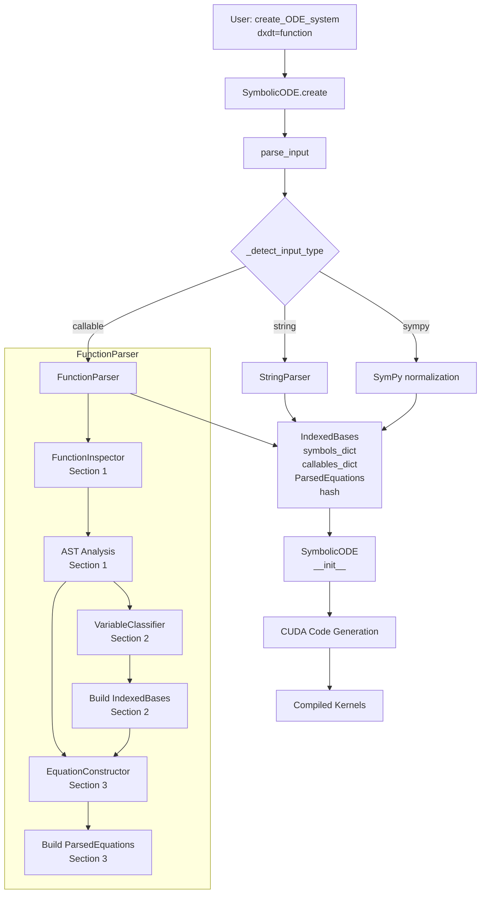
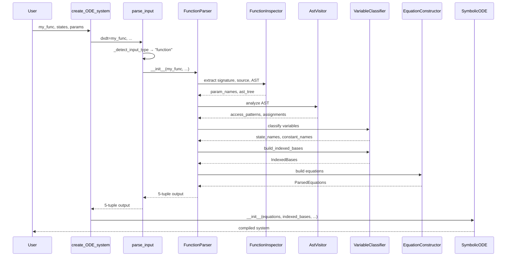

# Section 3: Integration with SymbolicODE - Human Overview

## User Stories

### User Story 1: Seamless Function-to-CUDA Pipeline
**As a** CuBIE user,  
**I want to** pass a Python function to `create_ODE_system()` and get compiled CUDA kernels,  
**So that** I can use familiar Python syntax without worrying about internal parsing details.

**Acceptance Criteria:**
- User calls `create_ODE_system(dxdt=my_function, ...)`
- Function is parsed and converted to SymPy expressions
- CUDA kernels are generated identically to string-based input
- No changes required to existing batch solving workflow
- Error messages guide user to fix function structure issues

### User Story 2: Consistent Output Structure
**As a** downstream component (SymbolicODE, codegen),  
**I want to** receive ParsedEquations and IndexedBases from FunctionParser in the same format as from StringParser,  
**So that** I can process function-based and string-based systems identically.

**Acceptance Criteria:**
- FunctionParser outputs same 5-tuple as StringParser
- ParsedEquations structure matches exactly
- IndexedBases categorization is identical
- Symbol identity matches between parsers
- Hash computation produces stable identifiers

### User Story 3: Observable and Auxiliary Support
**As a** CuBIE user defining observables in my function,  
**I want to** have intermediate calculations properly categorized,  
**So that** observables are saved correctly and auxiliaries optimize computation.

**Acceptance Criteria:**
- User specifies `observables=["energy", "momentum"]`
- Parser identifies assignments to these names in function body
- Observable equations are created with correct RHS expressions
- Auxiliary (intermediate) variables are tracked separately
- Evaluation order respects dependencies

## Overview

Section 3 integrates the function parsing components (Sections 1 and 2) with CuBIE's existing symbolic ODE infrastructure. The key insight is that `parse_input()` acts as a routing hub, detecting input type and delegating to the appropriate parser while maintaining a consistent output interface.

### Key Design Decisions

**1. Minimal Changes to Existing Code**
- Only modify `parse_input()` in `parser.py` to add function detection and routing
- No changes to SymbolicODE, codegen, or downstream components
- String parser logic remains untouched (rename for clarity)

**2. FunctionParser as Peer to StringParser**
- Both implement same output contract: `(IndexedBases, symbols_dict, callables_dict, ParsedEquations, hash)`
- FunctionParser coordinates Section 1 and 2 components internally
- Parse workflow mirrors string parser structure

**3. Equation Building Strategy**
- Convert AST expressions to SymPy using AstToSympyConverter (Section 1)
- Build ParsedEquations.from_equations() using IndexedBases (Section 2)
- Maintain topological ordering of assignments
- Partition into state_derivatives, observables, auxiliaries

**4. Validation Layer**
- Validate at parse time, not at runtime
- Provide actionable error messages with function context
- Guide users to fix structure rather than failing silently

## Architecture Diagram

## Data Flow

## Expected Impact

### Positive Changes
- **User Experience**: Pythonic interface alongside string interface
- **Maintainability**: Clean separation between parsing strategies
- **Testing**: Easier to test ODE logic with Python functions
- **Documentation**: Can show function examples in tutorials

### Integration Points
- **parse_input()**: Add 3-way routing logic (string/sympy/function)
- **FunctionParser**: New class in `parsing/function_parser.py`
- **IndexedBases**: Consumed identically to string parser usage
- **ParsedEquations**: Generated via .from_equations() classmethod

### Backward Compatibility
- All existing string-based systems work unchanged
- All existing SymPy-based systems work unchanged
- New function capability is additive only
- Tests for string/SymPy paths remain valid

## Trade-offs Considered

### Option 1: Extend parse_input() with inline function handling
- **Pros**: Minimal new files
- **Cons**: Mixed responsibilities, complex control flow
- **Decision**: Rejected - violates separation of concerns

### Option 2: Create FunctionParser mirroring StringParser
- **Pros**: Clear responsibilities, parallel structure
- **Cons**: Some code duplication for symbol management
- **Decision**: **Chosen** - better architecture, easier testing

### Option 3: Convert function to string then use StringParser
- **Pros**: Maximum code reuse
- **Cons**: Loses AST benefits, fragile, poor error messages
- **Decision**: Rejected - defeats purpose of function interface

## Key Technical Challenges

### Challenge 1: SymPy Symbol Identity
**Problem**: SymPy symbols must match by identity, not just name  
**Solution**: Use IndexedBases.all_symbols as canonical source, substitute consistently

### Challenge 2: Equation Ordering
**Problem**: Function body has explicit ordering, must preserve for evaluation  
**Solution**: Build ordered list during AST traversal, create ParsedEquations.from_equations()

### Challenge 3: Observable vs Auxiliary Distinction
**Problem**: Not all assignments are observables, need to categorize correctly  
**Solution**: User provides observable names explicitly; unmarked assignments become auxiliaries

### Challenge 4: Return Statement to Derivatives
**Problem**: Return values must map to state derivatives in correct order  
**Solution**: Extract return elements, match to states by position or name pattern (dx → x)

## Success Metrics

After implementation:
1. User can pass Python function to `create_ODE_system()`
2. Generated CUDA kernels identical to string-based equivalent
3. All existing tests pass unchanged
4. Function-based systems integrate with batch solver
5. Error messages clearly guide function structure fixes
