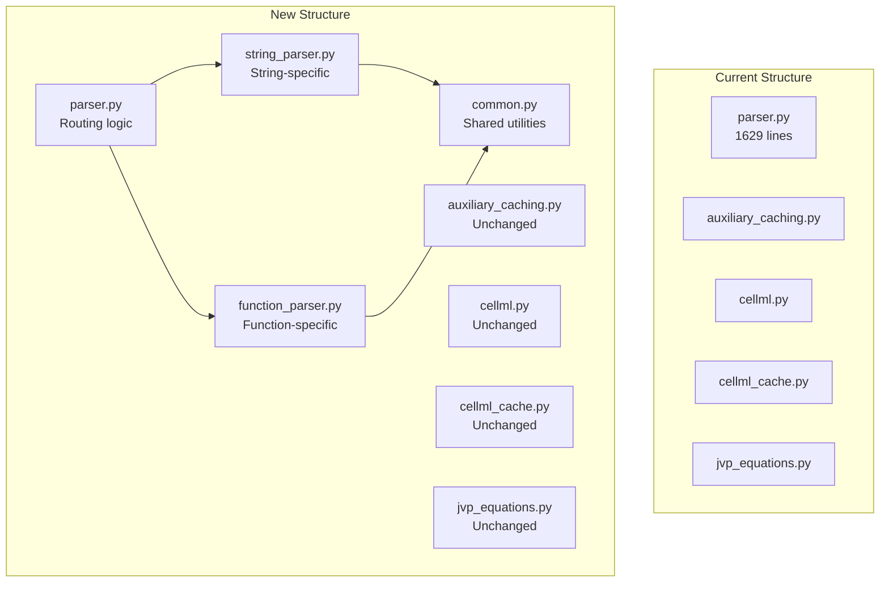
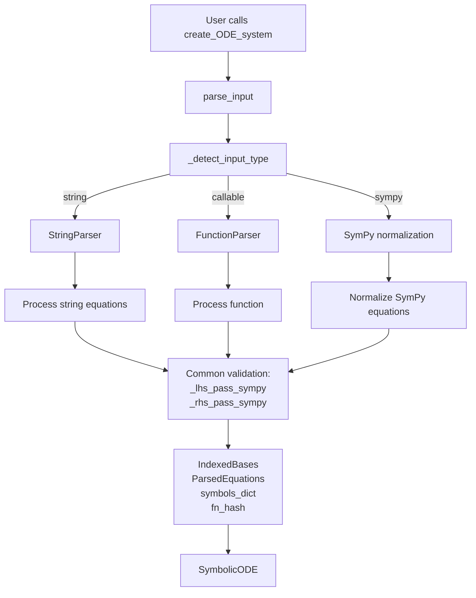
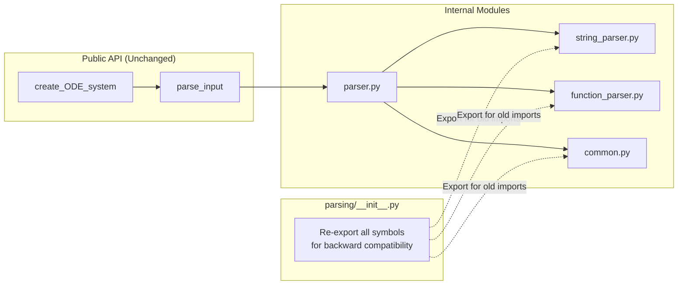

# Section 4: CuBIE Integration and Cleanup - Human Overview

## User Stories

### User Story 1: Transparent Parser Selection
**As a** CuBIE developer,  
**I want** the parser type (string, function, or SymPy) to be selected automatically based on input,  
**So that** users don't need to explicitly choose which parser to use.

**Acceptance Criteria:**
- `parse_input()` correctly routes to StringParser for string input
- `parse_input()` correctly routes to FunctionParser for callable input
- `parse_input()` correctly routes to SymPy path for SymPy expressions
- All three paths produce identical `ParsedEquations` and `IndexedBases` outputs for equivalent systems
- Error messages clearly indicate which parser detected the issue

### User Story 2: Module Organization
**As a** CuBIE maintainer,  
**I want** parsers organized in a clean module structure,  
**So that** the codebase is maintainable and extensible.

**Acceptance Criteria:**
- String parsing logic isolated in `string_parser.py`
- Function parsing logic isolated in `function_parser.py`
- Common utilities (AST-to-SymPy, validation) in `common.py`
- Module imports remain backward compatible
- No circular dependencies between parser modules

### User Story 3: Backward Compatibility
**As a** CuBIE user with existing code,  
**I want** my existing string-based ODE definitions to work unchanged,  
**So that** I don't need to update my scripts.

**Acceptance Criteria:**
- All existing tests pass without modification
- `create_ODE_system()` accepts strings exactly as before
- String parser behavior unchanged
- SymPy input path unchanged
- No breaking changes to public API

### User Story 4: Documentation Coverage
**As a** new CuBIE user,  
**I want** clear documentation on both string and function input methods,  
**So that** I can choose the best approach for my use case.

**Acceptance Criteria:**
- README.md updated with function input example
- API documentation includes function input parameters
- Migration examples show string-to-function conversions
- Error messages guide users to documentation
- Docstrings updated for all modified functions

---

## Overview

Section 4 focuses on integration: reorganizing the parsing module to cleanly separate string parsing from function parsing, updating the routing logic in `parse_input()`, ensuring backward compatibility, and documenting the new capability.

### Key Technical Decisions

**1. Module Reorganization Strategy**
- **Current**: All parsing in `parsing/parser.py` (1629 lines)
- **New Structure**:
  ```
  parsing/
  ├── __init__.py           # Exports for backward compatibility
  ├── parser.py             # Main parse_input() router (preserved name)
  ├── string_parser.py      # StringParser class + string-specific helpers
  ├── function_parser.py    # FunctionParser class (from Sections 1-3)
  ├── common.py             # Shared utilities
  ├── auxiliary_caching.py  # Unchanged
  ├── cellml.py            # Unchanged
  ├── cellml_cache.py      # Unchanged
  └── jvp_equations.py     # Unchanged
  ```
- **Rationale**: Keeps `parser.py` as entry point (backward compatibility), separates concerns

**2. StringParser Naming**
- Rename existing string-specific functions to include "string" prefix:
  - `_lhs_pass()` → stays in `string_parser.py` (only used for strings)
  - `_rhs_pass()` → stays in `string_parser.py` (only used for strings)
  - `_sanitise_input_math()` → stays in `string_parser.py`
  - `_normalise_indexed_tokens()` → stays in `string_parser.py`
- Keep existing function names for backward compatibility in `__init__.py` exports
- New code uses explicit class-based parsers

**3. Routing Logic**
Modify `_detect_input_type()` to return "string", "sympy", or "function":
```python
if callable(dxdt):
    return "function"
elif isinstance(dxdt, str):
    return "string"
# ... rest of existing logic
```

**4. Backward Compatibility Approach**
- **No API changes** to `parse_input()` signature
- **No API changes** to `create_ODE_system()` signature
- String and SymPy paths remain functionally identical
- All imports from `parsing` module still work via `__init__.py` re-exports
- Function path is additive - existing code paths untouched

**5. Testing Strategy**
- **Equivalence tests**: Same system via string vs function produces identical outputs
- **Backward compatibility tests**: All existing parser tests pass unchanged
- **Integration tests**: Complete pipeline from function to CUDA kernel
- **Cross-validation**: String and function produce same numerical results

---

## Architecture Diagrams

### Module Structure Before and After



### Parse Flow Integration



### Backward Compatibility Layer



---

## Expected Impact

### Positive Impacts
- **Clean Separation**: String and function parsing logic isolated
- **Maintainability**: Easier to modify/extend each parser independently
- **Testability**: Each parser can be unit tested in isolation
- **Backward Compatibility**: Zero breaking changes to existing code
- **Documentation**: Clear examples for both input methods

### Integration Points
- **Minimal Changes to Core**: Only `parse_input()` routing logic modified
- **Module Structure**: New files added, existing files refactored
- **Import Statements**: `__init__.py` manages backward compatibility
- **Testing**: New tests added, existing tests unchanged

### Migration Path
For users who want to adopt function input:
1. No changes required to existing code
2. New projects can use function input immediately
3. Mixed usage is supported (different systems use different methods)
4. Documentation provides side-by-side examples

---

## Trade-offs Considered

### Option 1: Keep Everything in parser.py
- **Pros**: No file reorganization, simpler git history
- **Cons**: File becomes too large (2000+ lines), mixed responsibilities
- **Decision**: Rejected - violates single responsibility principle

### Option 2: Create parsing/string/ and parsing/function/ subdirectories
- **Pros**: Maximum separation, clear boundaries
- **Cons**: Deeper nesting, complicates imports, overkill for current size
- **Decision**: Rejected - flat structure sufficient for now

### Option 3: Rename parser.py to string_parser.py, create new parser.py
- **Pros**: Clear naming, explicit separation
- **Cons**: Breaks git history, potential import issues for users importing internals
- **Decision**: Rejected - prioritize backward compatibility

### Option 4: Keep parser.py as router, extract string logic (Chosen)
- **Pros**: Backward compatible, clean separation, minimal disruption
- **Cons**: Requires careful extraction to avoid breaking logic
- **Decision**: Chosen - best balance of compatibility and organization

---

## Research Findings

### Current parse_input() Usage
- Used in `symbolicODE.py` line 38 and 270
- Used in `cellml.py` for CellML model loading
- Used in `cellml_cache.py` for cached models
- Signature must remain unchanged for backward compatibility

### Existing Test Coverage
- `tests/odesystems/symbolic/test_parser.py`: 
  - Tests input cleaning, function processing, parameter processing
  - Tests detection, normalization, LHS/RHS passes
  - All tests must pass unchanged after refactor

### Import Dependencies
From `parsing/__init__.py`:
```python
from .auxiliary_caching import *
from .cellml import *
from .jvp_equations import *
from .parser import *
```

Currently exports via star imports. Need to maintain this for backward compatibility.

### Documentation Files to Update
1. `readme.md` - Add function input example to overview
2. API docs (if separate) - Update `create_ODE_system` docstring
3. User guide (in docs/) - Add function input section
4. Migration guide - String-to-function conversion examples

