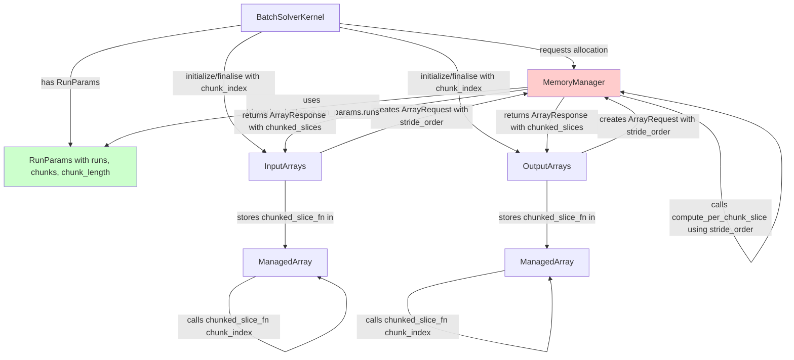
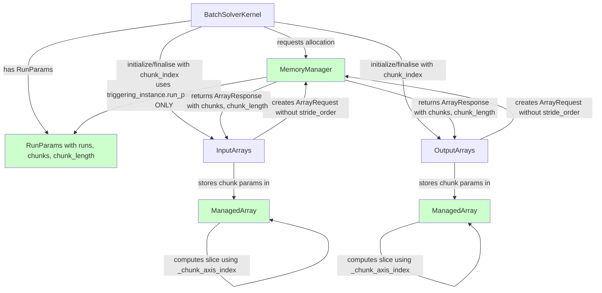

# Refactor Chunking Logic - Human Overview

## Context

This plan reflects the **post-merge state** after integrating changes from `copilot/remove-chunking-time-axis` which introduced:
- A unified `RunParams` class (replacing `ChunkParams`)
- `RunParams.__getitem__(index)` for computing per-chunk run parameters
- Removal of `axis_length` and `dangling_chunk_length` from `ArrayResponse`
- Memory manager using `triggering_instance.run_params.runs` for chunking calculations

## User Stories

### Story 1: Remove stride_order from Memory Manager
**As a** developer maintaining the memory management system  
**I want** the memory manager to not depend on `stride_order` from ArrayRequest  
**So that** the memory manager focuses purely on allocation strategy without knowing array structure details

**Acceptance Criteria:**
- Memory manager's `compute_per_chunk_slice()` function is removed entirely
- Memory manager does not access `request.stride_order` for chunking logic
- Memory manager continues to compute and return simple chunk parameters (`chunks`, `chunk_length`)
- ArrayRequest's `stride_order` field is removed or made truly optional (not used by memory manager)

### Story 2: ManagedArray Computes Own Slices
**As a** developer working with batch arrays  
**I want** ManagedArray objects to compute their own per-chunk slices  
**So that** chunking behavior is localized where the array structure is known

**Acceptance Criteria:**
- ManagedArray.chunk_slice() accepts a chunk_index integer (not a pre-computed slice)
- ManagedArray computes the slice tuple based on `_chunk_axis_index` and chunk parameters
- ManagedArray stores chunk parameters (chunk_length, num_chunks) from ArrayResponse
- No `chunked_slice_fn` closure stored in ManagedArray (this field is removed)

### Story 3: Clean BatchSolverKernel Integration
**As a** developer working on the solver kernel  
**I want** BatchSolverKernel to pass simple chunk indices to array managers  
**So that** the integration is straightforward and testable

**Acceptance Criteria:**
- BatchSolverKernel passes integer `chunk_index` to `initialize()`/`finalise()` methods
- No complex ChunkParams or slice objects passed between components
- Array managers receive chunk metadata from allocation response, not from kernel

### Story 4: Test Simplification
**As a** developer maintaining the test suite  
**I want** tests to use existing cubie fixtures and patterns  
**So that** tests are fast, maintainable, and aligned with project conventions

**Acceptance Criteria:**
- Tests use existing fixtures like `chunked_solved_solver` instead of creating new solver instances
- Tests check final values rather than intermediate states where possible
- Pattern-breaking test files are consolidated or removed
- Tests run quickly (not creating multiple full solver instances per test)

## Executive Summary

This refactoring removes the `stride_order` dependency and `compute_per_chunk_slice()` function from the memory manager. Instead, ManagedArray objects will compute their own per-chunk slices using their `_chunk_axis_index` field and simple chunk parameters (`chunks`, `chunk_length`) provided by the memory manager.

**Key Changes Post-Merge:**
- `RunParams` class now handles chunking metadata (replacing `ChunkParams`)
- `ArrayResponse` no longer has `axis_length` or `dangling_chunk_length` fields
- Memory manager gets `num_runs` from `triggering_instance.run_params.runs`
- The fallback to computing from array shapes should be removed per review feedback

## Current State After Merge

## Current State After Merge



**Current Problems:**
1. Memory manager still has `compute_per_chunk_slice()` that uses `stride_order` from ArrayRequest (line 1382-1437)
2. Memory manager accesses `request.stride_order.index("run")` to find chunk axis (line 1416)
3. ArrayRequest still requires `stride_order` field for memory manager's chunking logic
4. `chunked_slices` dict of callables stored in ArrayResponse and passed to ManagedArray (line 1243)
5. ManagedArray stores closure-based `chunked_slice_fn` instead of computing slices directly
6. Memory manager has fallback logic when `run_params` not available (lines 1206-1212) - this should be removed per review
7. Tests create new solver instances instead of using existing fixtures

## Target State Architecture



**Target Improvements:**
1. Memory manager **removes** `compute_per_chunk_slice()` function entirely
2. Memory manager returns only `chunks` and `chunk_length` in ArrayResponse (no `chunked_slices`)
3. ArrayRequest **removes** `stride_order` field (or makes it truly optional and unused)
4. ManagedArray computes slices in `chunk_slice(chunk_index)` using `_chunk_axis_index` and stored chunk parameters
5. Remove fallback logic in memory manager - `run_params` is always available
6. Clear separation: MM handles allocation, ManagedArray handles slicing
7. Tests use existing fixtures and patterns

## Data Flow Changes

### Current Flow (After Merge, Before This Refactor)
```
1. BatchSolverKernel creates RunParams(runs=1000)
2. ArrayRequest created with stride_order=("time", "variable", "run")
3. MemoryManager.allocate_queue():
   - Gets num_runs from triggering_instance.run_params.runs
   - Computes chunk_length=250, num_chunks=4
   - Calls compute_per_chunk_slice(requests, num_runs, num_chunks, chunk_length)
     → Uses request.stride_order.index("run") to find chunk axis
     → Returns dict of closures that capture stride_order
   - Returns ArrayResponse(chunks=4, chunk_length=250, chunked_slices={closures})
4. BaseArrayManager stores chunked_slice_fn in each ManagedArray
5. InputArrays.initialise(chunk_index=2):
   - Calls slice_tuple = managed_array.chunked_slice_fn(2)
   - Gets slice_tuple = (slice(None), slice(None), slice(500, 750))
   - Transfers data
```

### Target Flow (After This Refactor)
```
1. BatchSolverKernel creates RunParams(runs=1000)
2. ArrayRequest created WITHOUT stride_order (or stride_order ignored)
3. MemoryManager.allocate_queue():
   - Gets num_runs from triggering_instance.run_params.runs (MUST exist, no fallback)
   - Computes chunk_length=250, num_chunks=4
   - Does NOT call compute_per_chunk_slice (function removed)
   - Returns ArrayResponse(chunks=4, chunk_length=250)
4. BaseArrayManager stores chunks=4, chunk_length=250 in each ManagedArray
5. ManagedArray already has _chunk_axis_index=2 (from "run" in its stride_order)
6. InputArrays.initialise(chunk_index=2):
   - Calls slice_tuple = managed_array.chunk_slice(2)
   - ManagedArray computes:
     → start = 2 * 250 = 500
     → end = 500 + 250 = 750
     → slice_tuple = (slice(None), slice(None), slice(500, 750))
   - Transfers data
```

**Key Difference:** Slice computation moves from MemoryManager (closure generation) to ManagedArray (on-demand computation)

## Key Technical Decisions

### Decision 1: Remove stride_order from ArrayRequest
**Rationale:** 
- Post-merge, memory manager gets `num_runs` from `triggering_instance.run_params.runs`
- ManagedArray already has `_chunk_axis_index` computed from its own `stride_order` field
- Memory manager doesn't need to know array structure - just allocation size
- Review feedback: "If the memory manager needs more than the chunk axis index then it needs more refactoring"

**Impact:** 
- Cleaner separation: memory manager = allocation, ManagedArray = structure
- No tight coupling through stride_order

**Alternative Considered:** Keep stride_order as optional - rejected because review explicitly says not to pass complex structures

### Decision 2: Remove compute_per_chunk_slice() from MemoryManager
**Rationale:** 
- Function generates closures that capture stride_order - this is the indexing logic to remove
- ManagedArray can compute slices directly using simple arithmetic
- Review feedback: "Remove the slice function from mem_manager and generate a simple run-chunks-based slice"

**Impact:** 
- Memory manager has ~50 fewer lines of slice generation code
- Logic moves to where array structure is known

**Alternative Considered:** Keep function but simplify it - rejected because goal is to remove indexing logic entirely

### Decision 3: ManagedArray.chunk_slice(chunk_index: int)
**Rationale:** 
- ManagedArray already has `_chunk_axis_index` field (set in __attrs_post_init__)
- Simple arithmetic: start = chunk_index * chunk_length, end = start + chunk_length
- Review feedback: "ManagedArray now has _chunk_axis_index and chunk_slice methods to help with this"

**Impact:** 
- Each ManagedArray computes its own slice based on its structure
- No closure storage needed

**Alternative Considered:** Pass RunParams to ManagedArray - rejected because ManagedArray only needs chunks and chunk_length, not full RunParams

### Decision 4: Remove Fallback Logic in allocate_queue
**Rationale:**
- Review feedback: "run-params is never not available, remove this test and the fallback"
- Fallback creates "fragile link inside allocate_queue"
- Should provide "robust deterministic inputs"

**Impact:**
- Lines 1206-1212 in mem_manager.py removed
- If run_params missing, fail fast with clear error

**Alternative Considered:** Keep fallback for safety - rejected per explicit review guidance

### Decision 5: Update Tests to Use Existing Fixtures
**Rationale:**
- Review feedback: "tests are pattern-breaking - should use existing cubie fixtures like chunked_solved_solver"
- Tests are "too slow - should use existing fixtures and test values at the end"
- "Some tests don't make sense after refactor - remove them"

**Impact:**
- test_runparams.py and test_runparams_integration.py need review
- Use existing fixtures rather than creating new solver instances
- Check final values rather than intermediate states

**Alternative Considered:** Keep comprehensive unit tests - partially accepted, but must use proper fixtures

## Integration Points with Current Architecture

### ManagedArray Changes (src/cubie/batchsolving/arrays/BaseArrayManager.py)
- **Add fields**: `chunk_length: Optional[int]`, `num_chunks: Optional[int]`
- **Modify chunk_slice()**: Change signature from `chunk_slice(runslice: slice)` to `chunk_slice(chunk_index: int)`
- **Compute slice logic**: 
  ```python
  def chunk_slice(self, chunk_index: int) -> tuple[slice, ...]:
      if self._chunk_axis_index is None or not self.needs_chunked_transfer:
          return tuple(slice(None) for _ in self.shape)
      
      start = chunk_index * self.chunk_length
      # Last chunk: use remaining runs
      if chunk_index == self.num_chunks - 1:
          end = self.shape[self._chunk_axis_index]
      else:
          end = start + self.chunk_length
      
      chunk_slice = [slice(None)] * len(self.shape)
      chunk_slice[self._chunk_axis_index] = slice(start, end)
      return tuple(chunk_slice)
  ```
- **Remove**: `chunked_slice_fn` field (line 83-87)

### Memory Manager Changes (src/cubie/memory/mem_manager.py)
- **Remove function**: `compute_per_chunk_slice()` (lines 1382-1437)
- **Modify allocate_queue()** (line 1224-1229): Remove call to `compute_per_chunk_slice`, remove `chunked_slices` from ArrayResponse
- **Remove fallback logic** (lines 1206-1212): Delete the else clause, require `run_params` to exist
- **Keep**: `get_chunk_parameters()`, `compute_chunked_shapes()` - these return simple sizing info

### ArrayRequest Changes (src/cubie/memory/array_requests.py)
- **Remove field**: `stride_order` (lines 66-68) OR make it truly optional and remove default setting in `__attrs_post_init__`
- **Impact**: Any code that accesses `request.stride_order` in memory manager must be removed

### ArrayResponse Changes (src/cubie/memory/array_requests.py)
- **Remove field**: `chunked_slices: dict[str, Callable]` (lines 127-129)
- **Keep fields**: `arr`, `chunks`, `chunk_length`, `chunked_shapes`

### BaseArrayManager Changes (src/cubie/batchsolving/arrays/BaseArrayManager.py)
- **Modify _on_allocation_complete()**: Store `chunks` and `chunk_length` in ManagedArray instead of `chunked_slice_fn`
  ```python
  for array_label in self._needs_reallocation:
      self.device.attach(array_label, arrays[array_label])
      if array_label in response.chunked_shapes:
          for container in (self.device, self.host):
              array = container.get_managed_array(array_label)
              array.chunked_shape = chunked_shapes[array_label]
              array.chunk_length = response.chunk_length
              array.num_chunks = response.chunks
  ```

### InputArrays Changes (src/cubie/batchsolving/arrays/BatchInputArrays.py)
- **Modify initialise()** (line 314): Change from `host_obj.chunked_slice_fn(chunk_index)` to `host_obj.chunk_slice(chunk_index)`

### OutputArrays Changes (src/cubie/batchsolving/arrays/BatchOutputArrays.py)
- **Modify finalise()** (line 378): Change from `slot.chunked_slice_fn(chunk_index)` to `slot.chunk_slice(chunk_index)`

### BatchSolverKernel Changes
- **No changes needed** - already passes integer `chunk_index` to initialize/finalise

## Expected Impact

### Performance
- **Negligible**: Computing slices on-demand vs calling pre-generated closures has minimal overhead
- Removes closure allocation overhead
- Simpler code path may improve instruction cache efficiency

### Maintainability
- **High improvement**: 
  - Memory manager loses ~50 lines of complex closure generation
  - Chunking logic concentrated in ManagedArray (where array structure lives)
  - Clear responsibility: MemoryManager = allocation, ManagedArray = structure
  - No hidden dependencies via captured closures

### Testing
- **Test updates needed**:
  - `test_memmgmt.py`: Remove tests for `compute_per_chunk_slice()` 
  - `test_array_requests.py`: Update tests for ArrayResponse (no chunked_slices field)
  - `test_basearraymanager.py`: Update ManagedArray.chunk_slice() tests
  - `test_runparams.py` and `test_runparams_integration.py`: Review per feedback - use existing fixtures, test final values
  - `test_chunking.py`: Update to test new ManagedArray.chunk_slice() behavior
- **Pattern to follow**: Use `chunked_solved_solver` fixture and check final output arrays

## Review Feedback Addressed

### From PR #509 Comments:

1. **Line 1205 comment**: "This is unnecessary muddying and brittle. Pass a runs param in ArrayRequest if you absolutely need it, but ideally we'd refactor the need out."
   - **Resolution**: Remove fallback logic entirely. Memory manager must get runs from `triggering_instance.run_params.runs`

2. **Test pattern**: "Tests are pattern-breaking - should use existing cubie fixtures like chunked_solved_solver"
   - **Resolution**: Review test_runparams.py and test_runparams_integration.py, update to use existing fixtures

3. **Test performance**: "Tests are too slow - should use existing fixtures and test values at the end"
   - **Resolution**: Don't create new solver instances per test, reuse fixtures and check outputs

4. **Test relevance**: "Some tests don't make sense after refactor - remove them"
   - **Resolution**: Identify and remove tests that tested removed functionality (e.g., compute_per_chunk_slice)

5. **General guidance**: "The problem here is that you've got a fragile link inside allocate_queue, we don't want to include a fallback because we should provide robust deterministic inputs"
   - **Resolution**: No fallback logic, fail fast if run_params not available

## Migration Path

1. **Add chunk parameter storage to ManagedArray** (new fields: chunk_length, num_chunks)
2. **Modify ManagedArray.chunk_slice()** to accept int and compute slice
3. **Update ArrayResponse** to remove chunked_slices field
4. **Remove compute_per_chunk_slice()** from memory manager
5. **Remove fallback logic** in allocate_queue (lines 1206-1212)
6. **Update BaseArrayManager._on_allocation_complete()** to store chunk params instead of closures
7. **Update InputArrays.initialise()** to call chunk_slice(chunk_index)
8. **Update OutputArrays.finalise()** to call chunk_slice(chunk_index)
9. **Remove stride_order from ArrayRequest** (or make unused)
10. **Update tests** to use existing fixtures and remove obsolete tests

## Code References

- ManagedArray: `src/cubie/batchsolving/arrays/BaseArrayManager.py` lines 41-144
- MemoryManager.allocate_queue: `src/cubie/memory/mem_manager.py` lines 1170-1260
- compute_per_chunk_slice: `src/cubie/memory/mem_manager.py` lines 1382-1437
- ArrayRequest/ArrayResponse: `src/cubie/memory/array_requests.py`
- InputArrays.initialise: `src/cubie/batchsolving/arrays/BatchInputArrays.py` lines 275-332
- OutputArrays.finalise: `src/cubie/batchsolving/arrays/BatchOutputArrays.py` lines 344-416
- RunParams: `src/cubie/batchsolving/BatchSolverKernel.py` lines 70-177
