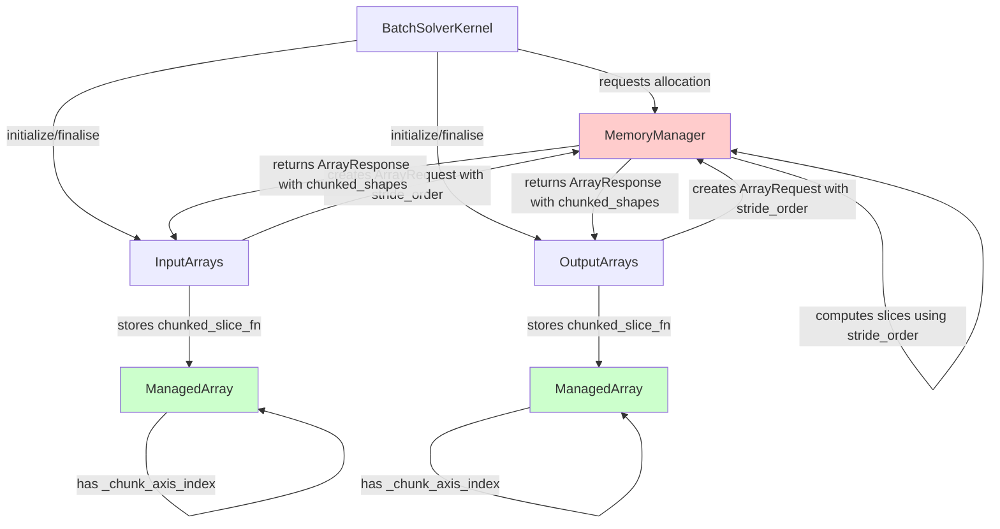
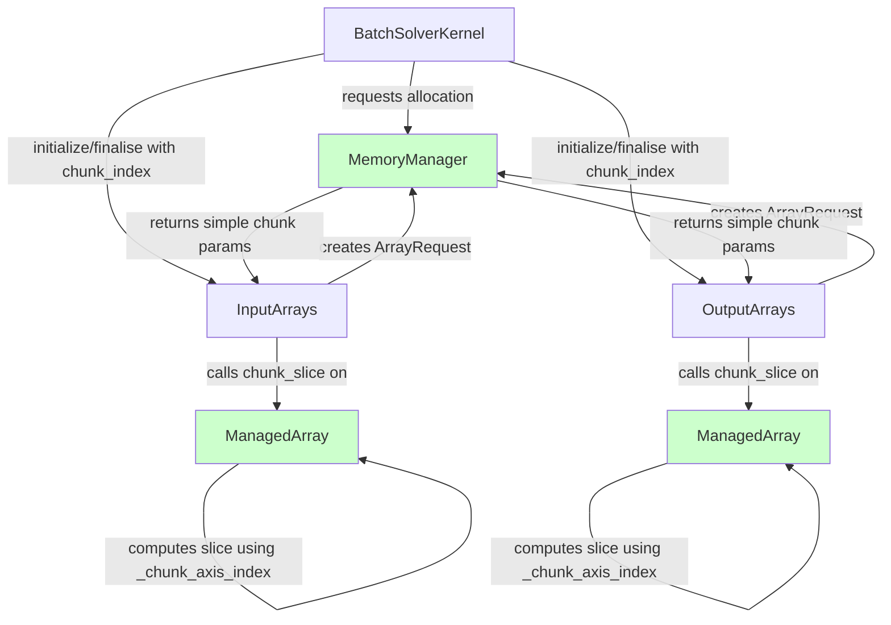

# Refactor Chunking Logic - Human Overview

## User Stories

### Story 1: Simplified Memory Manager Interface
**As a** developer maintaining the memory management system  
**I want** the memory manager to perform minimal array indexing logic  
**So that** the memory manager focuses on allocation strategy rather than array manipulation details

**Acceptance Criteria:**
- Memory manager no longer contains a `slice` function that computes per-chunk slices
- Memory manager returns simple chunking metadata (chunk size, axis length, num chunks) to callers
- Array slicing logic is delegated to ManagedArray objects that own the arrays

### Story 2: Self-Contained Array Chunking
**As a** developer working with batch arrays  
**I want** ManagedArray objects to handle their own chunking logic  
**So that** chunking behavior is localized where the array data lives

**Acceptance Criteria:**
- ManagedArray objects can generate their own per-chunk slices using stored metadata
- ManagedArray uses `_chunk_axis_index` and `chunked_slice_fn` to compute slices
- ArrayRequest no longer needs to carry `stride_order` for chunking purposes

### Story 3: Clean BatchSolverKernel Integration
**As a** developer working on the solver kernel  
**I want** BatchSolverKernel to coordinate chunking through simple run-based slices  
**So that** the integration between kernel and array managers is straightforward

**Acceptance Criteria:**
- BatchSolverKernel's `initialize`/`finalise` methods pass simple run indices or slices to array managers
- Array managers use these simple indices with their stored chunking metadata
- No complex structure passing between BatchSolverKernel and array managers

## Executive Summary

This refactoring removes array-manipulation logic from the memory manager and localizes it within the ManagedArray objects that own the data. The memory manager will focus purely on allocation strategy and return simple chunking parameters. Array managers use this metadata plus their own `_chunk_axis_index` and `chunked_slice_fn` to handle per-chunk slicing.

## Current State Architecture



**Current Problems:**
1. Memory manager performs complex array indexing logic using `stride_order` from ArrayRequest
2. ArrayRequest carries `stride_order` primarily for chunking, creating tight coupling
3. Memory manager's `compute_per_chunk_slice` function generates slice functions, duplicating logic that ManagedArray could handle
4. BatchSolverKernel receives complex chunking metadata but just passes chunk indices

## Target State Architecture



**Target Improvements:**
1. Memory manager returns simple chunking parameters (axis_length, chunk_length, num_chunks, dangling_chunk_length)
2. ArrayRequest optionally carries `stride_order` only if needed for other purposes
3. ManagedArray objects compute their own slices using `_chunk_axis_index` and simple chunk parameters
4. BatchSolverKernel passes simple chunk indices to array managers
5. Clear separation: MM handles allocation strategy, ManagedArray handles array manipulation

## Data Flow Changes

### Before: Complex Slice Function Generation
```
ArrayRequest (with stride_order) 
  → MemoryManager.compute_per_chunk_slice() 
  → generates closure capturing stride_order 
  → returns in ArrayResponse.chunked_slices
  → stored in ManagedArray.chunked_slice_fn
  → called during initialize/finalise
```

### After: Simple Parameter-Based Slicing
```
ArrayRequest (minimal metadata)
  → MemoryManager.get_chunk_parameters()
  → returns (chunk_length, num_chunks, axis_length, dangling_chunk_length)
  → stored in ArrayResponse
  → ManagedArray uses _chunk_axis_index + chunk parameters
  → computes slice on-demand during initialize/finalise
```

## Key Technical Decisions

### Decision 1: Remove `stride_order` from ArrayRequest
**Rationale:** `stride_order` is primarily used for chunking logic. Since ManagedArray already has `_chunk_axis_index`, the array knows which axis to chunk without the memory manager needing full stride information.

**Impact:** Cleaner separation of concerns, reduced coupling

**Alternative Considered:** Keep `stride_order` but mark it optional and deprecated - rejected because it perpetuates the coupling

### Decision 2: Generate Slices in ManagedArray.chunk_slice()
**Rationale:** The `chunk_slice` method already exists on ManagedArray. Expanding it to take chunk_index and compute the slice based on stored chunk parameters is a natural fit.

**Impact:** Chunking logic lives next to the data it operates on

**Alternative Considered:** Create a separate ChunkingStrategy object - rejected as over-engineering for this use case

### Decision 3: BatchSolverKernel Passes Simple Chunk Index
**Rationale:** The kernel just iterates over chunks and knows the current index. Passing complex metadata through initialize/finalise is unnecessary.

**Impact:** Clearer interface, less parameter passing

**Alternative Considered:** Pass full ChunkParams object - rejected because it contains data array managers don't need

## Integration Points with Current Architecture

### ManagedArray Changes
- Expand `_chunk_axis_index` usage beyond simple presence check
- Store chunk metadata (chunk_length, axis_length, num_chunks, dangling_chunk_length) from ArrayResponse
- Enhance `chunk_slice()` to compute slices based on chunk_index parameter

### Memory Manager Changes
- Remove or deprecate `compute_per_chunk_slice()` function
- Simplify `ArrayResponse` to contain chunk parameters instead of slice functions
- Focus `get_chunk_parameters()` on returning sizing information

### BatchSolverKernel Changes
- Store chunk parameters from allocation response
- Pass simple chunk indices to initialize/finalise
- Remove chunked_slices handling

### InputArrays/OutputArrays Changes
- Update initialize/finalise signatures to accept chunk_index
- Call ManagedArray.chunk_slice(chunk_index) instead of stored slice functions
- Store and use simple chunk parameters for slice generation

## Expected Impact

### Performance
- Minimal: Computing slices on-demand vs calling pre-generated closures has negligible overhead
- Potential minor improvement from reduced function call indirection

### Maintainability
- **High improvement**: Chunking logic concentrated in ManagedArray
- Reduced cognitive load: memory manager focuses on allocation strategy
- Clearer data flow: parameters flow one direction instead of complex closures

### Testing
- Existing chunking tests should continue to pass with minimal changes
- May need to update tests that directly inspect ArrayResponse structure
- Memory manager tests can focus on allocation strategy without slice generation

## Migration Path

1. Add chunk parameter storage to ManagedArray
2. Enhance ManagedArray.chunk_slice() to compute based on parameters
3. Update ArrayResponse to carry simple chunk parameters
4. Modify memory manager to return parameters instead of slice functions
5. Update array manager initialize/finalise to use new approach
6. Remove stride_order from ArrayRequest (or make optional with deprecation)
7. Update BatchSolverKernel integration
8. Remove deprecated slice generation code from memory manager

## References to Existing Code

- ManagedArray implementation: `src/cubie/batchsolving/arrays/BaseArrayManager.py` (lines 41-144)
- Memory manager chunking: `src/cubie/memory/mem_manager.py` (lines 1381-1436)
- ArrayRequest/ArrayResponse: `src/cubie/memory/array_requests.py`
- BatchSolverKernel integration: `src/cubie/batchsolving/BatchSolverKernel.py` (lines 615-650)
- Array manager initialize/finalise: 
  - `src/cubie/batchsolving/arrays/BatchInputArrays.py` (lines 275-332)
  - `src/cubie/batchsolving/arrays/BatchOutputArrays.py` (lines 344-416)
