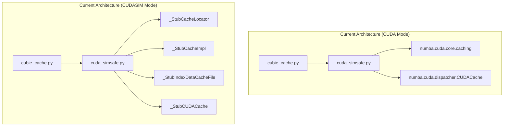
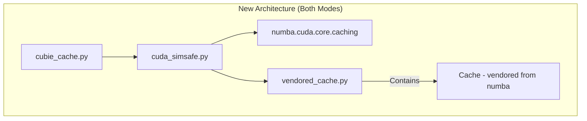
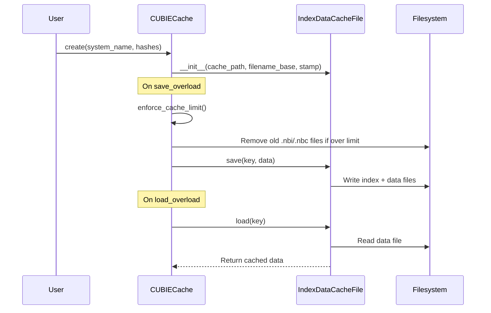

# Refactor CuBIE Caching Module for CUDASIM Compatibility

## User Stories

### User Story 1: Developer Testing Cache Logic in CI
**As a** developer running CuBIE's CI tests  
**I want** cache-related tests to execute in CUDASIM mode  
**So that** caching logic integrity is verified without requiring a GPU

**Acceptance Criteria:**
- All cache tests run in CUDASIM mode without `nocudasim` markers
- Tests that depend on actual compiled kernel files may fail gracefully
- Cache infrastructure classes (locator, impl, cache file) work in CUDASIM
- LRU eviction logic is testable in CUDASIM mode
- Flush and clear operations are testable in CUDASIM mode

### User Story 2: Clean Caching Architecture
**As a** maintainer of the CuBIE codebase  
**I want** the caching module to use numba's caching infrastructure directly  
**So that** there are no CUDASIM compatibility stubs cluttering the code

**Acceptance Criteria:**
- No `_Stub*` classes in `cuda_simsafe.py` for caching
- Caching classes imported/vendored from numba directly
- Clear separation between CuBIE's caching extensions and numba's base

---

## Executive Summary

The CuBIE caching module currently uses stub classes when running in CUDASIM mode, making caching logic untestable in CI (which runs without GPUs). The refactoring eliminates these stubs by:

1. Importing numba's `_CacheLocator`, `CacheImpl`, and `IndexDataCacheFile` directly (they work in CUDASIM mode)
2. Vendoring the `CUDACache` class (which doesn't exist in CUDASIM's simulator dispatcher)
3. Removing all `_Stub*` classes from `cuda_simsafe.py`
4. Removing `nocudasim` markers from all cache tests

---

## Architecture Diagram

---

## Data Flow

---

## Key Technical Decisions

### Decision 1: Vendor `Cache` class instead of `CUDACache`
**Rationale:** The `CUDACache` class in numba's dispatcher has a dependency on `utils.numba_target_override()` which is specific to CUDA context management. CuBIE's `CUBIECache` already overrides the critical methods and doesn't need `CUDACache` as a base - it can inherit directly from `Cache`.

### Decision 2: Import directly from numba.cuda.core.caching
**Rationale:** These classes (`_CacheLocator`, `CacheImpl`, `IndexDataCacheFile`) successfully import in CUDASIM mode. No vendoring needed.

### Decision 3: Remove `_CACHING_AVAILABLE` flag
**Rationale:** With vendoring, caching infrastructure is always available. The distinction shifts from "is caching available?" to "will compiled files actually exist?" - which is a test-level concern, not a runtime concern.

---

## Trade-offs

| Approach | Pros | Cons |
|----------|------|------|
| **Vendor Cache class** | Full control, works in CUDASIM | Must maintain vendored code if numba changes |
| **Keep stubs** | No maintenance burden | Tests can't verify caching logic in CI |
| **Mock numba classes** | Minimal code | Doesn't test real serialization paths |

**Chosen:** Vendor the `Cache` class with a dated comment, as it provides real testing with minimal maintenance burden.

---

## Expected Impact

1. **Tests:** ~12 tests marked `nocudasim` become runnable in CUDASIM mode
2. **Code Reduction:** Remove ~100 lines of stub classes from `cuda_simsafe.py`
3. **CI Coverage:** Caching logic verified on every CI run
4. **Maintenance:** One vendored file to track against numba-cuda releases

---

## References

- Reference files in `/home/runner/work/cubie/cubie/active_plans/`:
  - `numba_cuda_caching.py` - The numba-cuda caching implementation
  - `numba_cuda_dispatcher.py` - Notes on the dispatcher's caching integration
- Issue context: Caching stubs added for CUDASIM but made code convoluted
