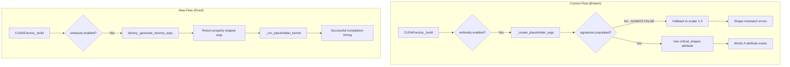
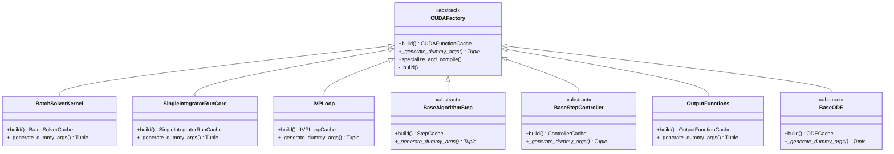

# Refactor Dummy Arguments for Compile-Time Logging

## User Stories

### US-1: Reliable Compile-Time Measurement
**As a** CuBIE developer  
**I want** compile-time logging to work correctly for all CUDAFactory subclasses  
**So that** I can measure and optimize compilation times across the library

**Acceptance Criteria:**
- Compilation timing occurs for all device functions regardless of whether signatures are pre-populated
- No errors occur when running dummy kernels for timing measurement
- Timing data is recorded correctly in the time logger when verbosity is enabled

### US-2: Consistent Dummy Argument Generation
**As a** CUDAFactory subclass author  
**I want** a clear, consistent way to define dummy arguments for my device functions  
**So that** I don't need to understand the fragile `critical_shapes`/`critical_values` attribute system

**Acceptance Criteria:**
- Each CUDAFactory subclass implements a single method to generate dummy args
- The method signature and behavior are documented in the base class
- Dummy arguments have correct shapes matching the device function signatures

### US-3: Maintainable Codebase
**As a** maintainer  
**I want** the dummy argument generation centralized in each CUDAFactory  
**So that** I don't have to hunt for `critical_shapes` attributes attached post-hoc to kernels

**Acceptance Criteria:**
- `critical_shapes` and `critical_values` attributes are removed from all device functions
- All dummy argument logic lives within the `_generate_dummy_args()` method
- No post-hoc attribute attachment on compiled device functions

---

## Overview

### Executive Summary

The current compile-time logging system in CuBIE has two bugs:
1. **Empty check failure**: The `_create_placeholder_args()` function checks `signatures=None` which is always `False` because signatures is an empty list `[]` when not populated
2. **Shape mismatch**: Default scalar arguments (1.0) don't work for device functions that expect arrays with specific shapes for indexing

The solution introduces a formal `_generate_dummy_args()` abstract method on `CUDAFactory` that each subclass must implement. This method returns properly-shaped dummy arguments that can be used to trigger compilation without causing illegal memory accesses or infinite loops.

### Data Flow

### Component Interaction

### Key Technical Decisions

1. **Abstract Method on CUDAFactory**: The `_generate_dummy_args()` method is abstract, forcing all subclasses to provide their own implementation. This ensures dummy args match the actual device function signatures.

2. **Return Type is Tuple**: The method returns a tuple of arguments matching the device function signature. For factories with multiple device functions, it returns a dict mapping function names to argument tuples.

3. **Uses compile_settings**: The method fetches sizing information from `self.compile_settings` to build correctly-shaped arrays, ensuring consistency with the actual compiled function.

4. **Host-side NumPy Arrays**: Dummy args are NumPy arrays (not device arrays) that will be transferred to device by `_run_placeholder_kernel()`. This is simpler and matches the current pattern.

5. **Deprecation of critical_shapes/critical_values**: The old attribute-based system is removed entirely. All shape/value metadata lives in the factory's `_generate_dummy_args()` method.

### Trade-offs

| Approach | Pros | Cons |
|----------|------|------|
| **Abstract method (chosen)** | Clear contract, IDE support, maintainable | Requires all subclasses to implement |
| **Optional override** | Less breaking, gradual migration | Easy to forget, silent failures |
| **Auto-inference from signature** | No code changes needed | Complex, doesn't handle shapes |

### Impact on Existing Architecture

- **CUDAFactory**: Adds one new abstract method `_generate_dummy_args()`
- **_create_placeholder_args()**: Simplified or removed; logic moves to factories
- **specialize_and_compile()**: Updated to call `_generate_dummy_args()` instead of `_create_placeholder_args()`
- **All CUDAFactory subclasses**: Must implement `_generate_dummy_args()`
- **Device functions**: No more `critical_shapes`/`critical_values` attributes

### References

- Current implementation in `CUDAFactory.py` lines 50-211 (`_create_placeholder_args`)
- Current usage of `critical_shapes` in `BatchSolverKernel.build_kernel()` lines 705-745
- Current usage of `critical_values` in `IVPLoop.build()` lines 737-766
