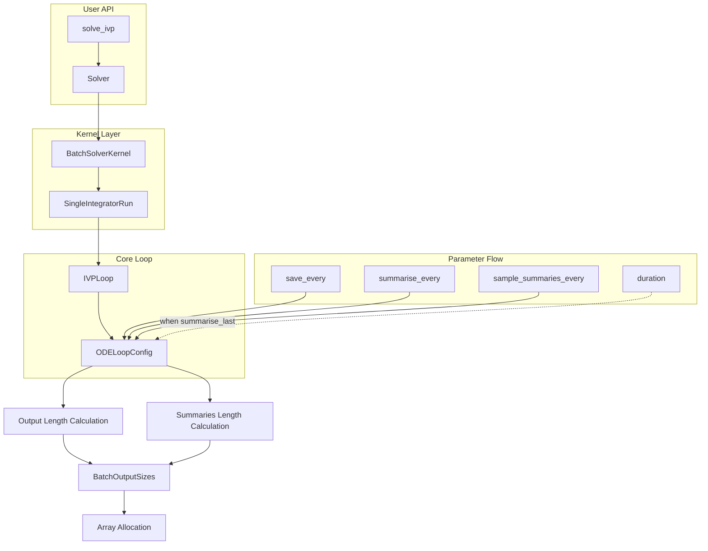

# Refactor Integrator Loop Timing Parameters

## User Stories

### US1: Explicit Save Frequency Control
**As a** solver user  
**I want** to specify `save_every=None` when I only need initial and final states  
**So that** I get minimal output without configuring periodic saves  

**Acceptance Criteria:**
- When `save_every=None` but "state" or "observables" in `output_types`: `save_last=True`, `output_length=2`
- Initial state at t=t0 and final state at t=t_end are captured
- No periodic saves occur between start and end

### US2: Summary-Only Mode with Auto Sample Rate
**As a** solver user  
**I want** to request summary metrics without specifying timing parameters  
**So that** I get reasonable default behavior for summary-only runs  

**Acceptance Criteria:**
- When `summarise_every=None` and `sample_summaries_every=None` but summary metrics requested: `summarise_last=True`
- `samples_per_summary` defaults to `duration/100` when duration available
- `output_summaries_length=2` (initial and final summary)
- Warning raised that `sample_summaries_every` was auto-calculated and recompile will occur on duration change

### US3: Periodic Summary with Auto Sample Rate
**As a** solver user  
**I want** to specify `summarise_every` without `sample_summaries_every`  
**So that** I get reasonable sampling within each summary period  

**Acceptance Criteria:**
- `sample_summaries_every` defaults to `summarise_every / 10`
- Output length calculated as `floor(duration/summarise_every)`

### US4: Full Periodic Save Control
**As a** solver user  
**I want** to specify `save_every` explicitly  
**So that** output length is calculated based on my specification  

**Acceptance Criteria:**
- `output_length` calculated as before (floor + 1 for initial)
- Behavior unchanged from current implementation

### US5: Save/Summarise Last Increments Output Length
**As a** solver user  
**I want** the `save_last` or `summarise_last` flags to correctly size output buffers  
**So that** final values are captured without buffer overflow  

**Acceptance Criteria:**
- `save_last=True` adds 1 to existing output length
- `summarise_last=True` adds 1 to existing summaries length
- When no outputs active, output length = 1 (initial value only)
- Already accounted for in `output_length=2` cases above

### US6: None-Safe Array Sizing
**As a** solver kernel implementer  
**I want** all array sizing logic to handle `None` timing parameters safely  
**So that** BatchSolverKernel operates correctly in all modes  

**Acceptance Criteria:**
- `output_length`, `summaries_length` properties handle None values
- Array allocation code receives valid sizes for all parameter combinations
- No division by zero or None-type errors

### US7: Parameter Reset on New Solve
**As a** solver user  
**I want** parameters to recalculate from defaults on each new solve  
**So that** derived values don't persist incorrectly across runs  

**Acceptance Criteria:**
- If `sample_summaries_every` was derived on run 1, providing `None` on run 2 recalculates it
- Parameter reset flows through `update()` methods from solver to loop config
- Uses common update machinery with minimal special-case code

### US8: Duration Dependency Warning
**As a** solver user  
**I want** to be warned when auto-calculated timing creates duration dependency  
**So that** I understand why recompilation occurs  

**Acceptance Criteria:**
- Warning when `summarise_last=True` with no `summarise_every` and duration used to calculate `samples_per_summary`
- Warning recommends setting `summarise_every` explicitly
- Duration propagation handled cleanly at solver kernel level

---

## Executive Summary

This refactor completes the timing parameter reorganization in CuBIE's integrator loop system. The goal is to separate the frequency of:
1. **Saving** state/observable outputs (`save_every`)
2. **Accumulating** summary metrics (`sample_summaries_every`)
3. **Finalizing** summary metrics to output buffers (`summarise_every`)

The IVPLoop function is already refactored. This plan addresses the higher-level parameter initialization and propagation from `solve_ivp()` down through `Solver`, `BatchSolverKernel`, `SingleIntegratorRun`, and `ODELoopConfig`.

---

## Architecture Overview



---

## Data Flow for Timing Parameters

```mermaid
sequenceDiagram
    participant User
    participant Solver
    participant Kernel as BatchSolverKernel
    participant SIR as SingleIntegratorRun
    participant Loop as IVPLoop
    participant Config as ODELoopConfig

    User->>Solver: solve(save_every=None, summarise_every=0.1)
    Solver->>Kernel: update(timing_params)
    Kernel->>SIR: update(timing_params)
    SIR->>Loop: update(timing_params)
    Loop->>Config: __init__ or update
    
    Config->>Config: __attrs_post_init__()
    Note over Config: Infer missing values<br/>Set flags (save_last, summarise_last)<br/>Validate relationships
    
    Config-->>Loop: Configured timing
    Loop-->>Kernel: output_length, summaries_length
    Kernel->>Kernel: Allocate arrays
```

---

## Key Technical Decisions

### 1. Inference Logic Location
All timing parameter inference happens in `ODELoopConfig.__attrs_post_init__()`. This centralizes the logic and ensures it runs both at initialization and after updates.

### 2. None Value Propagation
`None` values are preserved through the update chain and handled at the config level. This allows the config to distinguish between "not specified" and "explicitly set to some value".

### 3. Output Length Calculation
The `output_length` and `summaries_length` properties on `BatchSolverKernel` must become None-safe, checking `save_last`/`summarise_last` flags and returning appropriate lengths.

### 4. Duration Dependency
When `summarise_last=True` without `summarise_every`, `samples_per_summary` depends on `duration`. This dependency is:
- Documented via warning at solver level
- Handled by propagating duration through `kernel.run()`
- Triggers recompile if duration changes

---

## Trade-offs Considered

| Option | Pros | Cons | Decision |
|--------|------|------|----------|
| Infer timing in Solver | Early detection of issues | Duplicates logic across layers | Rejected |
| Infer timing in Config | Single source of truth | Must handle None carefully | **Chosen** |
| Add explicit "mode" parameter | Clear intent | Breaking change, verbose | Rejected |
| Auto-set from duration always | Simpler logic | Unexpected recompiles | Rejected (warning instead) |

---

## Constraint: Summary Metrics Code Excluded

Per the issue constraint, this refactor does **not** modify summary metrics implementation code. The changes affect only:
- Timing parameter handling
- Array sizing logic
- Update propagation machinery
- Warning generation

---

## References

- Current ODELoopConfig: `src/cubie/integrators/loops/ode_loop_config.py`
- IVPLoop (already refactored): `src/cubie/integrators/loops/ode_loop.py`
- BatchSolverKernel: `src/cubie/batchsolving/BatchSolverKernel.py`
- Solver: `src/cubie/batchsolving/solver.py`
