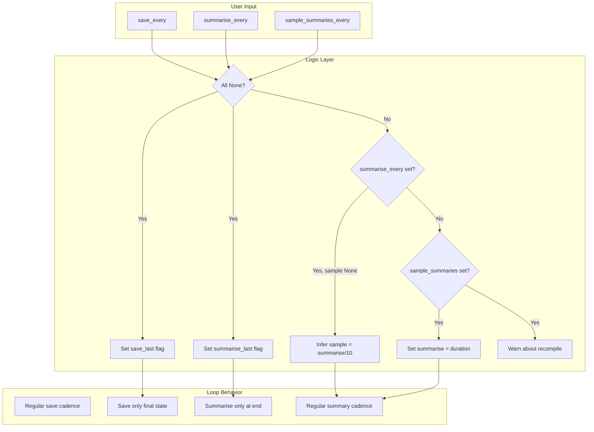
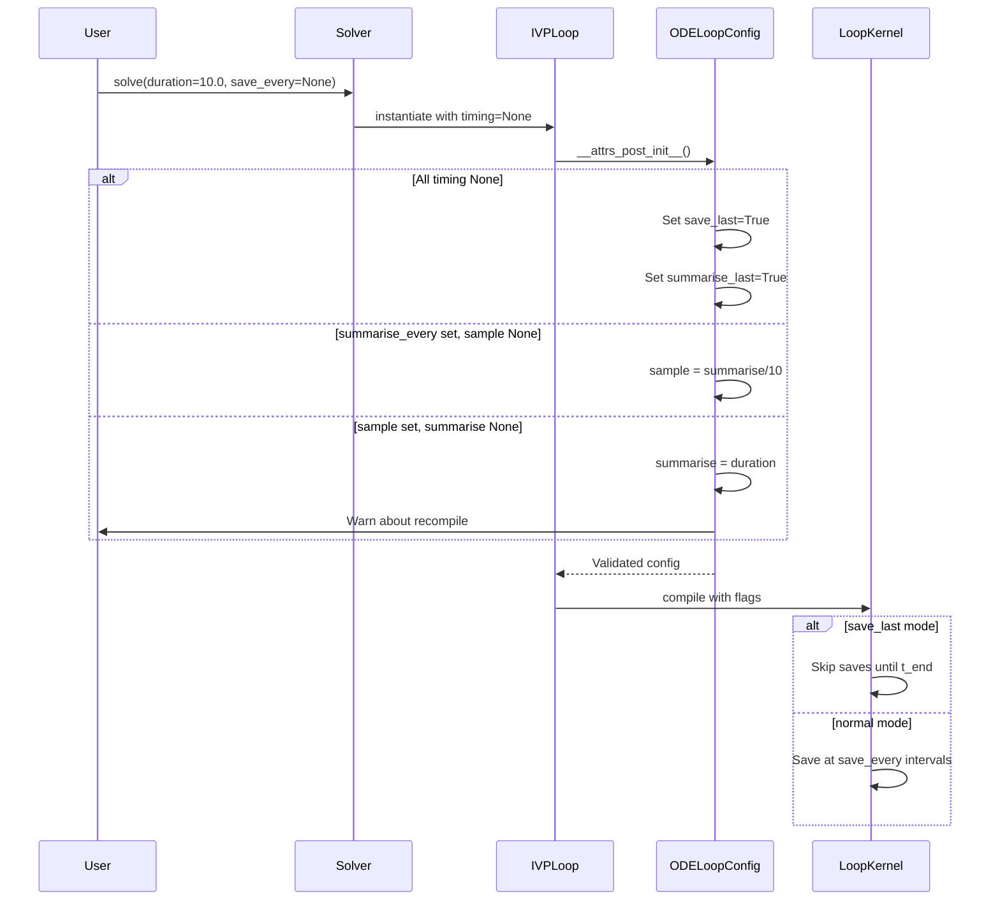

# Refactor Loop Timing Parameters

## User Stories

### US-1: Rename Timing Parameters for Clarity
**As a** CuBIE user  
**I want** timing parameter names that clearly describe their function  
**So that** I can configure save and summary intervals without confusion

**Acceptance Criteria:**
- `save_every` replaces `dt_save` as the primary parameter name
- `summarise_every` replaces `dt_summarise` as the primary parameter name
- `sample_summaries_every` replaces `dt_update_summaries` as the primary parameter name
- Old parameter names are completely removed (no backward compatibility)
- All user-facing API documentation uses the new names

### US-2: Optional Timing Parameters with Smart Defaults
**As a** CuBIE user  
**I want** all timing parameters to be optional with None defaults  
**So that** I can run simulations without specifying every timing detail

**Acceptance Criteria:**
- All three timing parameters (`save_every`, `summarise_every`, `sample_summaries_every`) default to `None`
- When all three are `None`, a `save_last` flag is set that saves only the final state
- When all three are `None`, a `summarise_last` flag is set that computes summaries only at run end
- No validation errors are raised when individual parameters are `None`

### US-3: Intelligent Summary Timing Inference
**As a** CuBIE user  
**I want** the system to infer missing summary timing parameters  
**So that** I can configure summaries with minimal specification

**Acceptance Criteria:**
- If `sample_summaries_every` is `None` and `summarise_every` is set:
  - `sample_summaries_every` defaults to `summarise_every / 10`
- If `summarise_every` is `None` and `sample_summaries_every` is set:
  - `summarise_every` defaults to `duration` (set at kernel start)
  - A warning is issued about potential recompilation overhead
- If both summary parameters are `None` but `save_every` is set:
  - `summarise_last` flag is set
  - `summarise_every` defaults to `duration / 10`
  - A warning advises setting explicit `summarise_every` to avoid recompilation

### US-4: Duration-Dependent Recompile Warning
**As a** CuBIE user  
**I want** clear warnings when my configuration causes recompilation  
**So that** I can optimize my workflow for repeated runs with different durations

**Acceptance Criteria:**
- When `summarise_every` must be set from `duration`, a warning is issued
- Warning message explains that changing `duration` will force kernel recompilation
- Warning suggests setting an explicit `summarise_every` to avoid this overhead

---

## Executive Summary

This feature refactors CuBIE's loop timing parameter system with three main goals:

1. **Rename parameters** for clarity: `dt_save` → `save_every`, `dt_summarise` → `summarise_every`, `dt_update_summaries` → `sample_summaries_every`

2. **Make all timing parameters optional** with `None` defaults, implementing smart inference logic

3. **Add `save_last` and `summarise_last` modes** that only capture data at the end of integration runs

## Architecture Overview

## Data Flow

## Key Technical Decisions

### 1. Remove Backward Compatibility
Per the requirements, old parameter names (`dt_save`, `dt_summarise`, `dt_update_summaries`) will be **completely removed**. This is a breaking change by design.

**Files affected:**
- `src/cubie/integrators/loops/ode_loop_config.py` - Remove deprecated fields
- `src/cubie/integrators/loops/ode_loop.py` - Remove deprecated parameters and properties
- `src/cubie/batchsolving/solver.py` - Remove deprecated aliases
- `src/cubie/outputhandling/output_config.py` - Update dt_save to save_every
- `src/cubie/outputhandling/output_functions.py` - Update parameter set

### 2. Save/Summarise Last Flags
New boolean flags `save_last` and `summarise_last` control end-of-run-only behavior:
- When `save_last=True`, the loop skips intermediate saves and only records the final state
- When `summarise_last=True`, summary accumulation happens only at the final timestep
- These flags are set when ALL timing parameters are `None`

### 3. Duration-Dependent Warning
When `summarise_every` must be derived from `duration`:
- Issue a `UserWarning` at configuration time
- Warning text: "Summarising only at the end forces kernel recompilation when duration changes. Set an explicit summarise_every to avoid this overhead."

### 4. Validation Updates
The existing validation for `sample_summaries_every` dividing `summarise_every` remains, but:
- Validation is skipped when `summarise_last=True` (no sampling cadence needed)
- New validation ensures `save_last` and `summarise_last` are consistent

## Trade-offs Considered

| Option | Pros | Cons | Decision |
|--------|------|------|----------|
| Keep backward compat | Less disruption | Bloated API, confusing | ❌ Rejected |
| Hard error on all-None | Forces explicit config | Poor UX for simple runs | ❌ Rejected |
| Smart defaults with flags | Flexible, clear behavior | More logic to implement | ✅ Chosen |

## Impact on Existing Architecture

1. **ODELoopConfig** - Primary changes to timing parameter handling
2. **IVPLoop** - Build method needs save_last/summarise_last branch logic
3. **OutputFunctions** - Update parameter name from dt_save
4. **Solver** - Remove deprecated property aliases
5. **Test Files** - Update all timing parameter references

## Research Findings

### Current Implementation
- Timing parameters already renamed with backward compatibility stubs
- `__attrs_post_init__` handles None inference but with defaults, not flags
- `save_last` variable exists in loop but is hardcoded to `False`
- Tests exist for current None-handling logic

### Required Changes
- Remove all deprecated parameter names and backward compatibility
- Implement `save_last` and `summarise_last` as config attributes
- Wire flags through to loop kernel behavior
- Add duration-dependent recompile warnings
- Update all tests to use new parameter names only
