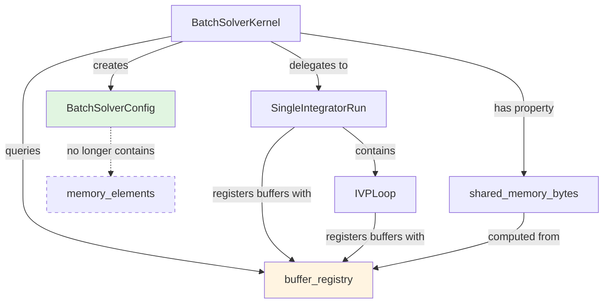
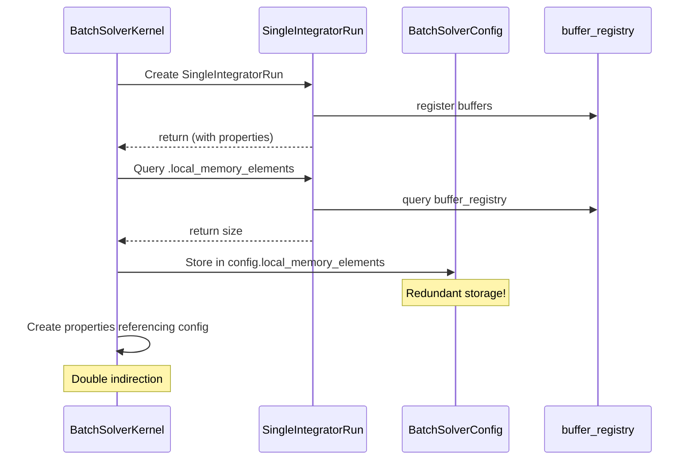
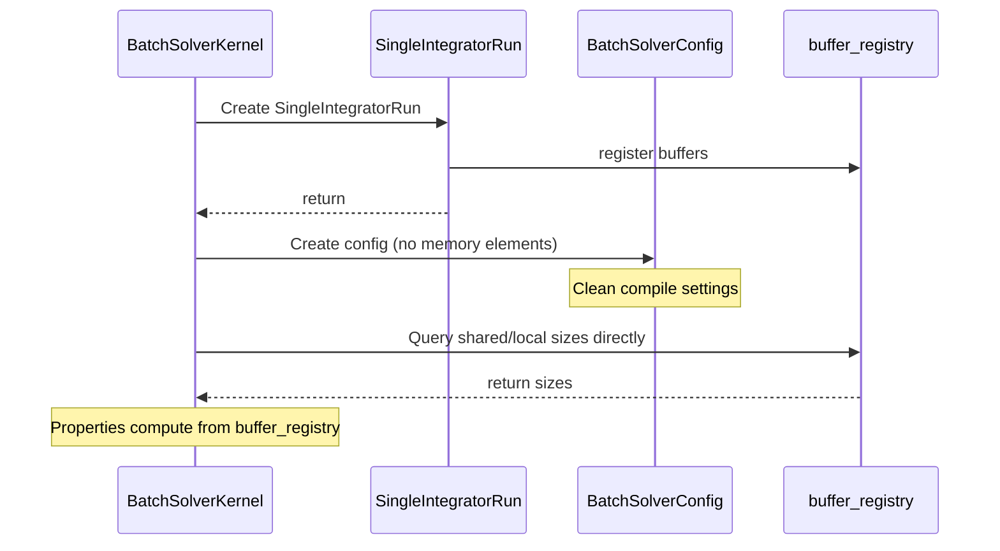

# Refactor Memory Allocation Patterns - Human Overview

## User Stories

### User Story 1: Consistent Memory Allocation Pattern
**As a** developer working on CuBIE's memory management
**I want** all CUDAFactory subclasses to use the buffer_registry pattern for memory allocation
**So that** memory sizing logic is centralized and maintainable

**Acceptance Criteria:**
- BatchSolverKernel uses buffer_registry.get_child_allocators() to obtain child buffer sizes
- BatchSolverKernel no longer stores memory size elements in its compile settings
- Memory allocation logic is consistent between CUDAFactory and BatchSolverKernel
- All memory sizing queries go through buffer_registry

### User Story 2: Configuration Cleanup
**As a** user of the batch solver API
**I want** BatchSolverConfig to only contain true compile-time settings
**So that** the configuration is simpler and memory management is handled transparently

**Acceptance Criteria:**
- BatchSolverConfig does not have local_memory_elements or shared_memory_elements fields
- SingleIntegratorRun does not expose custom properties for loop memory sizes
- Memory size computations are encapsulated in BatchSolverKernel methods

### User Story 3: Buffer Registry Enhancement
**As a** maintainer of the buffer registry system
**I want** buffer_registry to support any additional metadata needed by BatchSolverKernel
**So that** the centralized pattern works for all use cases

**Acceptance Criteria:**
- buffer_registry can accommodate padding requirements (if needed as separate metadata)
- BatchSolverKernel.update() refreshes buffer_registry state
- Shared memory bytes calculation is a BatchSolverKernel property using buffer_registry data

## Executive Summary

This refactoring aligns BatchSolverKernel with the existing buffer_registry pattern used throughout CuBIE's CUDAFactory subclasses. Currently, BatchSolverKernel stores memory allocation sizes in its compile settings (BatchSolverConfig), and SingleIntegratorRun exposes custom properties for memory allocation. This is inconsistent with the established pattern where CUDAFactory subclasses query buffer_registry for child buffer sizes.

The refactoring moves memory size tracking from compile settings into runtime properties and methods that query buffer_registry, simplifying the configuration surface and centralizing memory management logic.

## Architecture Overview



## Current State vs. Desired State

### Current Anti-Pattern



### Desired Pattern



## Key Technical Decisions

### Decision 1: Remove Memory Elements from BatchSolverConfig

**Rationale:** BatchSolverConfig should only contain true compile-time settings that affect kernel code generation. Memory allocation sizes are runtime metadata that change when the SingleIntegratorRun is updated. Storing them in compile settings creates unnecessary cache invalidations and violates single-source-of-truth.

**Impact:** 
- Simplifies BatchSolverConfig attrs class
- Eliminates redundant memory size tracking
- Cache invalidations only occur for true compile-time changes

### Decision 2: Compute shared_memory_bytes as a Property

**Rationale:** Following the established pattern in SingleIntegratorRun, shared_memory_bytes should be a computed property that queries buffer_registry for the current state, rather than a stored value.

**Impact:**
- Ensures memory size queries always reflect current buffer_registry state
- Eliminates sync issues between config and buffer_registry
- Consistent with existing SingleIntegratorRun pattern

### Decision 3: Update buffer_registry in BatchSolverKernel.update()

**Rationale:** When BatchSolverKernel configuration changes via update(), it delegates to SingleIntegratorRun.update(), which may re-register buffers. BatchSolverKernel should also participate in the buffer_registry update pattern to recognize location parameters.

**Impact:**
- Enables runtime buffer location changes
- Follows the established update pattern from CUDAFactory
- Maintains consistency across the update chain

### Decision 4: Handle Padding Metadata Separately

**Rationale:** The "padding" calculation in BatchSolverKernel (lines 556-557) is specific to the kernel launch and not a buffer property. It should remain a computed value based on precision and alignment requirements.

**Impact:**
- buffer_registry does not need modification for padding
- Padding logic stays in BatchSolverKernel where it's used
- Cleaner separation of concerns

## Data Flow Changes

### Before: Memory Size Flow
```
IVPLoop.register_buffers() 
  → buffer_registry 
  → SingleIntegratorRun.shared_memory_elements property
  → BatchSolverKernel stores in config.shared_memory_elements
  → BatchSolverKernel.shared_memory_elements property reads from config
  → BatchSolverKernel.shared_memory_bytes property reads from config
```

### After: Memory Size Flow
```
IVPLoop.register_buffers() 
  → buffer_registry
  → BatchSolverKernel.shared_memory_elements property queries buffer_registry
  → BatchSolverKernel.shared_memory_bytes property computes from buffer_registry
```

## Expected Integration Points

1. **BatchSolverConfig** - Remove local_memory_elements and shared_memory_elements fields
2. **BatchSolverKernel.__init__()** - Remove memory elements from initial_config creation
3. **BatchSolverKernel.update()** - Remove memory elements from updates_dict
4. **BatchSolverKernel properties** - Change from config access to buffer_registry queries
5. **SingleIntegratorRun properties** - May need adjustment if currently serving BatchSolverKernel

## References to Existing Patterns

- **buffer_registry.get_child_allocators()**: See `src/cubie/buffer_registry.py` lines 830-906
- **CUDAFactory buffer pattern**: See `.github/context/cubie_internal_structure.md` lines 60-191
- **SingleIntegratorRun memory properties**: See `src/cubie/integrators/SingleIntegratorRun.py` lines 59-80

## Trade-offs and Alternatives Considered

### Alternative 1: Keep memory sizes in config, remove from buffer_registry
**Rejected because:** This moves away from the centralized buffer_registry pattern that's already established. It would create inconsistency and make memory management harder to reason about.

### Alternative 2: Store sizes in both config and buffer_registry
**Rejected because:** Violates DRY principle and creates sync issues. The current anti-pattern demonstrates the problems with redundant storage.

### Alternative 3: Make buffer_registry store padding requirements
**Rejected because:** Padding is a kernel-launch-specific concern based on GPU architecture, not a buffer property. It depends on precision and alignment but isn't intrinsic to any single buffer.

## Expected Impact on Existing Architecture

### Minimal Breaking Changes
- Internal refactoring only; public API unchanged
- BatchSolverKernel properties still exist with same names
- Behavior is identical from user perspective

### Improved Maintainability
- Single source of truth for memory sizes
- Clearer separation between compile-time and runtime concerns
- Easier to trace memory allocation logic

### Better Consistency
- BatchSolverKernel aligns with established CUDAFactory patterns
- Reduced cognitive load for developers familiar with buffer_registry
