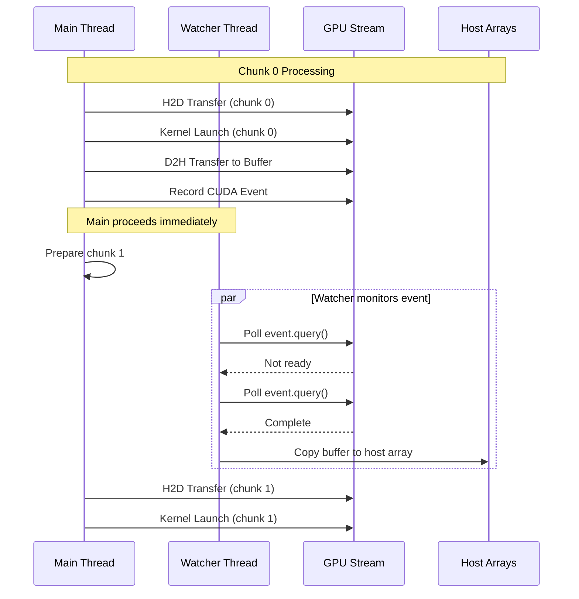

# Refactor Pinned Memory Usage in Chunking System

## User Stories

### US-1: Efficient Pinned Memory for Non-Chunked Arrays
**As a** CuBIE user with small-to-medium batch sizes,  
**I want** host arrays to use pinned memory for async transfers,  
**So that** I can benefit from fast async I/O without explicit memory management.

**Acceptance Criteria:**
- Arrays under chunking threshold use `'pinned'` memory type
- Async write/read operations work correctly on pinned memory
- Total pinned memory is bounded by GPU VRAM

### US-2: Memory-Efficient Chunked Array Processing
**As a** CuBIE user with large batch sizes exceeding GPU VRAM,  
**I want** chunked arrays to use regular numpy arrays with per-chunk pinned buffers,  
**So that** total pinned memory is limited to one chunk's worth (≤ GPU VRAM).

**Acceptance Criteria:**
- Host arrays for chunked operations use `'host'` memory type (regular numpy)
- Per-chunk pinned buffers are allocated for async transfers
- Buffers are reused across chunks where possible
- Total pinned memory never exceeds GPU VRAM

### US-3: Non-Blocking Chunk Execution Pipeline
**As a** CuBIE user running large batch integrations,  
**I want** the main thread to continue preparing the next chunk while waiting for writeback,  
**So that** I achieve optimal GPU utilization without blocking on sync_stream.

**Acceptance Criteria:**
- CUDA events are used for synchronization instead of `sync_stream`
- A watcher mechanism polls event completion without blocking main thread
- Main thread can proceed to next chunk write immediately after kernel launch
- Data integrity is maintained (no reads before write completion)

### US-4: Preserve Async I/O Functionality
**As a** CuBIE developer,  
**I want** the refactored system to maintain all existing async capabilities,  
**So that** no regression occurs in transfer performance.

**Acceptance Criteria:**
- H2D and D2H transfers remain asynchronous
- Chunked execution maintains overlap of compute and transfer
- All existing tests pass after refactoring

---

## Executive Summary

The current chunking system allocates pinned memory for all host arrays regardless of whether chunking is active. This leads to excessive pinned memory usage—pinned memory for the full batch is allocated even when only one chunk's worth is needed at a time. Additionally, the deferred writeback scheme relies on `sync_stream`, which blocks the main thread.

This refactor introduces a **two-tier memory strategy**:
1. **Non-chunked mode**: Use pinned host arrays directly (current behavior, efficient for small batches)
2. **Chunked mode**: Use regular numpy host arrays with per-chunk pinned staging buffers

For synchronization, replace `sync_stream` with **CUDA event polling** and a **watcher thread** that monitors event completion and triggers writeback without blocking the main thread.

---

## Architectural Overview

```mermaid
flowchart TD
    subgraph Current["Current Architecture"]
        A1[Host Arrays] --> |"pinned memory"| B1[Device Arrays]
        B1 --> |"sync_stream"| C1[Writeback]
        C1 --> |"blocks main thread"| D1[Next Chunk]
    end
    
    subgraph Proposed["Proposed Architecture"]
        A2[Host Arrays<br/>numpy or pinned] --> |"conditional"| S{Chunked?}
        S --> |No| P2[Pinned Array]
        S --> |Yes| N2[Numpy Array]
        N2 --> |"per-chunk"| BUF[Pinned Buffer Pool]
        P2 --> D2[Device Array]
        BUF --> D2
        D2 --> |"CUDA event"| E2[Event Recorded]
        E2 --> |"watcher polls"| W2[Watcher Thread]
        W2 --> |"event complete"| WB[Writeback to Host]
        D2 --> |"main thread continues"| NEXT[Next Chunk]
    end
```

---

## Data Flow Diagram

---

## Key Technical Decisions

### 1. Two-Tier Memory Strategy
- **Rationale**: Pinned memory is faster but limited. By using pinned only when not chunking (arrays already ≤ VRAM) or in bounded per-chunk buffers, we cap total pinned usage.
- **Trade-off**: Slight overhead copying between numpy and pinned buffer in chunked mode, but this is offset by not exhausting pinned memory.

### 2. CUDA Event-Based Synchronization
- **Rationale**: `sync_stream` blocks the calling thread. CUDA events can be queried (`event.query()`) without blocking.
- **Trade-off**: Requires a polling mechanism, adds complexity.

### 3. Watcher Thread Pattern
- **Rationale**: A dedicated thread can poll events and trigger writebacks without impeding main thread progress.
- **Trade-off**: Thread management complexity, but Python's threading is sufficient for this I/O-bound task.

### 4. Buffer Pool for Chunks
- **Rationale**: Reusing buffers across chunks reduces allocation overhead.
- **Trade-off**: Must carefully manage buffer lifecycle to avoid data races.

---

## Research Findings

### Numba CUDA Events
From `cubie/time_logger.py`, the project already uses `numba.cuda.event()`:
- `cuda.event()` creates an event
- `event.record(stream)` records on stream
- `cuda.event_elapsed_time(start, end)` measures duration
- Events have a `.query()` method returning True when complete

### Current Deferred Writeback
In `BatchOutputArrays.finalise()`:
1. Creates temporary pinned buffers for each chunk slice
2. Copies device data to pinned buffer asynchronously
3. Stores `(host_array, slice, buffer)` tuple for later
4. `complete_writeback()` copies buffer to host array after sync

### Current sync_stream Usage
- `BatchSolverKernel.run()` calls `sync_stream` after all chunks complete
- `Solver.solve()` calls `sync_stream` again
- Must be replaced with event-based completion

---

## Expected Impact on Existing Architecture

### Files to Modify
1. **`memory/mem_manager.py`**: Add method to determine if chunking is active
2. **`batchsolving/arrays/BaseArrayManager.py`**: Conditional memory type selection
3. **`batchsolving/arrays/BatchInputArrays.py`**: Per-chunk pinned buffer logic
4. **`batchsolving/arrays/BatchOutputArrays.py`**: Event-based writeback with watcher
5. **`batchsolving/BatchSolverKernel.py`**: Replace `sync_stream` with event completion
6. **`batchsolving/solver.py`**: Remove blocking sync, use event-based wait

### New Components
1. **WritebackWatcher**: Thread class managing async writeback completion
2. **ChunkBuffer**: Reusable pinned buffer for chunk staging
3. **EventCompletionManager**: Coordinate events and their callbacks

### Backward Compatibility
- Non-chunked operation unchanged (pinned arrays still used)
- API unchanged (Solver.solve() signature identical)
- Performance should improve for large batches
