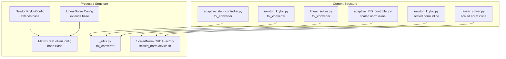
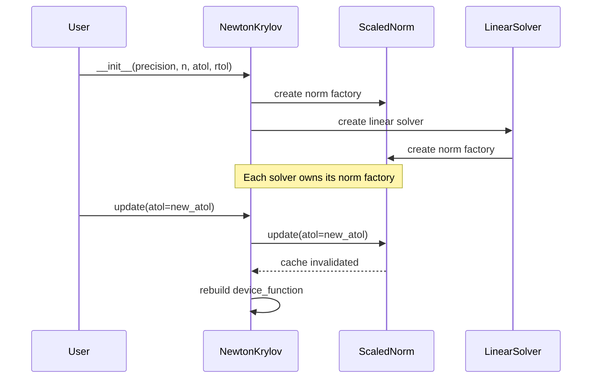

# Refactoring Scaled Tolerance in Newton and Krylov Solvers

## User Stories

### Story 1: Unified Tolerance Conversion
**As a** CuBIE developer  
**I want** a single, shared `tol_converter` function in `_utils.py`  
**So that** tolerance conversion logic is maintained in one location rather than duplicated across step controllers and nonlinear solvers.

**Acceptance Criteria:**
- [ ] `tol_converter` exists in `cubie._utils`
- [ ] Both `adaptive_step_controller.py` and the matrix-free solvers import from `_utils`
- [ ] The function maintains identical behavior to existing implementations
- [ ] All existing tests pass without modification

### Story 2: MatrixFreeSolver Base Class
**As a** CuBIE developer  
**I want** a `MatrixFreeSolver` base class with shared configuration  
**So that** common solver settings (like `max_iters`) are not duplicated across `LinearSolver` and `NewtonKrylov`.

**Acceptance Criteria:**
- [ ] `MatrixFreeSolverConfig` base attrs class exists with common fields
- [ ] `LinearSolver` and `NewtonKrylov` configs inherit from this base
- [ ] Shared configuration is centralized, reducing duplication
- [ ] The interface for creating solvers remains backward-compatible

### Story 3: Norms CUDAFactory for Scaled Norm Computation
**As a** CuBIE developer  
**I want** a `ScaledNorm` CUDAFactory subclass that builds a `scaled_norm` device function  
**So that** the duplicated scaled norm computation logic across solvers is extracted into a reusable, configurable component.

**Acceptance Criteria:**
- [ ] `ScaledNorm` CUDAFactory exists in `integrators/` (new module)
- [ ] The factory builds a `scaled_norm` CUDA device function
- [ ] Both `LinearSolver` and `NewtonKrylov` own norm factory instances
- [ ] The norm logic matches the adaptive PID controller pattern
- [ ] Instrumented test versions are updated to match

---

## Executive Summary

This refactoring addresses maintainability issues in the CuBIE nonlinear solvers by:

1. **Extracting `tol_converter`** from duplicated locations into `cubie._utils`
2. **Creating a `MatrixFreeSolver` base class** hierarchy with `MatrixFreeSolverConfig`
3. **Building a `ScaledNorm` CUDAFactory** that compiles the scaled norm device function

The goal is to eliminate code duplication and establish consistent patterns aligned with existing CuBIE architecture (step controllers, algorithm factories).

---

## Architecture Overview

## Data Flow: Solver with Norm Factory

## Key Technical Decisions

### 1. tol_converter Placement
- Move to `cubie._utils` alongside other shared utilities
- Use the generic signature that works with any config having `n` and `precision`
- Import in: `adaptive_step_controller.py`, `linear_solver.py`, `newton_krylov.py`

### 2. MatrixFreeSolverConfig Base Class
- Contains fields: `precision`, `n`, `max_iters` (renamed from `max_newton_iters`/`max_linear_iters`)
- Does NOT contain `atol`/`rtol` - those belong to the norm factory
- Placed in new file: `integrators/matrix_free_solvers/base_solver.py`

### 3. ScaledNorm CUDAFactory Pattern
- Located in new file: `integrators/norms.py`
- Config class: `ScaledNormConfig` with `precision`, `n`, `atol`, `rtol`
- Builds `scaled_norm(values, reference_values) -> norm²` device function
- Follows step controller CUDAFactory pattern (see `base_step_controller.py`)

## Trade-offs Considered

| Approach | Pros | Cons | Decision |
|----------|------|------|----------|
| Inline norm in solvers | No new classes | Duplication, harder maintenance | ❌ |
| Shared norm function (not factory) | Simple | Can't customize at compile time | ❌ |
| Norm CUDAFactory per solver | Full control, matches patterns | More classes | ✅ |

## Impact on Existing Architecture

- **Low risk**: All changes are internal refactoring
- **No public API changes**: User-facing interfaces unchanged
- **Instrumented tests**: Must update `tests/integrators/algorithms/instrumented/matrix_free_solvers.py`
- **Step controllers**: Import path for `tol_converter` changes

## References

- Existing pattern: `integrators/step_control/base_step_controller.py`
- Adaptive controller scaled norm: `integrators/step_control/adaptive_PID_controller.py`
- CUDAFactory base: `src/cubie/CUDAFactory.py`
