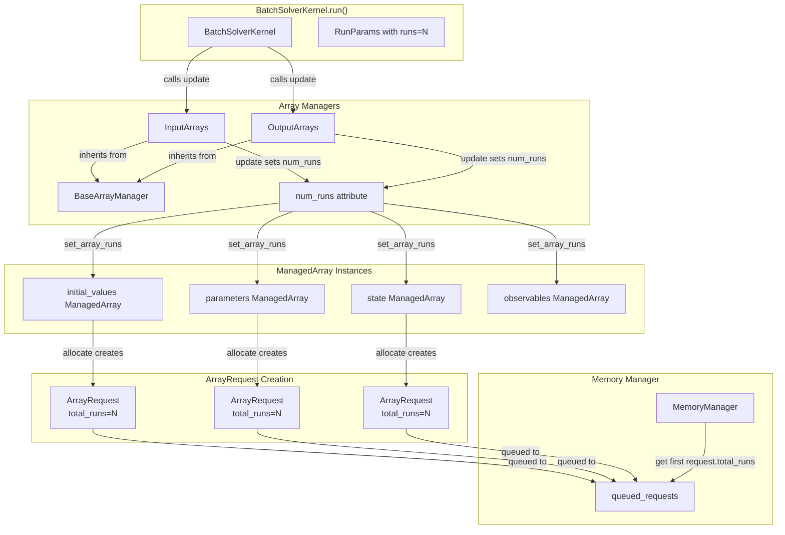
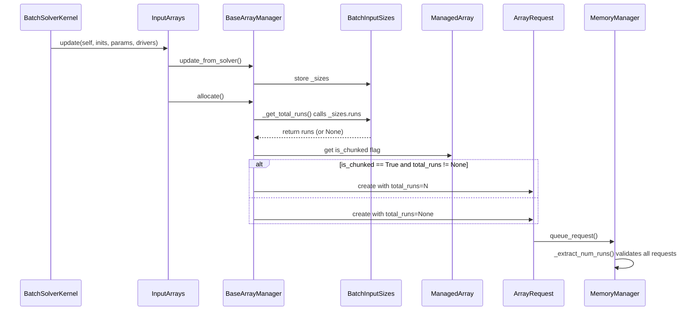
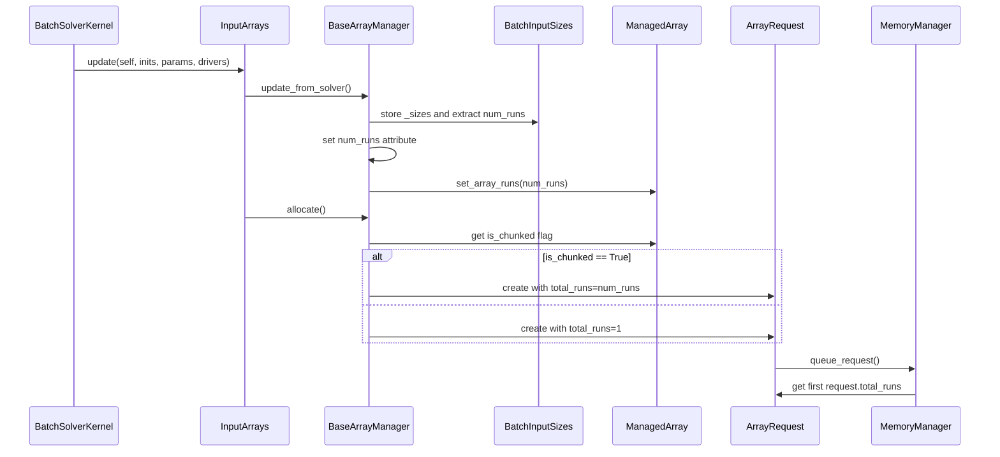

# Refactor total_runs Architecture - Human Overview

## User Stories

### Story 1: Simplified num_runs Tracking
**As a** CuBIE developer  
**I want** num_runs to be an internal attribute on BaseArrayManager  
**So that** the architecture is simpler and doesn't rely on extracting run counts from sizing objects  
**Acceptance Criteria:**
- BaseArrayManager has a `num_runs` attribute that is set during the `update()` method
- The `num_runs` value is propagated to all ManagedArray instances via a `set_array_runs()` method
- The `_get_total_runs()` helper method is removed as it's no longer needed
- All array managers correctly track num_runs internally

### Story 2: Always-Valid ArrayRequest.total_runs
**As a** memory manager  
**I want** ArrayRequest.total_runs to always be a valid integer >= 1  
**So that** I can reliably determine chunking parameters without conditional logic  
**Acceptance Criteria:**
- ArrayRequest.total_runs defaults to 1 (not None)
- ArrayRequest.total_runs type is always `int`, never Optional[int]
- ArrayRequest.total_runs validator enforces >= 1 constraint
- total_runs is always provided when creating ArrayRequest objects

### Story 3: Simplified Memory Manager Run Extraction
**As a** memory manager  
**I want** to get total_runs from the first ArrayRequest  
**So that** I don't need complex extraction logic that validates consistency  
**Acceptance Criteria:**
- `_extract_num_runs()` method is removed from MemoryManager
- Memory manager gets total_runs directly from first request in queued_requests
- All requests have the same total_runs value (enforced by array managers)
- No validation of consistency needed (guaranteed by architecture)

### Story 4: Remove Unnecessary runs Properties
**As a** developer  
**I want** to remove the runs properties from BatchInputSizes and BatchOutputSizes  
**So that** we don't have fragile index-based access to shape tuples  
**Acceptance Criteria:**
- `BatchInputSizes.runs` property is removed
- `BatchOutputSizes.runs` property is removed
- Tests for these properties are removed
- Code that used these properties now gets num_runs from BaseArrayManager

### Story 5: Fix Test API Mismatches
**As a** developer  
**I want** tests to match the actual API  
**So that** tests validate the real behavior rather than incorrect assumptions  
**Acceptance Criteria:**
- chunk_slice tests use host slice instead of full host array
- Negative chunk_index tests validate range instead of non-negative
- No tests for axis 0 chunking (this was an incorrect assumption)
- Tests don't try to modify read-only queue_request
- No skip conditions in deterministic tests
- Tests use correct attribute names (state, num_parameters)

## Executive Summary

This refactoring simplifies the total_runs/num_runs architecture based on detailed code review feedback. The changes eliminate complex helper methods, make ArrayRequest.total_runs always valid, and establish BaseArrayManager.num_runs as the single source of truth for run tracking within array managers.

The key insight is that num_runs should be an internal state managed by BaseArrayManager and propagated to ManagedArray instances, rather than being extracted from sizing objects on-demand. This eliminates the need for the `_get_total_runs()` helper and conditional logic in `allocate()`.

## Architecture Overview

## Data Flow

### Current (Before Refactoring)

### New (After Refactoring)

## Key Technical Decisions

### 1. num_runs as BaseArrayManager Attribute
**Decision:** Add `num_runs` attribute to BaseArrayManager, set during `update()` method  
**Rationale:** 
- Centralizes run tracking in the manager
- Eliminates need for repeated property access to sizing objects
- Makes the value available throughout manager lifetime
- Simplifies logic by having a single source of truth

**Trade-offs:**
- Adds state to BaseArrayManager
- Must be updated when solver configuration changes
- **Chosen because:** The benefit of simplicity outweighs the cost of additional state

### 2. ArrayRequest.total_runs Always int >= 1
**Decision:** Change total_runs from Optional[int] to int with default=1  
**Rationale:**
- Every array has a run dimension, even if it's 1
- Eliminates None checks throughout codebase
- Makes chunking logic unconditional
- Default of 1 is correct for unchunkable arrays

**Trade-offs:**
- Can't distinguish "not set" from "set to 1"
- **Chosen because:** Semantic meaning is clearer - total_runs=1 means "this array has 1 run worth of data"

### 3. Remove _extract_num_runs Complexity
**Decision:** Replace complex validation with simple first-request access  
**Rationale:**
- All requests from same manager have same total_runs (guaranteed by architecture)
- Validation is redundant if managers do their job correctly
- Simpler code is easier to understand and maintain

**Trade-offs:**
- No runtime validation of consistency
- **Chosen because:** Validation belongs in the managers, not memory manager

### 4. Remove runs Properties from Sizing Classes
**Decision:** Delete BatchInputSizes.runs and BatchOutputSizes.runs properties  
**Rationale:**
- Fixed index access is fragile and unsafe
- num_runs is now available directly from managers
- Properties were only added to support _get_total_runs pattern
- Removing reduces API surface and potential confusion

**Trade-offs:**
- External code can't get runs from sizing objects
- **Chosen because:** Sizing objects should describe shapes, not provide convenience accessors

## Expected Impact

### Code Simplification
- **BaseArrayManager:** Remove `_get_total_runs()`, add `num_runs` attribute and `set_array_runs()` method
- **MemoryManager:** Remove `_extract_num_runs()`, simplify `allocate_queue()`
- **ArrayRequest:** Change total_runs type from Optional[int] to int
- **Sizing Classes:** Remove runs properties

### Test Changes
- Remove 5 tests for deleted functionality
- Fix 6+ tests for API changes
- Update assertions to use correct attributes
- Remove skip conditions in deterministic tests

### Behavioral Changes
- ArrayRequest.total_runs now always has a value (minimum 1)
- Memory manager assumes first request has valid total_runs
- ManagedArray instances track their total_runs value
- BaseArrayManager update() now also updates num_runs

## Integration Points

### BatchSolverKernel.run()
- Calls `input_arrays.update()` and `output_arrays.update()`
- These calls trigger `update_from_solver()` in BaseArrayManager subclasses
- Must ensure num_runs is set before allocate() is called

### BaseArrayManager.update_from_solver()
- Must extract num_runs from sizing metadata
- Must call `set_array_runs()` to propagate to ManagedArray instances
- Called by both InputArrays and OutputArrays

### Memory Manager Chunking
- Relies on ArrayRequest.total_runs to compute chunks
- Gets total_runs from first request in queue
- Must work with both chunked (total_runs=N) and unchunked (total_runs=1) requests

## Risk Mitigation

### Risk: Breaking Existing Functionality
**Mitigation:** Run full test suite after each change, fix tests to match new API

### Risk: Inconsistent num_runs Values
**Mitigation:** Set num_runs in single location (update_from_solver), propagate via set_array_runs()

### Risk: Default total_runs=1 Incorrect
**Mitigation:** Validate that default=1 is semantically correct for unchunkable arrays

### Risk: Test Failures Due to API Changes
**Mitigation:** Update tests systematically, following reviewer's guidance on correct behavior

## References

- Review comments from PR review (comments 2695851260 through 2695868093)
- `.github/context/cubie_internal_structure.md` - CuBIE architecture documentation
- Existing implementations in `BaseArrayManager.py`, `array_requests.py`, `mem_manager.py`
