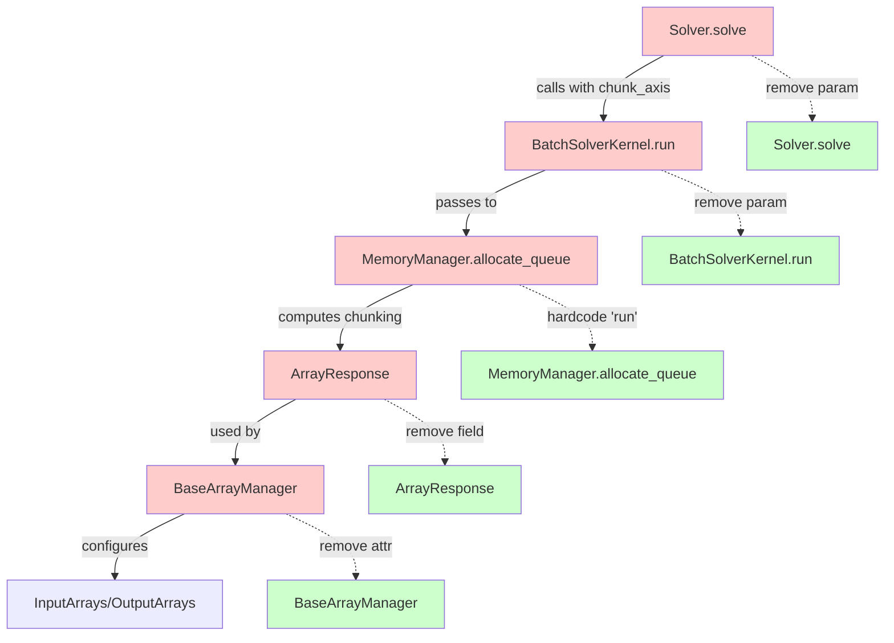
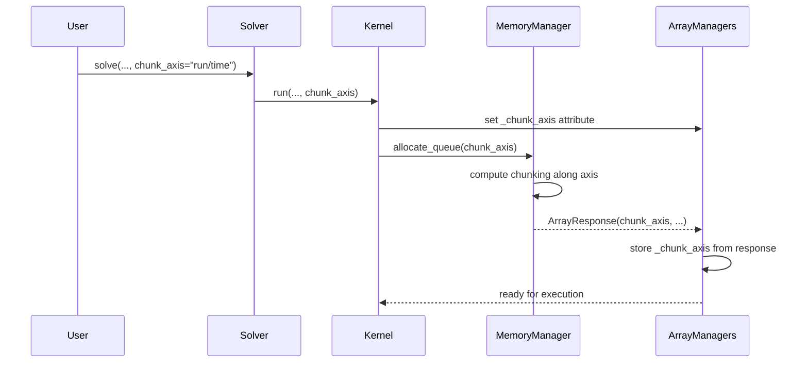
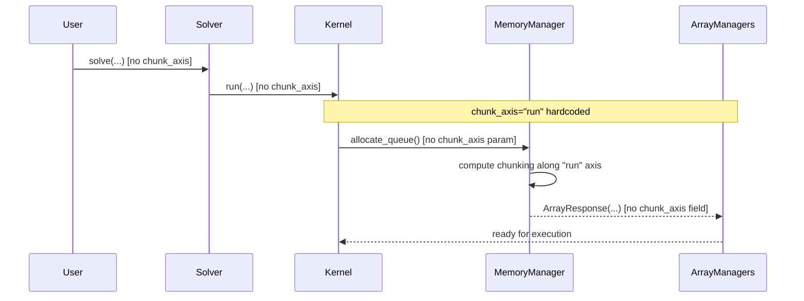

# Remove Chunk Axis Feature - Human Overview

## User Stories

### US-1: Remove Selectable Chunk Axis
**As a** CuBIE maintainer  
**I want** to remove the chunk_axis parameter and all associated logic  
**So that** the codebase is simpler and maintains only the supported run-axis chunking

**Acceptance Criteria:**
- [ ] `chunk_axis` parameter removed from all public APIs (Solver.solve(), solve_ivp(), etc.)
- [ ] `chunk_axis` attribute removed from BatchSolverKernel, BaseArrayManager, and InputArrays/OutputArrays
- [ ] `chunk_axis` field removed from ArrayResponse and related data structures
- [ ] `chunk_axis` parameter removed from MemoryManager.allocate_queue() and related methods
- [ ] All references to time-axis chunking removed from source code
- [ ] No grep matches for "chunk_axis" in src/ directory (except in removal commits/comments)
- [ ] Run-axis chunking continues to work correctly

### US-2: Remove Chunk Axis Tests
**As a** CuBIE maintainer  
**I want** to remove all tests that verify different chunk axis behaviors  
**So that** the test suite only covers supported functionality

**Acceptance Criteria:**
- [ ] `test_chunking.py` updated to remove chunk_axis parametrization
- [ ] All `@pytest.mark.parametrize("chunk_axis", ["run", "time"])` decorators removed
- [ ] Tests that specifically verify time-axis chunking removed
- [ ] chunk_axis fixture removed from conftest.py
- [ ] chunk_axis parameter removed from all test helper functions
- [ ] All tests pass with CUDASIM enabled: `pytest -m "not nocudasim and not cupy"`
- [ ] Full test suite passes with CUDA

### US-3: Clean Documentation
**As a** CuBIE user  
**I want** documentation to reflect that chunking only occurs along the run axis  
**So that** I understand the system's actual capabilities

**Acceptance Criteria:**
- [ ] Docstrings updated to remove references to selectable chunk_axis
- [ ] Parameter documentation for chunk_axis removed from all functions
- [ ] Class/module docstrings updated to describe run-axis-only chunking
- [ ] No misleading references to "time" or "variable" axis chunking remain

## Executive Summary

This task removes the **selectable chunk axis** feature from CuBIE, hardcoding chunking to occur only along the **run axis**. The feature was initially designed to support chunking along time or variable axes, but implementation complexities (particularly with summary arrays having incommensurate lengths to save arrays) make this impractical. The use case for non-run-axis chunking is extremely limited.

**Impact:** This is a **breaking change** with no backward compatibility. Users who explicitly pass `chunk_axis="time"` will receive errors. However, the default behavior (`chunk_axis="run"`) remains unchanged in functionality.

## Architecture Overview

## Data Flow - Current State

## Data Flow - Target State

## Key Technical Decisions

### Decision 1: Hardcode vs. Remove Chunking Logic
- **Decision:** Hardcode `chunk_axis = "run"` rather than removing chunking entirely
- **Rationale:** Run-axis chunking is essential for memory management when batch size exceeds GPU memory
- **Impact:** Chunking logic remains, but axis selection removed

### Decision 2: No Backward Compatibility
- **Decision:** Breaking change with no deprecated parameter handling
- **Rationale:** Feature is rarely used (if ever) for non-run axes; clean removal preferred
- **Impact:** Users with `chunk_axis="time"` will get TypeError (unexpected keyword argument)

### Decision 3: Remove _chunk_axis Attributes Entirely
- **Decision:** Don't keep private attributes for validation
- **Rationale:** Hardcoded value needs no storage or validation
- **Impact:** Simplifies array manager and kernel code

## Files Requiring Changes

### Source Code (5 files)
1. **src/cubie/batchsolving/solver.py** - Remove chunk_axis parameter from solve(), property
2. **src/cubie/batchsolving/BatchSolverKernel.py** - Remove chunk_axis parameter, property, attribute, FullRunParams field
3. **src/cubie/batchsolving/arrays/BaseArrayManager.py** - Remove _chunk_axis attribute and validator
4. **src/cubie/memory/mem_manager.py** - Remove chunk_axis parameter from allocate_queue(), get_chunk_parameters(), related functions
5. **src/cubie/memory/array_requests.py** - Remove chunk_axis field from ArrayResponse

### Test Code (9 files)
1. **tests/batchsolving/arrays/conftest.py** - Remove chunk_axis fixture and all references
2. **tests/batchsolving/arrays/test_chunking.py** - Remove chunk_axis parametrization
3. **tests/batchsolving/arrays/test_basearraymanager.py** - Remove chunk_axis parameters from all calls
4. **tests/batchsolving/arrays/test_batchinputarrays.py** - Remove chunk_axis from test calls
5. **tests/batchsolving/arrays/test_batchoutputarrays.py** - Remove chunk_axis from test calls
6. **tests/batchsolving/test_solver.py** - Remove chunk_axis from solve calls
7. **tests/batchsolving/test_config_plumbing.py** - Remove chunk_axis references
8. **tests/memory/test_memmgmt.py** - Remove chunk_axis from allocate_queue calls
9. **tests/memory/test_array_requests.py** - Remove chunk_axis from ArrayResponse creation

## Expected Impact

### Positive Changes
- **Reduced complexity:** ~167 lines referencing chunk_axis removed
- **Clearer architecture:** No confusion about which axes support chunking
- **Simpler testing:** Fewer parametrized test combinations
- **Maintenance:** Easier to reason about memory management

### Risk Mitigation
- **Testing strategy:** Run full CUDASIM suite before final review
- **Verification:** grep for "chunk_axis" should return zero matches in src/
- **Functional validation:** Existing chunking tests (run-axis only) must pass

## Research Findings

### Issue Analysis
- No open GitHub issues specifically requesting time-axis chunking
- Feature appears unused based on code archaeology
- Complexity stems from save vs. summary array length mismatches

### Alternative Approaches Considered
1. **Fix time-axis chunking** - Rejected: High complexity, low value
2. **Keep as deprecated parameter** - Rejected: Increases code surface area
3. **Make chunk_axis internal constant** - Selected approach

### Integration Points
- **MemoryManager:** Central orchestrator for chunked allocations
- **ArrayManagers:** Store per-chunk metadata and perform transfers
- **BatchSolverKernel:** Coordinates chunk iteration and parameter updates
- **ChunkParams:** Calculates per-chunk duration, t0, warmup (time-axis logic can be removed)

## Trade-offs

| Approach | Pros | Cons |
|----------|------|------|
| **Remove entirely (selected)** | Clean codebase, no confusion | Breaking change |
| **Deprecate with warning** | Gradual migration | Maintains dead code |
| **Fix time-chunking** | Feature completeness | High effort, low ROI |

## Verification Strategy

1. **Static verification:** `grep -r "chunk_axis" src/` returns empty
2. **CUDASIM tests:** Full suite passes without CUDA
3. **Integration tests:** Chunking behavior validated for memory-limited scenarios
4. **Property tests:** Kernel properties (chunks, chunk_axis) either removed or hardcoded

---
*Plan created for removal of selectable chunk_axis feature, preserving run-axis-only chunking*
