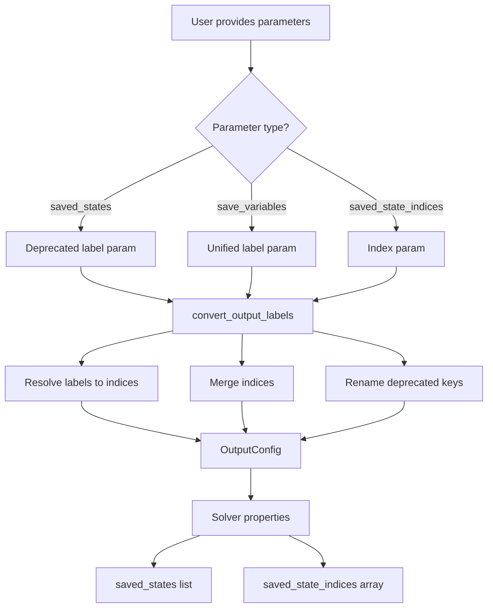
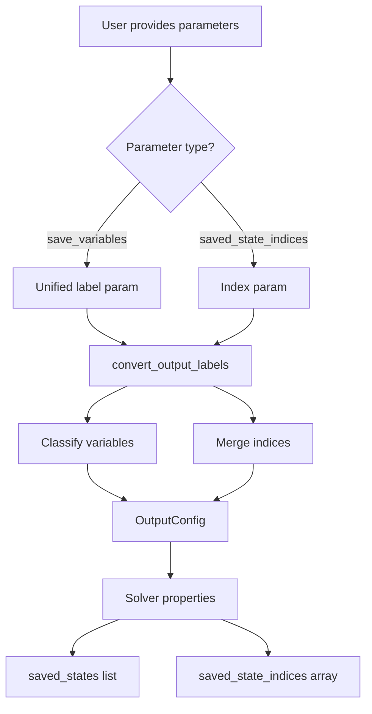

# Remove Deprecated Label Parameters - Human Overview

## User Stories

### Story 1: Clean Parameter Interface
**As a** CuBIE developer  
**I want** to remove deprecated label-based parameters (`saved_states`, `saved_observables`, `summarised_states`, `summarised_observables`)  
**So that** the codebase is cleaner and easier to maintain without backward compatibility clutter

**Acceptance Criteria:**
- [ ] Deprecated parameters removed from `ALL_OUTPUT_FUNCTION_PARAMETERS` constant
- [ ] Deprecated parameters removed from `convert_output_labels()` method logic
- [ ] Properties exposing label lists (`saved_states`, `saved_observables`, `summarised_states`, `summarised_observables`) retained in Solver for runtime access
- [ ] All tests using deprecated parameters updated to new interface
- [ ] Net reduction in lines of code achieved
- [ ] Breaking change is intentional and documented

### Story 2: Unified Variable Selection
**As a** CuBIE user  
**I want** to use `save_variables` and `summarise_variables` parameters  
**So that** I can specify which variables to track using a single, unified interface

**Acceptance Criteria:**
- [ ] `save_variables` parameter works as explicit argument
- [ ] `summarise_variables` parameter works as explicit argument
- [ ] Variables are automatically classified into states/observables
- [ ] Index-based kwargs (`saved_state_indices`, etc.) continue to work
- [ ] Documentation reflects the new unified interface

### Story 3: Preserved Label Access
**As a** CuBIE user  
**I want** to access variable labels via solver properties  
**So that** I can inspect which variables are being saved/summarised without knowing their indices

**Acceptance Criteria:**
- [ ] `solver.saved_states` property returns list of state labels
- [ ] `solver.saved_observables` property returns list of observable labels
- [ ] `solver.summarised_states` property returns list of state labels
- [ ] `solver.summarised_observables` property returns list of observable labels
- [ ] Properties work correctly after solver initialization and updates
- [ ] SolveSpec continues to expose these label lists

## Executive Summary

This plan removes backward-compatibility code for deprecated label-based parameters while preserving the unified `save_variables`/`summarise_variables` interface and read-only access to variable labels.

The change simplifies configuration by removing four deprecated parameter names that duplicated functionality now provided by the unified parameters. The cleanup reduces code complexity in the `convert_output_labels()` method and eliminates confusion about which parameters to use.

## Key Technical Decisions

### What Gets Removed

**Deprecated input parameters (removed completely):**
- `saved_states` - list of state names to save
- `saved_observables` - list of observable names to save
- `summarised_states` - list of state names to summarise
- `summarised_observables` - list of observable names to summarise

These four parameters are:
1. Removed from `ALL_OUTPUT_FUNCTION_PARAMETERS` constant
2. Removed from `convert_output_labels()` resolver dictionaries
3. No longer accepted as constructor/update arguments

### What Gets Kept

**Unified label parameters (kept as explicit arguments):**
- `save_variables` - list of variable names (auto-classified)
- `summarise_variables` - list of variable names (auto-classified)

**Index parameters (kept as kwargs):**
- `saved_state_indices` - array of state indices
- `saved_observable_indices` - array of observable indices
- `summarised_state_indices` - array of state indices
- `summarised_observable_indices` - array of observable indices

**Read-only properties (kept for runtime access):**
- `solver.saved_states` - property returning state labels
- `solver.saved_observables` - property returning observable labels
- `solver.summarised_states` - property returning state labels
- `solver.summarised_observables` - property returning observable labels
- `SolveSpec.saved_states`, etc. - attrs fields with label lists

## Data Flow Changes

### Before (Current State)



### After (Simplified)



## Architecture Impact

### Files Modified

1. **`src/cubie/outputhandling/output_functions.py`**
   - Remove deprecated params from `ALL_OUTPUT_FUNCTION_PARAMETERS`

2. **`src/cubie/batchsolving/solver.py`**
   - Simplify `convert_output_labels()` method
   - Remove resolver entries for deprecated params
   - Remove `labels2index_keys` dictionary
   - Remove key renaming loop
   - **Keep** `saved_states`, `saved_observables`, `summarised_states`, `summarised_observables` properties

3. **`src/cubie/batchsolving/solveresult.py`**
   - **Keep** `saved_states`, `saved_observables`, `summarised_states`, `summarised_observables` fields in SolveSpec
   - No changes needed (fields populated from solver properties)

4. **Tests**
   - Update all tests using deprecated parameters
   - Convert to `save_variables`/`summarise_variables` or index-based params

### No Changes Needed

- `OutputConfig` class - already works with indices only
- `OutputFunctions` class - already works with indices only
- Solver properties - kept for label access
- SolveSpec attrs fields - kept for result metadata

## Breaking Changes

This is an **intentional breaking change**:

- Users relying on `saved_states`, `saved_observables`, `summarised_states`, `summarised_observables` as **input parameters** must migrate to:
  - `save_variables` / `summarise_variables` (recommended)
  - `saved_state_indices` / etc. (for advanced usage)

- The **properties** with these names remain available for reading labels

## Migration Path

**Old code:**
```python
solver = Solver(
    system,
    saved_states=["x", "y"],
    saved_observables=["output"],
    summarised_states=["x"],
)
```

**New code (Option 1 - Recommended):**
```python
solver = Solver(
    system,
    save_variables=["x", "y", "output"],
    summarise_variables=["x"],
)
```

**New code (Option 2 - Advanced):**
```python
solver = Solver(
    system,
    saved_state_indices=[0, 1],
    saved_observable_indices=[0],
    summarised_state_indices=[0],
)
```

**Reading labels (unchanged):**
```python
# These properties still work
print(solver.saved_states)           # ["x", "y"]
print(solver.saved_observables)      # ["output"]
print(solver.summarised_states)      # ["x"]
```

## Expected Outcomes

1. **Code Reduction:**
   - Remove ~30 lines from `convert_output_labels()`
   - Remove 4 entries from `ALL_OUTPUT_FUNCTION_PARAMETERS`
   - Simpler method logic (no key renaming)

2. **Improved Clarity:**
   - Single source of truth for unified parameters
   - Clear separation: unified params for input, properties for output
   - Less confusion about which parameters to use

3. **Maintained Functionality:**
   - Label access still available via properties
   - Index-based parameters unchanged
   - Unified parameters work identically
   - Variable classification logic preserved
