# Remove Duplicated Work in FIRK Device Functions

## User Stories

### User Story 1: Eliminate Redundant Stage State Reconstruction
**As a** CuBIE library developer  
**I want to** eliminate the post-Newton-solve stage state reconstruction loop  
**So that** the FIRK step function executes more efficiently without redundant computations  

**Acceptance Criteria:**
- [ ] The FIRK step function no longer reconstructs `Y_i = y_n + Σ a_ij * u_j` after Newton convergence for the purpose of output/error accumulation
- [ ] The stage increment buffer is used directly for accumulation without needing stage state reconstruction
- [ ] Output values remain numerically identical to the current implementation
- [ ] Error values remain numerically identical to the current implementation

### User Story 2: Remove Redundant Function Evaluations in Accumulation Path
**As a** CuBIE library developer  
**I want to** eliminate unnecessary `dxdt_fn()` and `observables_function()` calls in the post-solve accumulation path  
**So that** the FIRK step avoids re-evaluating functions whose results are already encoded in stage_increment  

**Acceptance Criteria:**
- [ ] When `accumulates_output` is True, no `dxdt_fn()` evaluations are performed inside the post-solve stage loop
- [ ] When `accumulates_error` is True, no `dxdt_fn()` evaluations are performed inside the post-solve stage loop
- [ ] The `observables_function()` is not called inside the post-solve stage loop when only accumulating output/error
- [ ] FSAL caching behavior is preserved (if any final-stage state is needed for FSAL, it's still computed)

### User Story 3: Update Accumulation Formulas to Use Stage Increments Directly
**As a** CuBIE library developer  
**I want to** update the output and error accumulation formulas to use `stage_increment` directly  
**So that** the mathematical equivalence `u_i = h * k_i` is properly leveraged  

**Acceptance Criteria:**
- [ ] Output accumulation uses `proposed_state = state + Σ b_i * stage_increment[i]` (no dt_scalar multiplication)
- [ ] Error accumulation uses `error = Σ d_i * stage_increment[i]` (no dt_scalar multiplication)
- [ ] Existing tests continue to pass with identical numerical results
- [ ] Stiffly-accurate optimizations (`b_matches_a_row`, `b_hat_matches_a_row`) continue to work correctly

### User Story 4: Synchronize All Three FIRK Implementations
**As a** CuBIE library developer  
**I want to** apply the same optimization to all three FIRK step implementations  
**So that** the production code, instrumented test version, and all-in-one test version remain consistent  

**Acceptance Criteria:**
- [ ] `src/cubie/integrators/algorithms/generic_firk.py` is updated
- [ ] `tests/integrators/algorithms/instrumented/generic_firk.py` is updated identically (except instrumentation)
- [ ] `tests/all_in_one.py` `firk_step_inline_factory` is updated consistently

---

## Executive Summary

This change eliminates redundant computations in the FIRK (Fully Implicit Runge-Kutta) step device function by leveraging the mathematical property that at Newton convergence, the stage increment buffer contains `u_i = h * k_i` where `k_i = f(Y_i)`.

### Key Insight

The Newton-Krylov solver solves the nonlinear system:
```
residual[i] = M * u - h * f(t + c_i*h, y_n + Σ a_ij * u_j) = 0
```

At convergence (with M = I):
- `u_i = h * f(Y_i) = h * k_i`

Therefore the Runge-Kutta update formulas:
- `y_{n+1} = y_n + h * Σ b_i * k_i = y_n + Σ b_i * u_i`
- `error = h * Σ d_i * k_i = Σ d_i * u_i`

can use `stage_increment` directly **without** multiplying by `dt_scalar` again.

---

## Data Flow Diagram

```mermaid
flowchart TD
    subgraph Current["Current Implementation (Redundant)"]
        A[Newton Solve] --> B[stage_increment contains u_i = h*k_i]
        B --> C[Loop: Reconstruct Y_i from state + Σ a_ij*u_j]
        C --> D[Call observables_function&#40;Y_i&#41;]
        D --> E[Call dxdt_fn&#40;Y_i&#41; → stage_rhs_flat]
        E --> F[Accumulate: proposed_state = state + dt*Σ b_i*stage_rhs_flat]
    end

    subgraph Optimized["Optimized Implementation"]
        G[Newton Solve] --> H[stage_increment contains u_i = h*k_i]
        H --> I[Accumulate: proposed_state = state + Σ b_i*stage_increment]
    end

    style Current fill:#ffcccc
    style Optimized fill:#ccffcc
```



---

## Technical Changes Overview

### 1. Remove Post-Solve Stage Loop (lines 764-821 in generic_firk.py)

The current code loops through all stages after Newton solve to:
1. Reconstruct stage states `Y_i`
2. Call `observables_function(Y_i, ...)`
3. Call `dxdt_fn(Y_i, ..., stage_rhs_flat)`

This is entirely redundant when `accumulates_output` or `accumulates_error` is True because:
- The stage increments already contain `h * f(Y_i)`
- We can accumulate directly from `stage_increment`

### 2. Simplify Accumulation Formulas

**Current (lines 826-846):**
```python
# Uses stage_rhs_flat (which required dxdt_fn calls)
for idx in range(n):
    for stage_idx in range(stage_count):
        rhs_value = stage_rhs_flat[stage_idx * n + idx]
        solution_acc += solution_weights[stage_idx] * rhs_value
    proposed_state[idx] = state[idx] + solution_acc * dt_scalar
```

**Optimized:**
```python
# Uses stage_increment directly (already contains h*k_i)
for idx in range(n):
    for stage_idx in range(stage_count):
        inc_value = stage_increment[stage_idx * n + idx]
        solution_acc += solution_weights[stage_idx] * inc_value
    proposed_state[idx] = state[idx] + solution_acc  # No dt_scalar!
```

### 3. Preserve Stiffly-Accurate Path

The stiffly-accurate optimization (`b_matches_a_row` not None) still needs to:
1. Reconstruct the final stage state `Y_s` 
2. Set `proposed_state = Y_s` directly

This path is preserved since it's a compile-time branch that avoids the accumulation path entirely.

---

## Integration Points

| Component | Impact |
|-----------|--------|
| `FIRKStep.step` device function | Modified accumulation logic |
| `newton_krylov_solver_factory` | No changes (solver behavior unchanged) |
| `n_stage_residual_factory` | No changes (residual definition unchanged) |
| `FIRKTableau` properties | No changes (b_matches_a_row, accumulates_output unchanged) |
| FSAL caching | Verify no regression (final stage may still be needed) |

---

## Trade-offs and Alternatives

### Alternative 1: Keep Stage Loop, Skip Only dxdt_fn
Could keep the stage loop but skip the dxdt_fn calls. Rejected because:
- Still incurs loop overhead
- observables_function calls would still be redundant

### Alternative 2: Conditional Compilation
Could use compile-time conditionals to generate different code paths. Current approach already does this via `accumulates_output` and `accumulates_error` booleans captured in closure.

### Chosen Approach
Complete elimination of the redundant stage loop when accumulation is needed, using stage_increment directly. This provides maximum benefit with minimal risk.

---

## Expected Impact

1. **Reduced Computation**: Eliminates s×n `dxdt_fn` evaluations per step (where s = stage count, n = state dimension)
2. **Reduced Memory Reads**: No longer needs to reconstruct stage states for accumulation
3. **Simpler Code**: Fewer nested loops, clearer intent
4. **No Breaking Changes**: Numerical results should be bitwise identical
