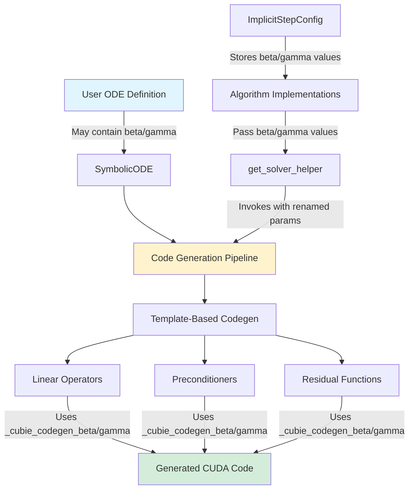
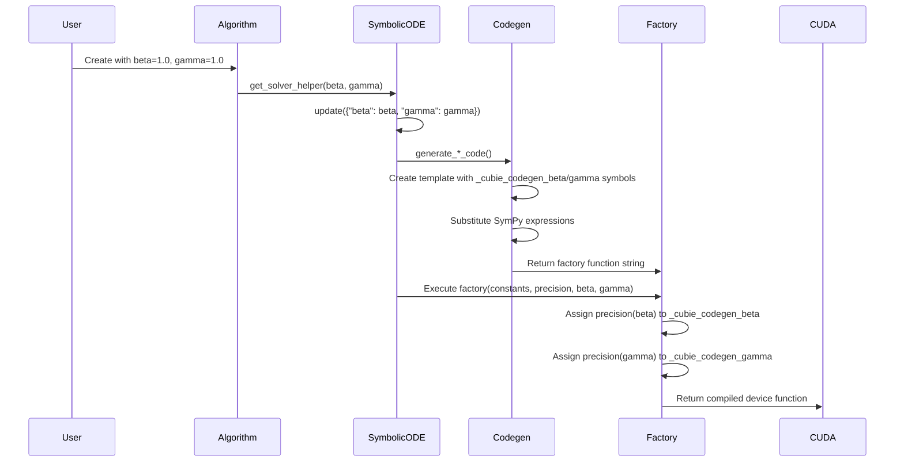

# Rename Beta/Gamma Internal Variables - Overview

## User Stories

### Story 1: Avoid Variable Name Conflicts
**As a** CuBIE user defining ODE/SDE systems  
**I want** to use variables named `beta`, `gamma`, or `sigma` in my system equations  
**So that** I can model systems that naturally use these common variable names without encountering code generation conflicts

**Acceptance Criteria:**
- User can define ODE systems with state variables, parameters, or constants named `beta`, `gamma`, or `sigma`
- Code generation produces valid CUDA kernels without naming conflicts
- Generated code correctly distinguishes between user variables and internal solver coefficients
- All existing tests pass with renamed internal variables

### Story 2: Clear Internal Variable Naming
**As a** CuBIE developer or contributor  
**I want** internal solver coefficients to have clearly namespaced names  
**So that** I can easily distinguish them from user-defined variables and avoid accidental conflicts

**Acceptance Criteria:**
- Internal variables follow consistent naming convention with `_cubie_codegen_` prefix
- Variable names clearly indicate they are internal to the code generation system
- Documentation and code comments reflect the purpose of these internal variables

## Executive Summary

The CuBIE symbolic code generation system currently uses the variable names `beta` and `gamma` as internal coefficients for implicit solver operations (linear operators, preconditioners, and residual functions). These names conflict with common mathematical variable names that users might want to use in their ODE/SDE systems.

This plan renames these internal variables to `_cubie_codegen_beta` and `_cubie_codegen_gamma` throughout the symbolic pathway to eliminate naming conflicts. Note that `sigma` was mentioned in the issue but does not appear to be used in the current codebase.

## Architecture Diagram

## Data Flow

## Key Technical Decisions

### 1. Prefix Choice: `_cubie_codegen_`
**Rationale:** 
- Leading underscore indicates internal/private variable
- `cubie` namespace prevents conflicts with common libraries
- `codegen` clarifies these are code generation artifacts
- Unlikely to collide with user variable names

**Alternative Considered:** `__cubie_beta__` (double underscores)
- Rejected: Python name mangling only applies to class attributes
- Rejected: Less readable and doesn't add value over single underscore prefix

### 2. Rename in Templates and SymPy Symbols
**Approach:** Change variable names in:
- Template strings (function signatures, docstrings)
- SymPy Symbol creation (`sp.Symbol("_cubie_codegen_beta")`)
- Local variable assignments within generated functions

**Rationale:**
- Ensures complete isolation from user namespace
- Makes generated code self-documenting
- Prevents SymPy from inadvertently substituting user variables

### 3. Preserve External API
**Decision:** Keep parameter names as `beta` and `gamma` in:
- `get_solver_helper()` method signature
- `ImplicitStepConfig` attributes
- Algorithm-level configuration
- Template factory function signatures

**Rationale:**
- No breaking changes for existing users
- `beta` and `gamma` are established mathematical terminology for these coefficients
- Renaming only needed where user symbols might appear (generated CUDA code)

### 4. No Changes to Rosenbrock Tableaus
**Decision:** Leave `gamma` field in `RosenbrockTableau` unchanged

**Rationale:**
- Rosenbrock `gamma` is a tableau coefficient, not a code generation variable
- No risk of conflict with user symbols (used before code generation)
- Maintains consistency with published Rosenbrock method literature

## Expected Impact

### Files Modified (Estimated ~10 files)
**Code Generation Templates:**
- `src/cubie/odesystems/symbolic/codegen/linear_operators.py`
- `src/cubie/odesystems/symbolic/codegen/preconditioners.py`
- `src/cubie/odesystems/symbolic/codegen/nonlinear_residuals.py`

**No Changes Required:**
- `src/cubie/integrators/algorithms/` (algorithms pass values, don't rename)
- `src/cubie/odesystems/baseODE.py` (interface unchanged)
- `src/cubie/odesystems/symbolic/symbolicODE.py` (interface unchanged)
- Rosenbrock tableaus (different `gamma` usage)

### Testing Strategy
- All existing tests should pass without modification
- Tests may need coefficient value adjustments if they inspect generated code strings
- No new tests required (functionality unchanged, only internal naming)

## Trade-offs

**Chosen Approach:**
- ✅ Minimal code changes (only codegen templates)
- ✅ No breaking changes to external API
- ✅ Clear intent through naming convention
- ⚠️ Slightly longer variable names in generated code

**Alternative Rejected:** Rename external API parameters
- ❌ Breaking change for existing users
- ❌ Deviates from standard mathematical notation
- ❌ More extensive changes required

## References
- Issue #373: "bug: codegen and solvers use beta, sigma, and gamma, so if a system uses those variables all bets are off"
- `.github/context/cubie_internal_structure.md` - CUDAFactory pattern, code generation architecture
- SymPy documentation for symbolic math operations
