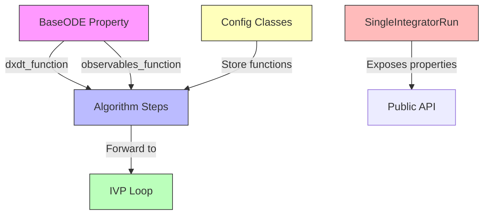

# Device Function Renaming - Human Overview

## User Stories

### User Story 1: Improved Code Readability
**As a** developer new to the CuBIE codebase  
**I want** device function names that describe what they do (verbs) rather than what object is passed (nouns)  
**So that** I can quickly understand function purposes without deep knowledge of the project structure

**Acceptance Criteria**:
- All device function references use verb-based names
- Function names clearly indicate their action (evaluate, compute, calculate)
- No references to the old noun-based names remain in source code
- Documentation reflects the new naming convention

### User Story 2: Consistent Naming Convention
**As a** CuBIE maintainer  
**I want** all device functions to follow a consistent naming pattern  
**So that** the codebase is more maintainable and easier to navigate

**Acceptance Criteria**:
- All device functions follow verb-first naming pattern
- Names are descriptive without being excessively verbose
- Similar functions use parallel naming structures
- Test code uses the same naming convention as source code

### User Story 3: Breaking Change Awareness
**As a** CuBIE user  
**I want** to understand that function names have changed  
**So that** I can update my code if I'm using internal APIs

**Acceptance Criteria**:
- CHANGELOG documents the renaming
- Breaking change is clearly marked
- Migration guide is not required (internal refactoring)

## Overview

This refactoring task systematically renames device function references throughout the CuBIE codebase from noun-based names to verb-based names that clearly describe their actions.

### Current vs. New Names

| Current Name | New Name | Purpose |
|--------------|----------|---------|
| `dxdt_function` | `evaluate_f` | Evaluates the right-hand side function f(t, y) for ODEs |
| `observables_function` | `evaluate_observables` | Computes observable values from system state |
| `driver_function` | `evaluate_driver_at_t` | Evaluates driver/forcing functions at time t |

### Scope of Changes



### Architectural Impact

**Low-Impact Refactoring**: This is a pure renaming operation with no behavioral changes.

**Affected Components**:
1. **ODE Systems** (`odesystems/baseODE.py`)
   - Property `dxdt_function` → `evaluate_f`
   - Property `observables_function` → `evaluate_observables`

2. **Algorithm Steps** (`integrators/algorithms/`)
   - All algorithm classes accept and store these functions
   - Configuration classes contain these as fields
   - Properties expose them for validation

3. **Integration Loops** (`integrators/loops/`)
   - Loop configuration passes functions through

4. **Single Integrator Core** (`integrators/SingleIntegratorRun*.py`)
   - Exposes functions via properties
   - Validates function references match

5. **Tests** (`tests/`)
   - 557+ references to `dxdt` in tests
   - 213+ references to `observables_function`/`driver_function`

### Data Flow

```mermaid
sequenceDiagram
    participant User
    participant ODE as BaseODE/SymbolicODE
    participant Algo as AlgorithmStep
    participant Loop as IVPLoop
    participant Kernel as CUDA Kernel
    
    User->>ODE: Create system
    ODE->>ODE: Compile evaluate_f
    ODE->>ODE: Compile evaluate_observables
    User->>Algo: Initialize with functions
    Algo->>Algo: Store in config
    Algo->>Loop: Pass functions
    Loop->>Kernel: Embed in device loop
    Kernel->>Kernel: Call evaluate_f(state, ...)
    Kernel->>Kernel: Call evaluate_observables(state, ...)
    Kernel->>Kernel: Call evaluate_driver_at_t(t, ...)
```

### Key Technical Decisions

1. **Naming Convention**: Use `evaluate_*` prefix consistently
   - `evaluate_f` follows mathematical convention where f is the RHS function
   - `evaluate_observables` and `evaluate_driver_at_t` are explicit about what's computed

2. **No Aliases**: Complete replacement without backwards compatibility
   - Project explicitly allows breaking changes during development
   - Clean break preferred over maintaining dual names

3. **Systematic Approach**: Rename in dependency order
   - Start with base classes (BaseODE)
   - Move to consumers (algorithms, loops)
   - Finish with tests and documentation

### Expected Challenges

1. **Volume of Changes**: 750+ references across source and tests
   - Requires careful systematic renaming
   - Risk of missing edge cases in string references

2. **Documentation Updates**: Some RST files reference these names
   - API documentation needs updating
   - Internal structure documentation needs updating

3. **String Literals**: Some references may be in dictionaries or string literals
   - Parameter name constants (ALL_ALGORITHM_STEP_PARAMETERS)
   - Error messages and logging

### Research Findings

**Search Results**:
- `dxdt_function`: Used as property name, parameter name, and in configs
- `observables_function`: Similar pattern across algorithms
- `driver_function`: Less pervasive but consistent usage pattern
- No existing uses of `evaluate_f`, `evaluate_observables`, or `evaluate_driver_at_t`

**Related Issues**: 
- Renamer agent has already flagged some of these for review
- Naming convention improvements align with project quality goals

### Impact on Existing Architecture

**No Breaking Changes to Public API**:
- These are internal device function references
- External users don't typically interact with these directly
- Breaking change is acceptable per project guidelines

**Memory Management**: No impact
**CUDA Compilation**: No impact
**Buffer Registry**: No impact
**Test Infrastructure**: Requires comprehensive test updates but no structural changes

