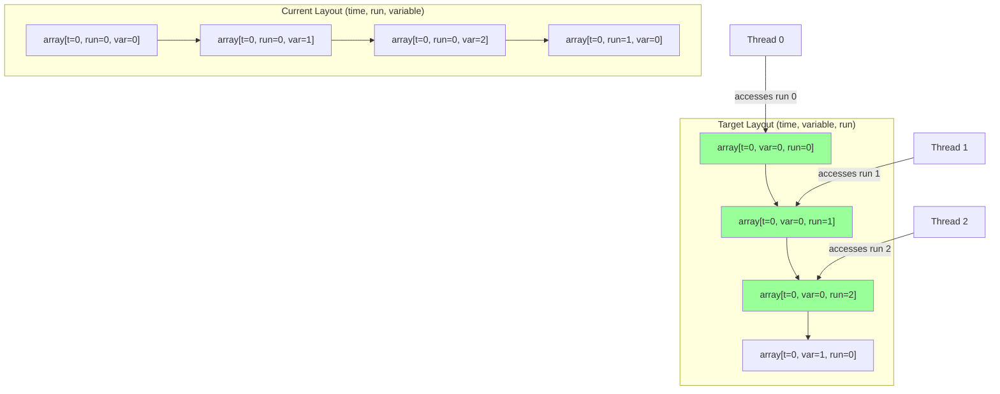
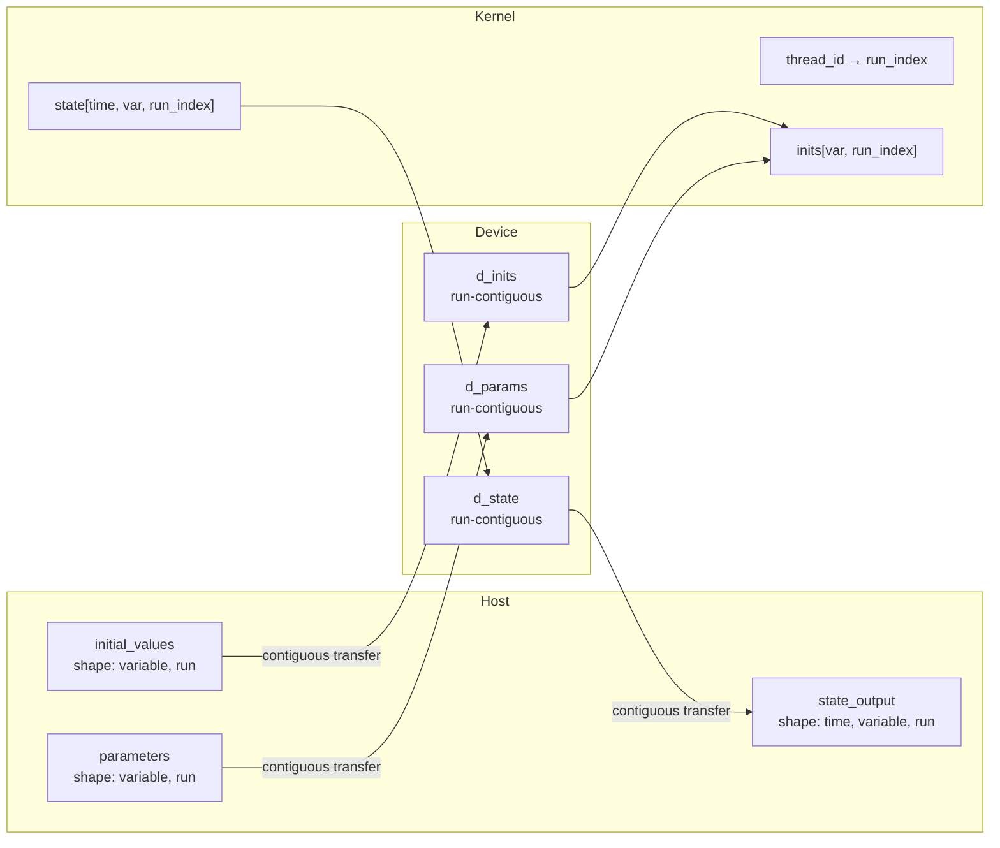

# Optimize Array Memory Layout for CUDA Coalesced Memory Access

## User Stories

### US-1: Run-Contiguous 3D Output Arrays
**As a** GPU developer using CuBIE for batch simulations  
**I want** 3D output arrays (state, observables, state_summaries, observable_summaries) to have run as the rightmost (innermost) dimension  
**So that** adjacent GPU threads access adjacent memory locations enabling CUDA memory coalescing

**Acceptance Criteria:**
- Default `_stride_order` in MemoryManager is `("time", "variable", "run")`
- All 3D output array containers declare `stride_order=("time", "variable", "run")`
- CUDA kernel indexing uses `array[time_idx, var_idx, run_idx]` pattern
- Host-device transfers are optimized for the new layout

### US-2: Run-Contiguous 2D Input Arrays
**As a** GPU developer using CuBIE for batch simulations  
**I want** 2D input arrays (initial_values, parameters) to have run as the rightmost dimension  
**So that** initial value loading is memory-coalesced across threads

**Acceptance Criteria:**
- 2D input arrays declare `stride_order=("variable", "run")`
- CUDA kernel indexing uses `array[var_idx, run_idx]` pattern
- The default fallback in ArrayRequest for 2D arrays is `("variable", "run")`

### US-3: Run-Contiguous Driver Coefficients
**As a** GPU developer using CuBIE for batch simulations  
**I want** driver_coefficients arrays to be contiguous in the expected access pattern  
**So that** forcing term interpolation benefits from coalesced access

**Acceptance Criteria:**
- driver_coefficients array uses appropriate stride order for its access pattern
- CUDA kernel indexing is consistent with the declared stride order

### US-4: C-Contiguous Kernel Array Signatures
**As a** a CUDA performance engineer  
**I want** batch arrays in `cuda.jit` signatures to specify C-contiguity  
**So that** Numba can generate optimized memory access patterns

**Acceptance Criteria:**
- 3D array parameters use `[:,:,::1]` notation indicating C-contiguous layout
- 2D array parameters use `[:,::1]` notation 
- All CUDA kernel signatures in BatchSolverKernel.py are updated

### US-5: Consistent Test Array Layouts
**As a** test developer  
**I want** all test fixtures to use the new run-contiguous layout  
**So that** tests validate the production memory layout

**Acceptance Criteria:**
- All test files creating arrays use the new stride_order conventions
- Test assertions validate the expected array shapes and indexing patterns

---

## Executive Summary

This optimization changes the default memory layout of CuBIE's batch arrays from the current `(time, run, variable)` stride ordering to `(time, variable, run)`, placing the run index in the rightmost (innermost) dimension. This enables CUDA memory coalescing where adjacent GPU threads (each processing a different run) access adjacent memory addresses.

### Key Benefits

1. **Coalesced Memory Access**: When thread T processes run R and thread T+1 processes run R+1, their memory accesses to array[time, variable, R] and array[time, variable, R+1] are adjacent
2. **Reduced Memory Transactions**: Coalesced reads/writes combine 32 thread accesses into a single memory transaction
3. **Faster Host-Device Transfers**: Contiguous run data improves PCIe/NVLink transfer efficiency

---

## Architecture Overview



### Data Flow with New Layout



---

## Technical Decisions

### 1. Stride Order Convention
- **3D Arrays**: `(time, variable, run)` - run varies fastest
- **2D Arrays**: `(variable, run)` - run varies fastest
- **1D Arrays**: `(run,)` - no change needed

### 2. Kernel Signature Annotations
Use Numba's contiguity annotations to enable compiler optimizations:
```python
@cuda.jit((
    precision[:, ::1],    # 2D: variable × run, run-contiguous
    precision[:, :, ::1], # 3D: time × variable × run, run-contiguous
))
```

### 3. Backward Compatibility
This is a breaking change. The `set_global_stride_ordering()` method allows users to restore the old layout if needed.

---

## Impact Analysis

### Files Requiring Modification

| Category | File | Changes |
|----------|------|---------|
| Memory | `mem_manager.py` | Default `_stride_order` |
| Memory | `array_requests.py` | 2D/3D fallback orders |
| Input Arrays | `BatchInputArrays.py` | stride_order declarations |
| Output Arrays | `BatchOutputArrays.py` | stride_order declarations |
| Output Sizes | `output_sizes.py` | Default stride_order values |
| Kernel | `BatchSolverKernel.py` | Array indexing, signatures |
| Solve Result | `solveresult.py` | Default stride_order |
| Tests | Multiple test files | stride_order fixtures, assertions |

### Risk Assessment

| Risk | Mitigation |
|------|------------|
| Index order errors | Systematic search-and-replace with verification |
| Test failures | Run full test suite after each major change |
| Performance regression | Benchmark before/after on representative workloads |
| User code breakage | Document breaking change in CHANGELOG |

---

## Related Issues

- Issue #81 (closed): Compile-time transpose operation - implemented the current striding system
- Issue #86 (closed): Pad shared buffers - related to memory access patterns
- Issue #85 (closed): Memory checks and batching - context for chunking behavior

---

## Testing Strategy

1. **Unit Tests**: Verify each modified file maintains correct behavior
2. **Integration Tests**: Run full solve operations with new layout
3. **Shape Validation**: Assert array shapes match expected `(time, variable, run)`
4. **Index Pattern Tests**: Verify kernel indexing follows `[t, v, r]` pattern
