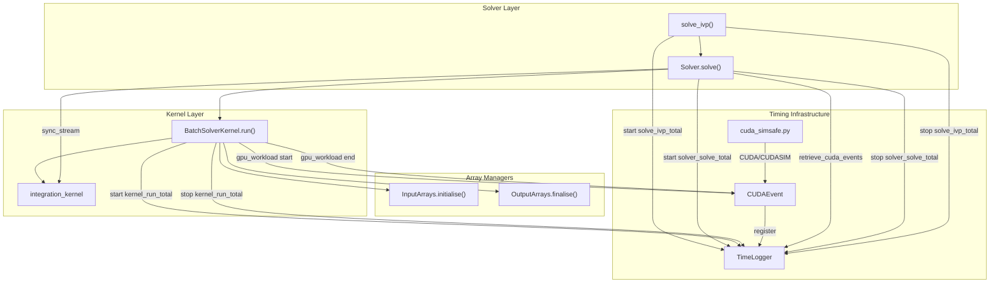
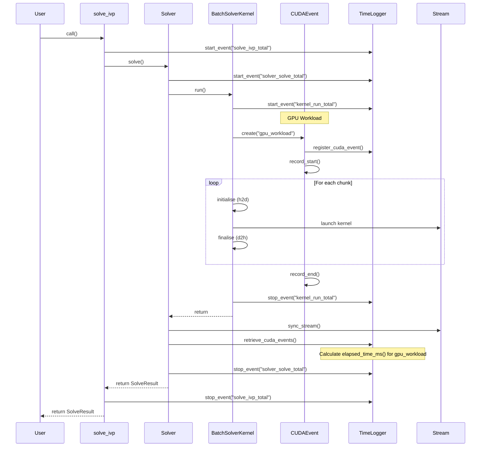

# Runtime Logging Feature Plan

## User Stories

### US-1: CUDAEvent Abstraction
**As a** CuBIE user profiling GPU performance,
**I want** CUDA event timing with CUDASIM fallback,
**So that** I can measure GPU operations accurately in both modes.

**Acceptance Criteria:**
- CUDAEvent wrapper class exists in cuda_simsafe.py with CUDASIM fallback
- Uses numba.cuda.event() in CUDA mode
- CUDASIM mode falls back to time.perf_counter() wall-clock timing
- Event timing data is available through TimeLogger after solve() returns
- Events log even when duration is 0

### US-2: GPU Workload Timing
**As a** CuBIE user diagnosing GPU execution bottlenecks,
**I want** timing for the entire GPU workload (transfers + kernels),
**So that** I can identify GPU-side execution time.

**Acceptance Criteria:**
- Single `gpu_workload` event covers ALL GPU operations (h2d, kernels, d2h)
- Event records start before first operation, end after last operation
- Interleaved chunk structure preserved (no restructuring)
- Events log even when duration is 0

### US-3: Outer Solve Timing
**As a** CuBIE user measuring end-to-end latency,
**I want** wall-clock timing for solve_ivp, Solver.solve, and BatchSolverKernel.run,
**So that** I can see total elapsed time including all suboperations.

**Acceptance Criteria:**
- `solve_ivp_total` event captures full solve_ivp() duration
- `solver_solve_total` event captures full Solver.solve() duration  
- `kernel_run_total` event captures full BatchSolverKernel.run() duration
- Outer events use wall-clock timing (not CUDA events)
- Events integrate with existing TimeLogger infrastructure

### US-4: Deferred Event Retrieval
**As a** CuBIE developer maintaining GPU performance,
**I want** CUDA event times collected only after stream synchronization,
**So that** timing measurement doesn't impact kernel execution performance.

**Acceptance Criteria:**
- No stream synchronization occurs during kernel execution
- CUDAEvent instances register with TimeLogger for later retrieval
- `retrieve_cuda_events()` called by solve() after sync to collect all timings
- Timing data available in TimeLogger.events after solve() completes

---

## Overview

This feature adds runtime timing instrumentation to CuBIE's batch solving infrastructure. The implementation builds on the existing TimeLogger and cuda_simsafe modules, adding CUDA event-based timing with proper CUDASIM fallback.

### Architecture Diagram

### Event Flow Sequence

### Key Technical Decisions

1. **CUDAEvent in cuda_simsafe.py**: The abstraction lives in the existing CUDASIM compatibility module, following established patterns for numba.cuda wrappers. This keeps solver/kernel code clean of conditional imports.

2. **Single GPU Workload Event**: Due to the interleaved loop structure (h2d/kernel/d2h per chunk), separate events for transfers vs. kernels would overlap on the GPU timeline. A single `gpu_workload` event captures total GPU execution time.

3. **Deferred Retrieval**: CUDA events are recorded asynchronously; elapsed_time_ms() blocks until both events complete. By deferring to after sync_stream(), we avoid mid-execution stalls.

4. **Wall-clock Outer Events**: The outer timing (solve_ivp_total, solver_solve_total, kernel_run_total) uses existing TimeLogger start/stop events with time.perf_counter(), not CUDA events. This captures Python-side overhead.

5. **Zero-duration Logging**: Events log even when there are no operations. This provides consistent event sequences for analysis tools.

6. **Preserved Loop Structure**: The existing interleaved chunk loop is preserved. No restructuring is needed - timing wraps the entire loop.

### Trade-offs Considered

| Option | Pros | Cons | Decision |
|--------|------|------|----------|
| Separate h2d/kernel/d2h events | Fine-grained insight | Requires restructuring loop | Rejected - preserves existing structure |
| Per-array transfer events | Fine-grained insight | High overhead, verbose output | Rejected |
| Inline sync for timing | Simpler implementation | Massive performance hit | Rejected |
| Separate timing module | Clean separation | Code fragmentation | Rejected - use cuda_simsafe |
| Optional timing (compile flag) | Zero overhead when disabled | Complexity, testing burden | Deferred |

### Impact on Existing Architecture

- **TimeLogger**: Add `register_cuda_event()` and `retrieve_cuda_events()` methods
- **cuda_simsafe.py**: Add CUDAEvent class with CUDASIM fallback
- **BatchSolverKernel.run()**: Add gpu_workload CUDAEvent around existing loop (minimal changes)
- **Solver.solve()**: Call `retrieve_cuda_events()` after sync, before return
- **solve_ivp()**: Add outer timing wrapper

No changes to kernel compilation, memory management, or integrator logic required.
The existing interleaved loop structure in run() is preserved.
