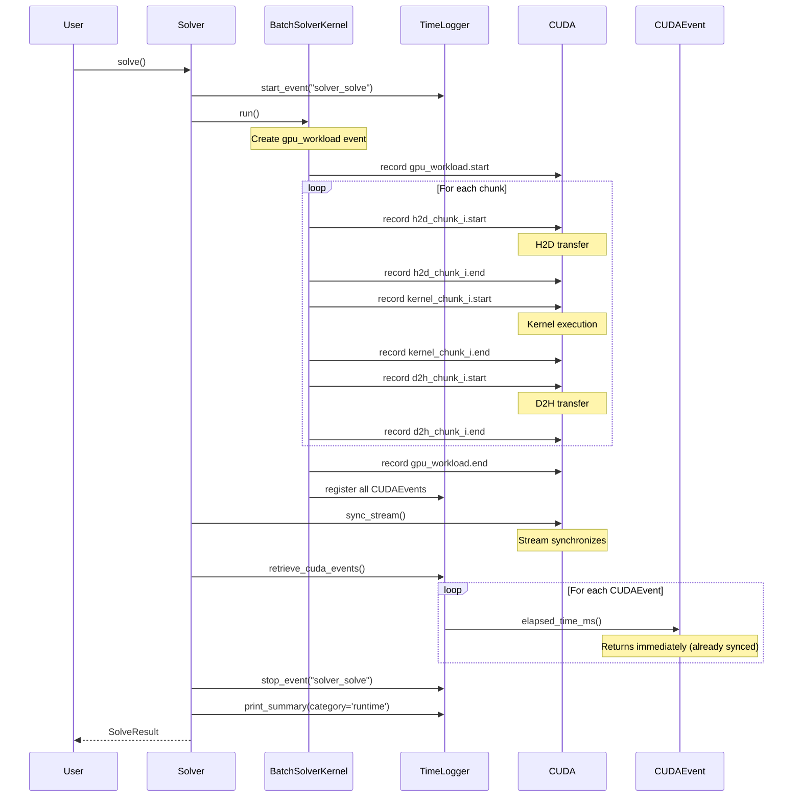
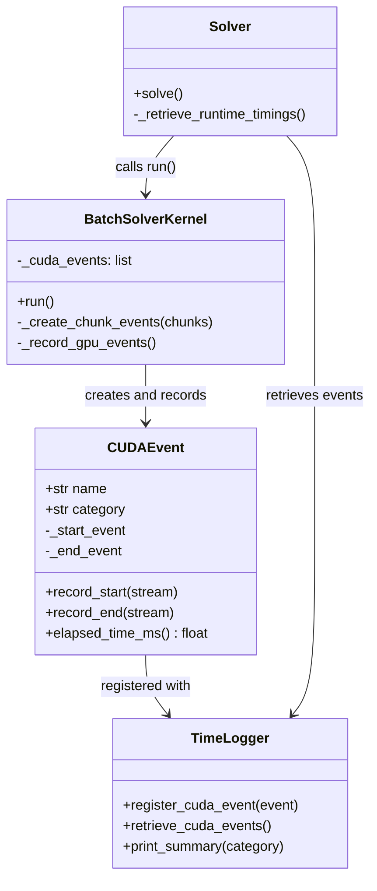

# Runtime Logging for CuBIE BatchSolverKernel and Solver

## User Stories

### Story 1: Kernel Execution Timing
**As a** CuBIE user optimizing GPU performance  
**I want** per-chunk kernel execution times displayed  
**So that** I can identify bottlenecks in my batch integration workloads

**Acceptance Criteria:**
- Kernel execution time recorded for each chunk using CUDA events
- Per-chunk timing displayed: "kernel_chunk_0: 10.3ms", "kernel_chunk_1: 9.8ms", etc.
- CUDA events record on the solver's registered stream
- No synchronization blocking during kernel execution

### Story 2: Memory Transfer Timing
**As a** CuBIE user analyzing data movement costs  
**I want** host-to-device and device-to-host transfer times per chunk  
**So that** I can understand the memory transfer overhead in my workflows

**Acceptance Criteria:**
- H2D transfer time recorded per chunk: "h2d_transfer_chunk_0: 2.5ms"
- D2H transfer time recorded per chunk: "d2h_transfer_chunk_0: 1.8ms"
- Transfer events use CUDA events on the registered stream
- Timing calculated after stream synchronization completes

### Story 3: Total GPU Workload Timing
**As a** CuBIE user benchmarking GPU utilization  
**I want** a single metric capturing total GPU work duration  
**So that** I can compare GPU time against total wall-clock time

**Acceptance Criteria:**
- Single `gpu_workload` event spanning first h2d to last operation
- Event starts before first chunk's h2d transfer
- Event ends immediately before stream sync in Solver.solve()
- Reports total GPU timeline duration

### Story 4: Wall-Clock Method Timing
**As a** CuBIE user profiling complete solver operations  
**I want** wall-clock times for solve_ivp() and Solver.solve()  
**So that** I can understand end-to-end latency including Python overhead

**Acceptance Criteria:**
- `solve_ivp` wall-clock timing captured using TimeLogger
- `Solver.solve` wall-clock timing captured using TimeLogger
- Times include all synchronous operations and Python overhead
- Displayed with other runtime events in timing summary

### Story 5: Verbosity-Controlled Output
**As a** CuBIE user controlling output detail  
**I want** runtime timing respecting existing verbosity levels  
**So that** I can adjust detail level consistently across compile/runtime

**Acceptance Criteria:**
- Runtime events respect 'default', 'verbose', 'debug', None settings
- Per-chunk details shown at appropriate verbosity levels
- Timing summary called with category='runtime' after solver returns
- No output when verbosity=None (zero overhead)

## Overview

### Executive Summary

This feature adds comprehensive runtime timing instrumentation to CuBIE's batch solver pipeline using CUDA events for GPU operations and wall-clock timing for synchronous methods. The implementation preserves the existing non-blocking async execution model while enabling accurate timing measurements after stream synchronization.

### Key Design Decisions

**1. CUDA Events for GPU Timing**
- Rationale: CUDA events provide accurate GPU timeline measurements without blocking
- Implementation: `cuda.event()` objects record on the solver's stream
- Timing retrieved via `cuda.event_elapsed_time()` after synchronization

**2. CUDAEvent Wrapper Class**
- Location: `src/cubie/cuda_simsafe.py` (alongside other CUDA compatibility helpers)
- Purpose: Encapsulate CUDA event lifecycle with CUDASIM fallback
- Benefits: Consistent API, automatic CUDASIM compatibility, clean integration

**3. Per-Chunk Event Recording**
- Pattern: Create events for each chunk at execution time
- Storage: Events held in BatchSolverKernel instance until timing retrieval
- Registration: Events registered with TimeLogger for summary inclusion

**4. Deferred Timing Calculation**
- Critical: `elapsed_time_ms()` must NOT block or sync
- Timing calculated AFTER `sync_stream()` completes in Solver.solve()
- Uses `cuda.event_elapsed_time()` which returns immediately post-sync

**5. Wall-Clock Timing Scope**
- `solve_ivp()`: Full function wall-clock time (synchronous)
- `Solver.solve()`: Full method wall-clock time (includes sync)
- BatchSolverKernel.run(): NO wall-clock timing (asynchronous)

### Architecture Diagrams

### Data Flow

**Event Creation Flow:**
1. BatchSolverKernel.run() creates CUDAEvent instances for each chunk
2. Events include: h2d_transfer_chunk_i, kernel_chunk_i, d2h_transfer_chunk_i
3. One gpu_workload event spans entire GPU timeline
4. All events stored in BatchSolverKernel._cuda_events list

**Event Recording Flow:**
1. gpu_workload.record_start() before first chunk's h2d transfer
2. For each chunk in interleaved loop:
   - h2d_chunk_i.record_start() before InputArrays.initialise()
   - h2d_chunk_i.record_end() after InputArrays.initialise()
   - kernel_chunk_i.record_start() before kernel launch
   - kernel_chunk_i.record_end() after kernel launch
   - d2h_chunk_i.record_start() before OutputArrays.finalise()
   - d2h_chunk_i.record_end() after OutputArrays.finalise()
3. gpu_workload.record_end() after loop completes
4. Events registered with TimeLogger

**Timing Retrieval Flow:**
1. Solver.solve() calls sync_stream() to complete GPU work
2. Solver.solve() calls TimeLogger.retrieve_cuda_events()
3. For each registered CUDAEvent:
   - Call elapsed_time_ms() (returns immediately, no blocking)
   - Create TimingEvent with elapsed time in metadata
4. TimeLogger.print_summary(category='runtime') displays results

### Expected Impact

**Memory:**
- Minimal: ~100 bytes per CUDAEvent (3 events × chunks + 1 overall)
- Stored transiently in BatchSolverKernel until timing retrieved

**Performance:**
- Zero impact when verbosity=None
- Negligible overhead from event recording (~1-2 microseconds per event)
- No blocking during kernel execution
- Single synchronization point (existing sync_stream call)

**Code Changes:**
- New CUDAEvent class in cuda_simsafe.py (~80 lines)
- TimeLogger extensions (~50 lines)
- BatchSolverKernel instrumentation (~60 lines)
- Solver timing retrieval integration (~30 lines)
- Total: ~220 lines, isolated changes

### Trade-offs Considered

**Alternative: CPU Wall-Clock Timing for Kernel**
- Rejected: Would measure async launch time, not actual execution
- CuBIE's async execution model makes wall-timing inaccurate

**Alternative: Single GPU Event Per Run**
- Rejected: Per-chunk granularity provides valuable profiling data
- Users need to identify which chunks are bottlenecks

**Alternative: Store Timing in Separate Logger**
- Rejected: TimeLogger already handles codegen/compile categories
- Consistency: runtime events should use same infrastructure

**Alternative: Automatic Timing Retrieval in BatchSolverKernel**
- Rejected: Would require sync inside kernel, breaking async model
- Solver.solve() already syncs, ideal place for retrieval

### Research Findings

**CUDA Event API:**
- `cuda.event()` creates event objects
- `event.record(stream)` records timestamp on stream
- `cuda.event_elapsed_time(start, end)` returns ms between events
- Post-sync calls return immediately (GPU already completed)

**TimeLogger Structure:**
- Supports categories: 'codegen', 'runtime', 'compile'
- Events must be registered before use
- Summary printing respects verbosity and category filters
- Existing pattern: register during __init__, start/stop during execution

**Solver Execution Flow:**
- BatchSolverKernel.run() launches all chunks asynchronously
- No sync between chunks (comment explicitly states this)
- Solver.solve() syncs stream before creating SolveResult
- Ideal timing retrieval point: after sync, before result creation
