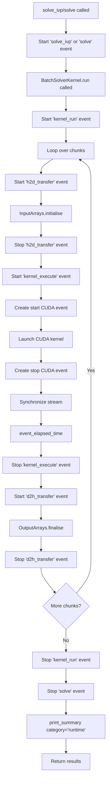
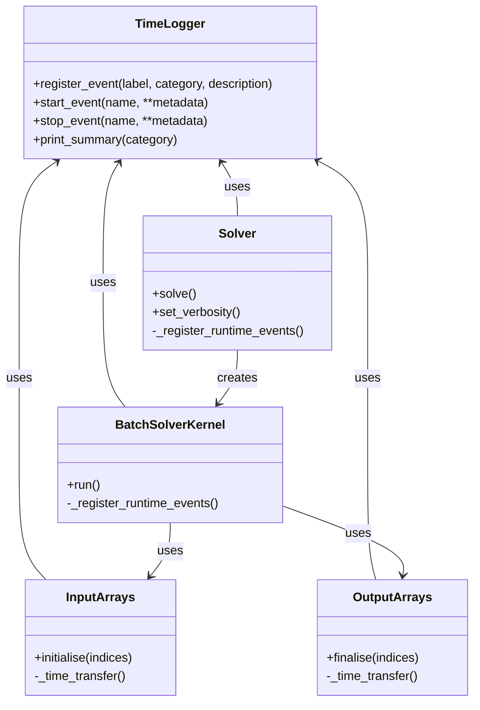

# Runtime Logging Feature - Overview

## User Stories

### Story 1: Kernel Execution Timing
**As a** CuBIE user  
**I want** to measure GPU kernel execution time using CUDA events  
**So that** I can understand where time is spent during batch integration

**Acceptance Criteria:**
- Kernel launch timing starts before the kernel is launched
- Kernel execution timing stops after the kernel completes
- Timing uses `numba.cuda.event()` for accurate GPU measurement
- Event data is recorded to the TimeLogger with category='runtime'
- Timing works correctly in both single-chunk and multi-chunk scenarios

### Story 2: Memory Transfer Timing
**As a** CuBIE user  
**I want** to measure memory transfer times between host and device  
**So that** I can identify data movement bottlenecks

**Acceptance Criteria:**
- Host-to-device transfers are timed in `InputArrays.initialise()`
- Device-to-host transfers are timed in `OutputArrays.finalise()`
- Each transfer type (inits, params, drivers, state, observables, summaries, status) is timed separately
- Transfer timing uses wall-clock time via `time.perf_counter()`
- Events are registered with category='runtime'

### Story 3: Outer Method Timing
**As a** CuBIE user  
**I want** to see total execution time for solve_ivp(), solve(), and run() methods  
**So that** I can understand overall integration performance including all subevents

**Acceptance Criteria:**
- `solve_ivp()` has outer timing capturing the complete function execution
- `Solver.solve()` has outer timing from method entry to return
- `BatchSolverKernel.run()` has outer timing including all chunks
- Outer times represent the sum total of all nested timing events
- Summary can be printed with `print_summary(category='runtime')` after method returns

### Story 4: Integration with TimeLogger
**As a** CuBIE user  
**I want** runtime events to integrate seamlessly with existing TimeLogger infrastructure  
**So that** I can view codegen, compile, and runtime timing in a unified report

**Acceptance Criteria:**
- Runtime events use the same `_default_timelogger` instance as compile/codegen
- Events are registered before first use with category='runtime'
- Event data is fetched and sent to timelogger before method returns
- TimeLogger verbosity settings control runtime event output
- `print_summary(category='runtime')` displays runtime timing after integration completes

## Executive Summary

This feature extends CuBIE's existing TimeLogger system to capture runtime performance metrics during batch integration. The implementation adds GPU kernel timing via CUDA events, memory transfer timing via wall-clock measurements, and outer method timing to provide complete execution visibility.

The architecture follows the established pattern where events are registered in advance, timing decorators wrap key operations, and the global `_default_timelogger` instance collects all measurements. Runtime events use category='runtime' to distinguish them from existing 'compile' and 'codegen' categories.

## Key Technical Decisions

### CUDA Event Timing for Kernels
**Decision:** Use `numba.cuda.event()` with `event_elapsed_time()` for kernel timing  
**Rationale:** 
- CPU timing via `time.perf_counter()` cannot accurately measure asynchronous GPU operations
- CUDA events provide precise GPU-side measurements in milliseconds
- Events integrate with CUDA streams for async operation tracking
- Numba provides direct access to CUDA event API

**Trade-off:** Requires CUDA-specific code that won't work in CUDASIM mode; fallback to wall-clock timing in simulation.

### Wall-Clock Timing for Memory Transfers
**Decision:** Use `time.perf_counter()` for host-device memory transfer timing  
**Rationale:**
- Memory transfers are synchronous operations that block the stream
- Wall-clock timing is sufficient and simpler than CUDA event pairs
- Transfers already complete before timing stop is called

**Alternative Considered:** CUDA events could also time transfers, but add unnecessary complexity for synchronous operations.

### Event Registration Strategy
**Decision:** Register runtime events during class initialization  
**Rationale:**
- Follows existing pattern used by CUDAFactory for compile events
- Prevents registration errors during execution
- Events are lightweight and registration is cheap

**Trade-off:** Events exist even if never used; acceptable overhead given TimeLogger's no-op mode.

### Timing Location Strategy
**Decision:** Add timing instrumentation directly in run(), solve(), solve_ivp(), and array managers  
**Rationale:**
- Runtime methods are not compiled CUDA code - direct instrumentation is safe
- Timing overhead is negligible compared to kernel execution and transfers
- Simplifies implementation vs. callback-based approaches

**Alternative Considered:** Decorator-based timing; rejected because it obscures event names and complicates conditional timing.

## Data Flow Diagram

## Component Interaction Diagram

## Architecture Changes

### TimeLogger Extension
- No changes required to `TimeLogger` class itself
- Category='runtime' already supported
- Existing `_default_timelogger` instance will be used

### BatchSolverKernel Changes
- Add event registration during `__init__`
- Add timing instrumentation in `run()` method
- Record CUDA event elapsed time to metadata
- Print runtime summary after all chunks complete

### Solver Changes
- Add event registration during `__init__`
- Add timing instrumentation in `solve()` method
- Ensure timing completes before returning `SolveResult`

### solve_ivp Changes
- Add timing at function entry and exit
- Register event at module load time
- Print runtime summary before return

### Array Manager Changes
- Add timing in `InputArrays.initialise()`
- Add timing in `OutputArrays.finalise()`
- Track individual array transfers separately

## Expected Impact

### Minimal Code Changes
- Event registration: ~5 lines per component
- Timing instrumentation: 2 lines (start/stop) per timed section
- No changes to CUDA device code
- No changes to TimeLogger infrastructure

### Performance Impact
- CUDA event overhead: microseconds per kernel launch
- Wall-clock timing overhead: nanoseconds per call
- No impact when `verbosity=None` (no-op paths)
- Negligible impact in default/verbose/debug modes

### Testing Requirements
- New tests for event registration
- Tests for timing data collection
- Tests for verbosity level behavior
- Tests for CUDASIM fallback behavior

## Dependencies

### Internal
- `src/cubie/time_logger.py` - TimeLogger infrastructure (existing)
- `src/cubie/batchsolving/BatchSolverKernel.py` - Kernel execution
- `src/cubie/batchsolving/solver.py` - High-level solver API
- `src/cubie/batchsolving/arrays/` - Array transfer management

### External
- `numba.cuda` - CUDA event API for kernel timing
- `time` - Standard library for wall-clock measurements

### Feature Flags
- Respects `time_logging_level` parameter in solve_ivp() and Solver()
- Controlled by TimeLogger verbosity setting
- No new configuration parameters required
