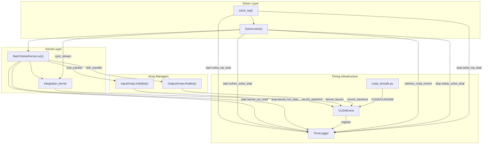
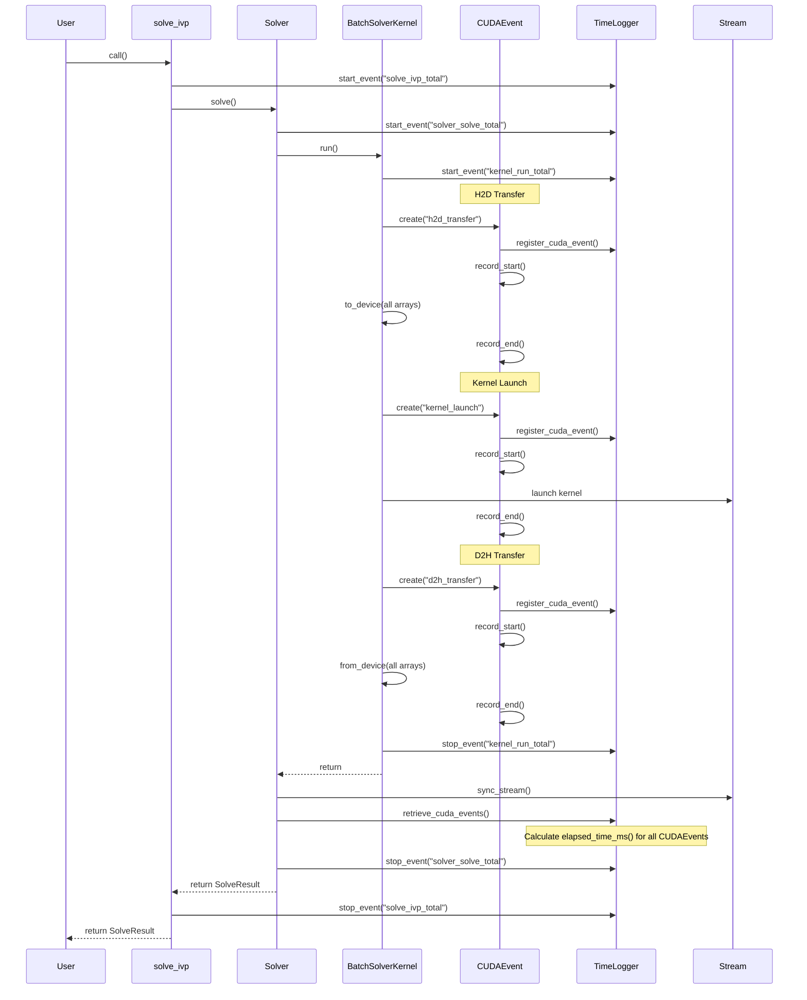

# Runtime Logging Feature Plan

## User Stories

### US-1: CUDA Kernel Timing
**As a** CuBIE user profiling GPU performance,
**I want** to measure actual CUDA kernel execution time,
**So that** I can understand how much time is spent on GPU computation vs. overhead.

**Acceptance Criteria:**
- CUDAEvent wrapper class exists in cuda_simsafe.py with CUDASIM fallback
- Each kernel launch records start/end events via numba.cuda.event() in CUDA mode
- CUDASIM mode falls back to time.perf_counter() wall-clock timing
- Event timing data is available through TimeLogger after solve() returns
- Events log even when duration is 0

### US-2: Memory Transfer Timing
**As a** CuBIE user diagnosing data movement bottlenecks,
**I want** consolidated timing for host-to-device and device-to-host transfers,
**So that** I can identify if memory bandwidth limits my workload.

**Acceptance Criteria:**
- Single `h2d_transfer` event covers ALL host-to-device transfers
- Single `d2h_transfer` event covers ALL device-to-host transfers
- Events record start before ANY transfers and end after ALL transfers
- Events log 0 duration when no arrays to transfer

### US-3: Outer Solve Timing
**As a** CuBIE user measuring end-to-end latency,
**I want** wall-clock timing for solve_ivp, Solver.solve, and BatchSolverKernel.run,
**So that** I can see total elapsed time including all suboperations.

**Acceptance Criteria:**
- `solve_ivp_total` event captures full solve_ivp() duration
- `solver_solve_total` event captures full Solver.solve() duration  
- `kernel_run_total` event captures full BatchSolverKernel.run() duration
- Outer events use wall-clock timing (not CUDA events)
- Events integrate with existing TimeLogger infrastructure

### US-4: Deferred Event Retrieval
**As a** CuBIE developer maintaining GPU performance,
**I want** CUDA event times collected only after stream synchronization,
**So that** timing measurement doesn't impact kernel execution performance.

**Acceptance Criteria:**
- No stream synchronization occurs during kernel execution
- CUDAEvent instances register with TimeLogger for later retrieval
- `retrieve_cuda_events()` called by solve() after sync to collect all timings
- Timing data available in TimeLogger.events after solve() completes

---

## Overview

This feature adds runtime timing instrumentation to CuBIE's batch solving infrastructure. The implementation builds on the existing TimeLogger and cuda_simsafe modules, adding CUDA event-based timing with proper CUDASIM fallback.

### Architecture Diagram

### Event Flow Sequence

### Key Technical Decisions

1. **CUDAEvent in cuda_simsafe.py**: The abstraction lives in the existing CUDASIM compatibility module, following established patterns for numba.cuda wrappers. This keeps solver/kernel code clean of conditional imports.

2. **Consolidated Transfer Events**: One event per transfer direction (h2d_transfer, d2h_transfer) simplifies analysis and reduces overhead vs. per-array events.

3. **Deferred Retrieval**: CUDA events are recorded asynchronously; elapsed_time_ms() blocks until both events complete. By deferring to after sync_stream(), we avoid mid-execution stalls.

4. **Wall-clock Outer Events**: The outer timing (solve_ivp_total, solver_solve_total, kernel_run_total) uses existing TimeLogger start/stop events with time.perf_counter(), not CUDA events. This captures Python-side overhead.

5. **Zero-duration Logging**: Events log even when there are no arrays to transfer. This provides consistent event sequences for analysis tools.

### Trade-offs Considered

| Option | Pros | Cons | Decision |
|--------|------|------|----------|
| Per-array transfer events | Fine-grained insight | High overhead, verbose output | Rejected |
| Inline sync for timing | Simpler implementation | Massive performance hit | Rejected |
| Separate timing module | Clean separation | Code fragmentation | Rejected - use cuda_simsafe |
| Optional timing (compile flag) | Zero overhead when disabled | Complexity, testing burden | Deferred |

### Impact on Existing Architecture

- **TimeLogger**: Add `register_cuda_event()` and `retrieve_cuda_events()` methods
- **cuda_simsafe.py**: Add CUDAEvent class with CUDASIM fallback
- **BatchSolverKernel.run()**: Wrap transfers and kernel in CUDAEvent recording
- **Solver.solve()**: Call `retrieve_cuda_events()` after sync, before return
- **solve_ivp()**: Add outer timing wrapper

No changes to kernel compilation, memory management, or integrator logic required.
