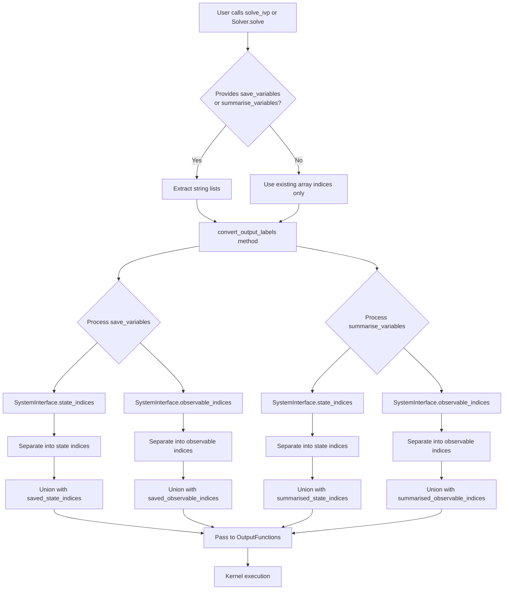
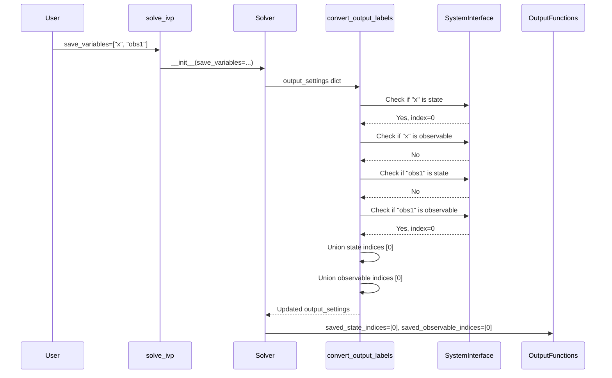

# Add save_variables and summarise_variables Parameters

## User Stories

### US1: Simplified Output Variable Selection
**As a** CuBIE user solving ODEs with both states and observables,  
**I want to** specify output variables using string names regardless of whether they are states or observables,  
**So that** I don't need to understand the internal distinction between states and observables when configuring my solver.

**Acceptance Criteria:**
- User can pass `save_variables=["x", "y", "observable1"]` to `solve_ivp()` or `Solver.solve()`
- The system automatically determines if each variable is a state or observable
- Variables are added to the correct internal indices arrays (saved_state_indices or saved_observable_indices)
- Behavior is identical to manually specifying saved_states and saved_observables separately

### US2: Backward Compatibility
**As a** CuBIE user with existing code,  
**I want** the existing parameter-based output selection to continue working unchanged,  
**So that** my existing scripts don't break when the new parameters are added.

**Acceptance Criteria:**
- Existing parameters (`saved_states`, `saved_state_indices`, `saved_observables`, `saved_observable_indices`, etc.) work unchanged
- Users can mix old and new parameters (e.g., `saved_states=[0]` with `save_variables=["x"]`)
- The union of both approaches is used (no duplicates)
- No performance degradation when using existing array-index-only parameters

### US3: Summary Variables Selection
**As a** CuBIE user interested in summary statistics,  
**I want to** specify summary variables using string names,  
**So that** I can easily configure which variables to summarize without distinguishing states from observables.

**Acceptance Criteria:**
- User can pass `summarise_variables=["x", "observable2"]` to configure summary metrics
- Variables are correctly routed to summarised_state_indices or summarised_observable_indices
- Behavior is identical to manually specifying summarised_states and summarised_observables separately

### US4: Performance Preservation
**As a** performance-conscious CuBIE user,  
**I want** the new string-based parameters to not slow down existing array-index workflows,  
**So that** I can use whichever interface is most appropriate without performance concerns.

**Acceptance Criteria:**
- When only array indices are provided (no string lists), no name resolution logic executes
- Performance benchmarks show no regression for array-only workflows
- String-based resolution happens once during solver setup, not during kernel execution

## Overview

### Executive Summary
Add two optional list-of-strings parameters (`save_variables` and `summarise_variables`) to both `solve_ivp()` and `Solver.solve()`. These parameters provide a unified interface for specifying output variables without requiring users to distinguish between states and observables. The implementation extends the existing `convert_output_labels()` method to handle variable name resolution via `SystemInterface`, merging results with existing array-based parameters.

### Architecture Diagram

### Data Flow

### Key Technical Decisions

1. **Extend convert_output_labels()**: Rather than creating a new method, extend the existing `convert_output_labels()` method in `Solver` to handle the new parameters. This maintains consistency with existing architecture.

2. **Fast-path optimization**: When only array indices are provided (no string variable lists), skip the name resolution entirely. This ensures zero performance overhead for existing workflows.

3. **Iterative classification**: For each variable name in `save_variables` or `summarise_variables`, check both state and observable SystemValues. If found in states, add to state indices; if found in observables, add to observable indices. Raise clear error if not found in either.

4. **Union semantics**: Merge the results of string-based parameters with existing array-based parameters using set union to avoid duplicates.

5. **Error handling**: Provide clear error messages when a variable name is not found in either states or observables, helping users identify typos or incorrect variable names.

### Integration Points

- **solve_ivp() signature**: Add optional parameters `save_variables` and `summarise_variables`
- **Solver.solve() signature**: Add optional parameters `save_variables` and `summarise_variables`
- **Solver.convert_output_labels()**: Extend to handle new parameters and merge with existing ones
- **SystemInterface**: Use existing `state_indices()` and `observable_indices()` methods
- **ALL_OUTPUT_FUNCTION_PARAMETERS**: Add new parameter names to the recognized set

### Expected Impact

**Minimal changes to existing code:**
- Two new optional parameters in function signatures
- Extended logic in `convert_output_labels()` method
- New recognized parameter names in `ALL_OUTPUT_FUNCTION_PARAMETERS`
- All existing functionality preserved

**No changes to:**
- OutputFunctions (still receives index arrays)
- Kernel compilation or execution
- Memory management
- GPU code generation

### Trade-offs Considered

**Alternative 1: Separate method for name resolution**
- **Rejected**: Would duplicate logic and require additional coordination between methods

**Alternative 2: Always resolve names, even for array indices**
- **Rejected**: Would add unnecessary overhead to performance-critical workflows

**Alternative 3: Replace existing parameters entirely**
- **Rejected**: Would break backward compatibility and require migration effort

**Chosen approach**: Extend existing method with optional parameters and fast-path optimization. This provides the best balance of usability, performance, and backward compatibility.
