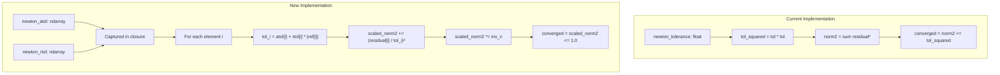
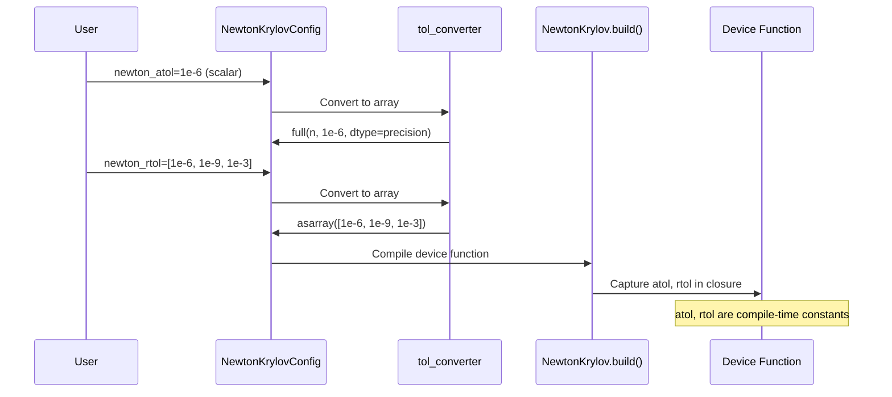

# Scaled Tolerance in Newton-Krylov Solver

## User Stories

### US-1: Per-Element Tolerance for Newton Convergence
**As a** user simulating poorly-scaled ODE systems,  
**I want** the Newton-Krylov solver to use per-element scaled tolerances when checking convergence,  
**So that** states with vastly different magnitudes (e.g., nA currents alongside V voltages) all converge appropriately relative to their characteristic scales.

**Acceptance Criteria:**
- Newton solver accepts `atol` and `rtol` arrays (one value per state variable)
- Scalar tolerance inputs are broadcast to arrays of length `n`
- Convergence check uses scaled norm: `norm(residual[i] / tol[i])` where `tol[i] = atol[i] + rtol[i] * |state[i]|`
- Default behavior (scalar tolerance) produces identical results to current implementation
- Tolerance arrays are factory-scope constants (captured in closure at compile time)

### US-2: Per-Element Tolerance for Linear Solver (Krylov) Convergence
**As a** user simulating poorly-scaled ODE systems,  
**I want** the internal Krylov (linear) solver to use per-element scaled tolerances,  
**So that** the linear solve converges appropriately for all state variables regardless of their magnitude.

**Acceptance Criteria:**
- Linear solver accepts `krylov_atol` and `krylov_rtol` arrays
- Scalar tolerance inputs are broadcast to arrays of length `n`
- Linear solver convergence uses scaled norm matching the step controller pattern
- Tolerance arrays are captured as factory-scope constants

### US-3: Tolerance Array Configuration via attrs Converters
**As a** developer configuring the Newton-Krylov solver,  
**I want** tolerance parameters to accept both scalars and arrays with automatic conversion,  
**So that** the API remains simple for common use cases while supporting advanced per-element configuration.

**Acceptance Criteria:**
- Both `newton_tolerance` and `krylov_tolerance` accept scalars or array-like inputs
- `tol_converter` pattern (from step controllers) is reused for consistency
- Invalid shapes raise clear `ValueError` messages
- Tolerance arrays are stored with correct precision

---

## Overview

### Executive Summary

This feature enhances the Newton-Krylov solver's robustness against poorly-scaled ODE systems by replacing scalar L2 norm tolerance checks with per-element scaled tolerances. The implementation mirrors the existing pattern in step controllers (`AdaptiveStepControlConfig`) where tolerance arrays are constructed via attrs converters and captured as factory-scope constants.

The change affects two convergence checks:
1. **Newton iteration convergence** - currently uses `norm2(residual) <= tol²`
2. **Krylov (linear) iteration convergence** - currently uses `norm2(residual) <= tol²`

Both will be modified to use the scaled norm pattern already proven in step controllers:
```
scaled_norm2 = sum((residual[i] / (atol[i] + rtol[i] * |reference[i]|))²) / n
converged = scaled_norm2 <= 1.0
```

### Architecture Overview



### Data Flow: Tolerance Array Configuration



### Key Technical Decisions

1. **Reuse `tol_converter` pattern**: The step controller already has a working converter that handles scalar-to-array broadcasting with precision awareness. We replicate this pattern for Newton and Krylov tolerances.

2. **Factory-scope constants**: Tolerance arrays are captured in the device function closure at compile time, avoiding runtime parameter passing overhead.

3. **Reference value for rtol**: For Newton solver, use the current `stage_increment` or `state` as the reference for relative tolerance scaling. For Krylov solver, use the current `x` iterate.

4. **Separate atol/rtol from combined tolerance**: The current `newton_tolerance` and `krylov_tolerance` are single floats. We add `newton_atol`, `newton_rtol`, `krylov_atol`, `krylov_rtol` as new parameters while keeping the original parameters for backward compatibility (they become defaults when atol/rtol are not specified).

### Trade-offs Considered

| Approach | Pros | Cons |
|----------|------|------|
| **Per-element atol+rtol (chosen)** | Matches step controller pattern; maximum flexibility; handles mixed-scale systems | More parameters; slightly more FLOPS per convergence check |
| **Scale vector only** | Simple multiplication; one parameter | Doesn't adapt to state magnitude; less robust |
| **Single scaled tolerance** | Minimal change | Doesn't address per-element scaling |

### Expected Impact on Architecture

- **NewtonKrylovConfig**: Add `newton_atol`, `newton_rtol` array fields with converter
- **LinearSolverConfig**: Add `krylov_atol`, `krylov_rtol` array fields with converter
- **newton_krylov.py build()**: Modify convergence check loops to use scaled norm
- **linear_solver.py build()**: Modify convergence check loops to use scaled norm
- **Instrumented test versions**: Must be updated to match source changes

### References

- Step controller tolerance implementation: `src/cubie/integrators/step_control/adaptive_step_controller.py` (lines 22-56, 159-168)
- Newton-Krylov solver: `src/cubie/integrators/matrix_free_solvers/newton_krylov.py`
- Linear solver: `src/cubie/integrators/matrix_free_solvers/linear_solver.py`
- Issue #120 comments confirming implementation approach
