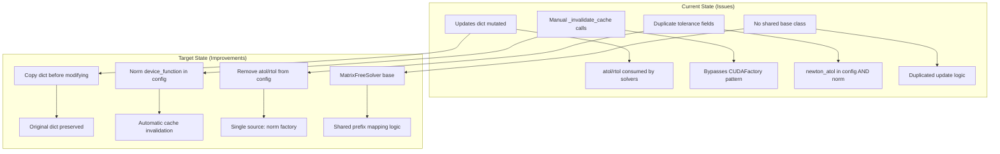
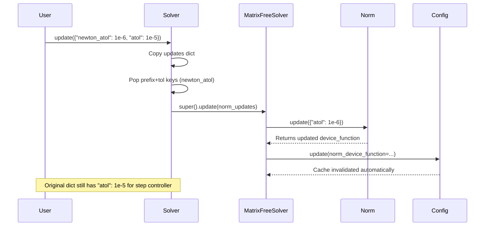

# Scaled Tolerance Refactoring Improvements

## User Stories

### US-1: Safe Update Dict Handling
**As a** user of the Newton-Krylov or Linear solver via higher-level integrator APIs,
**I want** my tolerance updates (`atol`, `rtol`) for step controllers to pass through without being consumed or modified by solver updates,
**So that** step controllers receive the tolerance values I configured, not solver-specific renamed versions.

**Acceptance Criteria:**
- When an updates dict containing `atol` and `rtol` is passed through solver update methods, the original dict is not mutated
- Step controller tolerance parameters remain separate from solver tolerance parameters
- Prefixed parameter names (e.g., `krylov_atol`, `newton_atol`) are properly mapped to their unprefixed form for norm updates

---

### US-2: Proper Cache Invalidation via Config Updates
**As a** developer extending or using CuBIE's matrix-free solvers,
**I want** cache invalidation to happen automatically through compile settings updates rather than manual `_invalidate_cache()` calls,
**So that** the cache invalidation mechanism follows CuBIE's established CUDAFactory patterns and remains maintainable.

**Acceptance Criteria:**
- No direct calls to `_invalidate_cache()` in solver update methods
- Norm device function is stored in config and updates to it trigger cache invalidation automatically
- Updating the norm factory causes the solver's cache to be invalidated through the standard compile settings mechanism

---

### US-3: Centralized Solver Settings with Prefix Mapping
**As a** developer maintaining the solver infrastructure,
**I want** a shared `MatrixFreeSolver` base class with a `settings_prefix` attribute,
**So that** tolerance parameter mapping (`krylov_atol` → `atol`, `newton_atol` → `atol`) is consistent and DRY across all solvers.

**Acceptance Criteria:**
- `MatrixFreeSolver` CUDAFactory base class exists in `base_solver.py`
- Each solver has a `settings_prefix` attribute (e.g., `"krylov_"`, `"newton_"`)
- Update methods use prefix stripping to map prefixed tolerance names to unprefixed form
- `max_iters` is added as a common field to `MatrixFreeSolverConfig`

---

### US-4: Norm Factory Owned by Solver Base Class
**As a** developer working on solver cache management,
**I want** the `ScaledNorm` factory to be owned and managed by the `MatrixFreeSolver` base class,
**So that** norm updates and cache invalidation are handled uniformly across all solvers.

**Acceptance Criteria:**
- `MatrixFreeSolver` owns the `self.norm` attribute
- Norm's device function is stored in solver config for automatic cache invalidation
- Tolerance parameter updates flow through to norm factory via base class methods
- Config includes the norm's device function reference for compile-time dependency tracking

---

### US-5: Remove Duplicated Tolerance Fields from Config
**As a** developer maintaining clean architecture,
**I want** `newton_atol`/`newton_rtol` to be removed from `NewtonKrylovConfig` and sourced from the norm factory,
**So that** there is a single source of truth for solver tolerances.

**Acceptance Criteria:**
- `newton_atol` and `newton_rtol` fields are removed from `NewtonKrylovConfig`
- Same for `krylov_atol` and `krylov_rtol` in `LinearSolverConfig`
- Tolerance values are accessed through the norm factory owned by the solver
- `settings_dict` properties pull tolerance values from norm factory

---

## Overview

This refactoring addresses five key architectural improvements to the scaled tolerance implementation in Newton and Krylov solvers:

### Data Flow After Refactoring

### Key Architectural Decisions

1. **Dict Copy Before Modification**: Both `LinearSolver.update()` and `NewtonKrylov.update()` must copy the updates dict before popping tolerance keys, preserving the original for downstream consumers (step controllers).

2. **Norm Device Function in Config**: Instead of calling `self.norm.device_function` directly in `build()`, we store the device function reference in `compile_settings`. Updates to the norm trigger a config update, which automatically invalidates the solver's cache.

3. **Settings Prefix Pattern**: The `settings_prefix` attribute (e.g., `"krylov_"`, `"newton_"`) enables uniform mapping of prefixed parameters to their base form. When `krylov_atol` is received, it's mapped to `atol` for the norm update.

4. **Base Class Norm Ownership**: `MatrixFreeSolver` owns the norm factory and handles the tolerance update → config update → cache invalidation chain. Subclasses just set their prefix and inherit the behavior.

### Trade-offs Considered

| Approach | Pros | Cons | Decision |
|----------|------|------|----------|
| Keep atol/rtol in config + norm | Backwards compatible | Dual source of truth, sync issues | **Rejected** |
| Norm-only tolerance storage | Single source of truth, cleaner | Breaking change to config interface | **Accepted** |
| Manual cache invalidation | Simple, direct | Bypasses CUDAFactory pattern, error-prone | **Rejected** |
| Config-based device function | Follows established patterns | Slightly more indirection | **Accepted** |

### Impact on Existing Architecture

- **Breaking Changes**: `NewtonKrylovConfig` and `LinearSolverConfig` will no longer have `newton_atol`/`krylov_atol` fields directly accessible. Access via solver properties remains unchanged.
- **New Inheritance**: Both `LinearSolver` and `NewtonKrylov` will inherit from `MatrixFreeSolver` base class.
- **Update Behavior**: Tolerance updates now flow: User → Solver.update() → MatrixFreeSolver.update() → Norm.update() → Config.update() → Cache invalidation.
