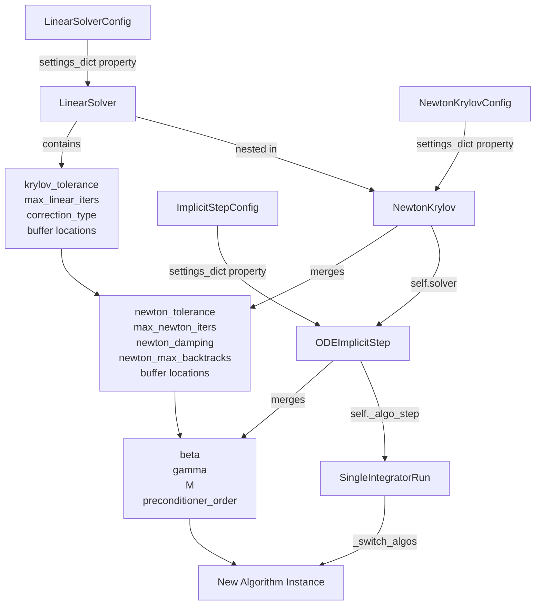
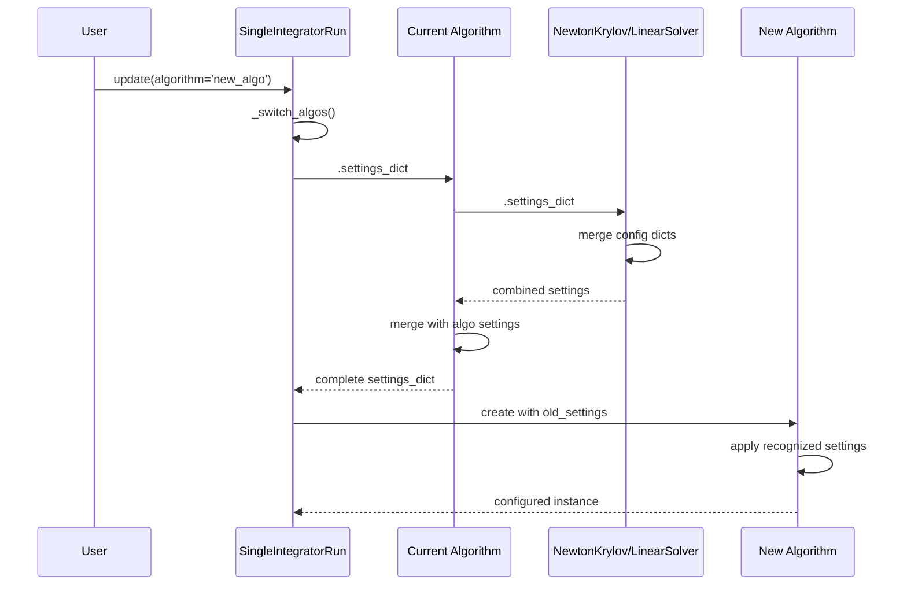
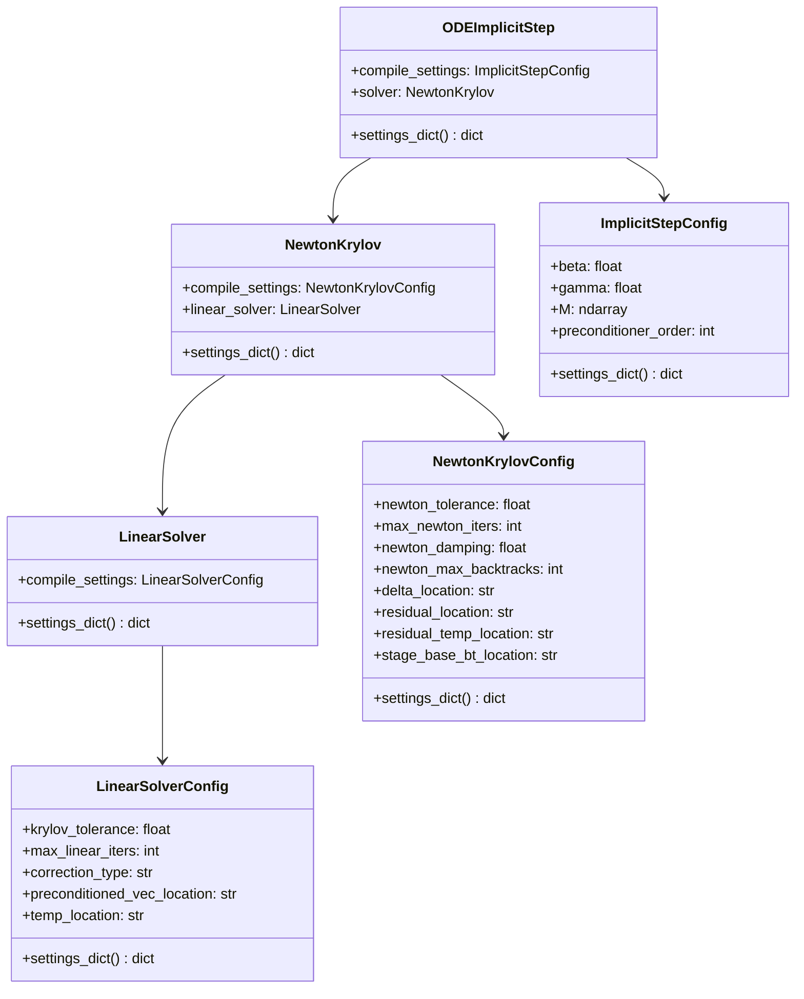

# Settings Dict Properties - Hot-Swapping Configuration Pipeline

## User Stories

### User Story 1: Linear Solver Configuration Preservation
**As a** developer implementing hot-swappable algorithm configurations  
**I want** the linear solver to export all its configuration parameters in a settings_dict  
**So that** when algorithms are swapped, the new algorithm can inherit applicable linear solver settings

**Acceptance Criteria:**
- LinearSolverConfig has a `settings_dict` property that returns krylov_tolerance, max_linear_iters, and correction_type
- LinearSolver has a `settings_dict` property that passes through the config's settings_dict
- All buffer location parameters (preconditioned_vec_location, temp_location) are included in the settings_dict
- The settings_dict can be used to initialize a new LinearSolver instance with equivalent configuration

### User Story 2: Newton Solver Configuration Preservation
**As a** developer implementing hot-swappable algorithm configurations  
**I want** the Newton-Krylov solver to export all its configuration parameters including nested linear solver settings  
**So that** when algorithms are swapped, the new algorithm receives a complete solver configuration

**Acceptance Criteria:**
- NewtonKrylovConfig has a `settings_dict` property that returns newton_tolerance, max_newton_iters, newton_damping, and newton_max_backtracks
- NewtonKrylov has a `settings_dict` property that fetches its config dict, merges it with the linear solver's settings_dict, and returns the combined dict
- All buffer location parameters (delta_location, residual_location, residual_temp_location, stage_base_bt_location) are included in the settings_dict
- The combined settings_dict contains both Newton-level and linear solver parameters without key conflicts

### User Story 3: Implicit Step Configuration Propagation
**As a** developer implementing hot-swappable algorithm configurations  
**I want** ODEImplicitStep to combine solver settings with algorithm-level settings  
**So that** the complete configuration state is available for algorithm hot-swapping

**Acceptance Criteria:**
- ODEImplicitStep's `settings_dict` property fetches self.solver.settings_dict and merges it with the ImplicitStepConfig settings_dict
- All implicit algorithm parameters (beta, gamma, M, preconditioner_order) are included
- All buffer location parameters from the solver hierarchy are present in the final dict
- The merged dict is correctly passed through the algorithm chain

### User Story 4: Settings Propagation Through Integration Chain
**As a** developer implementing hot-swappable algorithm configurations  
**I want** settings_dict to propagate correctly through SingleIntegratorRun  
**So that** algorithm swaps in _switch_algos preserve all applicable configuration

**Acceptance Criteria:**
- When _switch_algos creates a new algorithm instance, it captures old_settings from self._algo_step.settings_dict
- The new algorithm receives these settings and applies all recognized parameters
- Settings flow correctly through the next_function interface used for algorithm chaining
- SingleIntegratorRun's update cycle correctly handles settings_dict from algorithm properties

## Overview

### Executive Summary

This implementation creates a hierarchical settings_dict property chain that enables hot-swapping of algorithm configurations without losing parameter settings. The chain flows from the lowest level (LinearSolver config) through NewtonKrylov solver, ODEImplicitStep algorithms, and finally to SingleIntegratorRun's algorithm swap mechanism.

The key innovation is that each level merges its own settings with child component settings, creating a complete configuration snapshot that can be passed to a new instance of the same or different algorithm type.

### Architecture Diagram



### Data Flow: Settings Dict Propagation



### Component Hierarchy



## Key Technical Decisions

### 1. Property-Based Settings Export
**Decision:** Implement settings_dict as properties at each level rather than methods  
**Rationale:** 
- Consistent with existing CuBIE patterns (see step_controller.settings_dict)
- Properties are more intuitive for configuration access
- Enables simple chaining: `self.solver.settings_dict`

### 2. Bottom-Up Merging Strategy
**Decision:** Each level fetches child settings and merges with own settings  
**Rationale:**
- Child components are most authoritative about their own configuration
- Avoids duplication - parent doesn't need to track child parameters
- Natural composition pattern that scales to arbitrary nesting depth
- Parent-level settings override child settings when keys conflict (by merging order)

### 3. Include All Buffer Locations
**Decision:** All `*_location` parameters are included in settings_dict  
**Rationale:**
- Buffer locations are part of the algorithm configuration
- They affect compilation and cache invalidation
- Essential for complete hot-swap capability
- Without them, buffer allocations could mismatch after swap

### 4. Config-Level Properties
**Decision:** Add settings_dict property to Config classes (attrs classes) in addition to Factory classes  
**Rationale:**
- Factory classes delegate to compile_settings for configuration state
- Keeps configuration logic centralized in the Config class
- Factory settings_dict simply returns `self.compile_settings.settings_dict`
- Cleaner separation of concerns

## Research Findings

### Existing Settings Dict Pattern

Current implementation (from base_algorithm_step.py):
```python
@property
def settings_dict(self) -> Dict[str, object]:
    """Return a mutable view of the configuration state."""
    return {
        "n": self.n,
        "n_drivers": self.n_drivers,
        "precision": self.precision,
    }
```

Step controllers follow the same pattern (from adaptive_step_controller.py):
```python
@property
def settings_dict(self) -> dict[str, object]:
    settings_dict = super().settings_dict
    settings_dict.update(
        {
            "dt_min": self.dt_min,
            "dt_max": self.dt_max,
            "atol": self.atol,
            "rtol": self.rtol,
        }
    )
    return settings_dict
```

### Current Algorithm Hot-Swap Implementation

From SingleIntegratorRunCore._switch_algos():
```python
if new_algo != self.compile_settings.algorithm:
    old_settings = self._algo_step.settings_dict
    old_settings["algorithm"] = new_algo
    self._algo_step = get_algorithm_step(
        precision=precision,
        settings=old_settings,
    )
```

This demonstrates the intended usage: capture settings from old algorithm, create new algorithm with those settings.

### Buffer Registry Pattern

Buffer locations are managed through buffer_registry and stored in Config classes:
- LinearSolverConfig: `preconditioned_vec_location`, `temp_location`
- NewtonKrylovConfig: `delta_location`, `residual_location`, `residual_temp_location`, `stage_base_bt_location`

These are currently NOT included in settings_dict, which is a gap this implementation must close.

## Trade-Offs and Alternatives Considered

### Alternative 1: Separate Method for Full Settings
**Considered:** Having `settings_dict` return minimal settings and `full_settings_dict()` return everything  
**Rejected:** 
- Two interfaces for similar purposes creates confusion
- Hot-swap needs full settings, so minimal dict has no use case
- Violates single responsibility principle

### Alternative 2: Top-Down Settings Collection
**Considered:** ODEImplicitStep directly queries all child parameters  
**Rejected:**
- Creates tight coupling between parent and child implementations
- Parent must track which parameters exist in children
- Breaks when child components change their parameter sets
- Violates encapsulation

### Alternative 3: Explicit Settings Registry
**Considered:** Central registry tracking all parameters at each level  
**Rejected:**
- Over-engineering for this use case
- Adds complexity without clear benefits
- Parameter sets are already defined in attrs Config classes
- Would require maintaining registry separately from Config definitions

## Expected Impact on Existing Architecture

### Minimal Changes Required
- Add `settings_dict` property to 2 Config classes (LinearSolverConfig, NewtonKrylovConfig)
- Add `settings_dict` property to 2 Factory classes (LinearSolver, NewtonKrylov)
- Modify existing `settings_dict` in ODEImplicitStep to merge solver settings
- No changes to calling code - SingleIntegratorRun already uses settings_dict pattern

### Cache Invalidation Behavior
- No impact on cache invalidation - properties are read-only views
- Changing settings via update() continues to trigger cache invalidation through existing mechanisms
- settings_dict is a snapshot, not a live reference

### Backward Compatibility
- Additive change - no existing functionality removed
- Existing settings_dict properties continue to work
- New properties only add information, don't change existing keys
- Buffer location parameters were already settable via update(), just not queryable via settings_dict

## Integration Points with Current Codebase

### 1. LinearSolver and NewtonKrylov
- Both are CUDAFactory subclasses with Config objects
- Both use buffer_registry for memory management
- Both have update() methods that recognize buffer location parameters
- Integration: Add settings_dict properties consistent with existing BaseAlgorithmStep pattern

### 2. ODEImplicitStep
- Already has settings_dict property (inherited from BaseAlgorithmStep)
- Currently returns only ImplicitStepConfig.settings_dict
- Integration: Override to merge with self.solver.settings_dict

### 3. SingleIntegratorRunCore
- Already uses settings_dict in _switch_algos() and _switch_controllers()
- Pattern is: `old_settings = self._algo_step.settings_dict`
- Integration: No code changes needed - enhanced settings_dict will automatically flow through

### 4. Buffer Registry
- buffer_registry.update() already handles buffer location parameters
- Parameters recognized but not currently exported in settings_dict
- Integration: Include buffer locations in Config.settings_dict properties

## Expected Behavior

### Before Hot-Swap (Capture Settings)
```python
# User has BackwardsEulerStep with newton_tolerance=1e-4, krylov_tolerance=1e-7
old_settings = algo_step.settings_dict
# Returns:
{
    'n': 10,
    'precision': np.float64,
    'beta': 1.0,
    'gamma': 1.0,
    'M': <array>,
    'preconditioner_order': 1,
    'newton_tolerance': 1e-4,
    'max_newton_iters': 100,
    'newton_damping': 0.5,
    'newton_max_backtracks': 8,
    'delta_location': 'local',
    'residual_location': 'local',
    'residual_temp_location': 'local',
    'stage_base_bt_location': 'local',
    'krylov_tolerance': 1e-7,
    'max_linear_iters': 100,
    'correction_type': 'minimal_residual',
    'preconditioned_vec_location': 'local',
    'temp_location': 'local',
}
```

### After Hot-Swap (Apply to New Algorithm)
```python
# Create new CrankNicolsonStep with old settings
old_settings['algorithm'] = 'crank_nicolson'
new_algo = get_algorithm_step(precision=precision, settings=old_settings)
# New algorithm inherits applicable solver settings:
# - newton_tolerance, krylov_tolerance, etc. are applied
# - beta, gamma may be overridden by algorithm-specific constants
# - Buffer locations are preserved
# - Unrecognized parameters for this algorithm are ignored with warning
```

### Settings Merge Order
1. LinearSolver config dict (linear solver parameters + buffer locations)
2. NewtonKrylov config dict (newton parameters + buffer locations), merged with linear solver dict
3. ImplicitStepConfig dict (algorithm parameters), merged with solver dict
4. Result: Complete configuration snapshot suitable for hot-swapping
