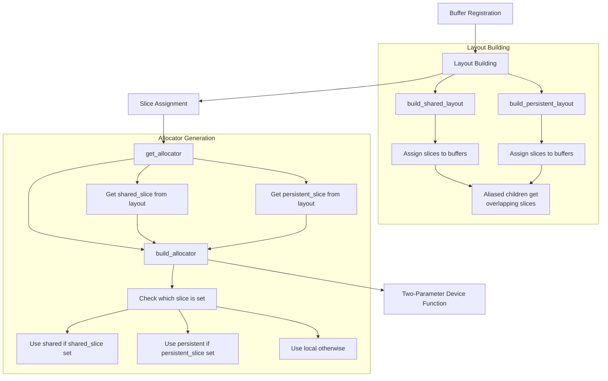
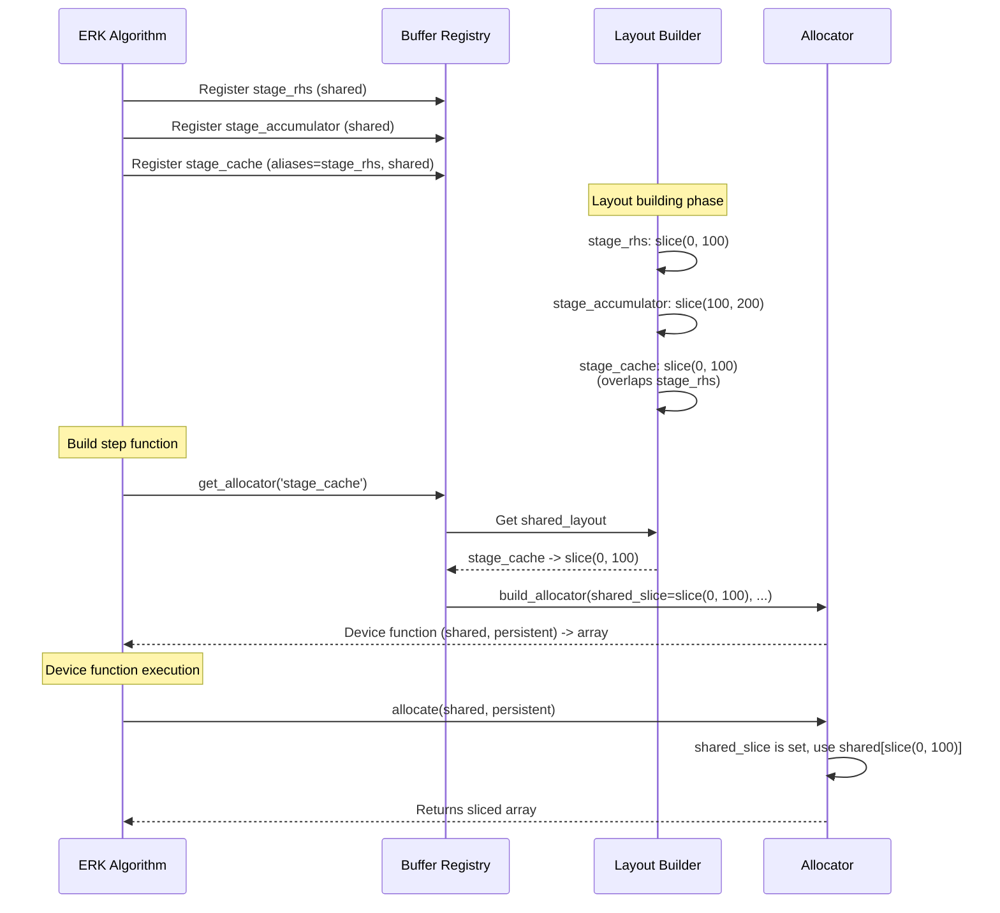

# Simplify Aliasing Implementation - Human Overview

## User Stories

### User Story 1: Correct ERK Stage Cache Aliasing
**As a** CuBIE developer  
**I want** ERK's stage_cache to follow the correct preference order for aliasing  
**So that** memory is reused optimally and FSAL (First Same As Last) optimization works correctly

**Acceptance Criteria:**
- stage_cache prefers to alias stage_rhs if rhs is shared
- stage_cache falls back to aliasing stage_accumulator if accumulator is shared
- stage_cache falls back to persistent local if neither is shared
- All aliasing decisions are made by buffer_registry, not manual logic
- No manual location computation or conditional registration logic

### User Story 2: Simplified Rosenbrock Buffer Registration
**As a** CuBIE developer  
**I want** Rosenbrock's stage_cache registration to be declarative  
**So that** the buffer_registry handles all aliasing logic without manual intervention

**Acceptance Criteria:**
- Rosenbrock registers stage_cache with correct location and aliases parameters
- No manual aliasing logic or preference checking in Rosenbrock code
- Buffer registry determines if aliasing succeeds

### User Story 3: Two-Parameter Allocator
**As a** CuBIE maintainer  
**I want** allocators to accept only (shared, persistent) parameters  
**So that** the interface is simple and the slice-based approach is fully utilized

**Acceptance Criteria:**
- Allocator signature is `(shared, persistent) -> array`
- Third `aliased_parent` parameter is removed
- Allocators use slices assigned during layout building
- All call sites updated to new signature

### User Story 4: Simplified get_allocator Logic
**As a** CuBIE maintainer  
**I want** get_allocator to simply retrieve slices from layouts  
**So that** complex bounds-checking logic is eliminated

**Acceptance Criteria:**
- get_allocator retrieves slice from appropriate layout
- No bounds-checking to determine if aliasing succeeded
- Layout building phase is the sole source of truth for slice assignments
- Allocator just checks which slice is set (shared_slice vs persistent_slice)

## Overview

The current aliasing implementation has become overcomplicated with three-parameter allocators and complex bounds-checking logic in `get_allocator`. The user's review feedback indicates that the slice-based layout approach already determines aliasing success, making the third parameter and bounds checking redundant.

### Key Insight

**The layout-building phase already determines whether aliasing succeeds by assigning overlapping slices.** The allocator should just use those slices without additional logic.

**Example:**
- Parent buffer: assigned `slice(0, 100)` in shared layout
- Child that successfully aliases parent: assigned `slice(20, 40)` in shared layout (overlaps parent)
- Allocator for child: gets `shared_slice=slice(20, 40)`, uses it directly
- No need to pass parent buffer or perform bounds checking

### Current Problems

1. **ERK stage_cache logic was removed incorrectly**
   - Original had preference order: stage_rhs > stage_accumulator > persistent local
   - Current just aliases stage_accumulator with persistent=True
   - Need to restore preference order but let buffer_registry decide success

2. **Rosenbrock has manual aliasing logic**
   - Registers with `aliases='stage_store'` and `persistent=True`
   - This is trying to do what buffer_registry should do
   - Should just register with correct location and aliases

3. **Third parameter (`aliased_parent`) is redundant**
   - Slice-based layout already assigns overlapping slices during layout building
   - Allocator can just use the slice from the layout
   - Three-parameter format creates unnecessary complexity

4. **get_allocator has overly complex bounds-checking**
   - Checks if child slice is within parent bounds to determine aliasing success
   - This information is already encoded in the slice assignments
   - Should just get slice from layout and return it

### Solution Architecture



### Data Flow



### Technical Decisions

**Decision 1: Restore ERK preference order**
- Rationale: Original logic was correct, just needs to be expressed declaratively
- Implementation: Use conditional registration based on location parameters
- Trade-off: Slightly more registration code vs. correct memory reuse

**Decision 2: Remove third allocator parameter**
- Rationale: Slice-based layout eliminates need for parent buffer reference
- Implementation: Allocator signature becomes `(shared, persistent) -> array`
- Trade-off: Simpler interface, less runtime flexibility (but flexibility wasn't needed)

**Decision 3: Simplify get_allocator to just retrieve slices**
- Rationale: Layout building is source of truth, no need to re-check
- Implementation: Get slice from layout, pass to build_allocator, done
- Trade-off: Less validation at allocator generation time (but validation happens during layout building)

### Expected Impact

**Positive:**
- Simpler, more maintainable code
- Clearer separation of concerns (layout building vs. allocation)
- Easier to understand and debug
- Fewer opportunities for bugs

**Neutral:**
- Slight increase in registration code for ERK (conditional logic)
- No performance impact (all decisions made at compile time)

**Risk Mitigation:**
- Existing tests will catch any behavioral changes
- Layout building logic is already tested and working
- Changes are isolated to registration and allocator generation

## Research Findings

### Key References

1. **buffer_registry.py lines 280-344**: `build_shared_layout` already implements correct overlapping slice logic
2. **buffer_registry.py lines 359-411**: `build_persistent_layout` follows same pattern
3. **git show HEAD~10 generic_erk.py**: Shows original ERK preference order logic
4. **Current ERK lines 251-259**: Shows simplified (incorrect) registration
5. **Current Rosenbrock lines 252-260**: Shows manual aliasing attempt

### Original ERK Logic (Correct)

```python
use_shared_rhs = config.stage_rhs_location == 'shared'
use_shared_acc = config.stage_accumulator_location == 'shared'
if use_shared_rhs:
    buffer_registry.register(
        'stage_cache', self, n, 'shared',
        aliases='stage_rhs', precision=precision
    )
elif use_shared_acc:
    buffer_registry.register(
        'stage_cache', self, n, 'shared',
        aliases='stage_accumulator', precision=precision
    )
else:
    buffer_registry.register(
        'stage_cache', self, n, 'local',
        persistent=True, precision=precision
    )
```

This correctly implements the preference order while letting buffer_registry decide if aliasing succeeds.

### Layout Building Already Handles Overlap

From `build_shared_layout` (lines 323-334):

```python
if entry.size <= available:
    # Alias within parent (WITH OVERLAP - reuse memory)
    parent_slice = layout[entry.aliases]
    start = parent_slice.start + consumed
    layout[name] = slice(start, start + entry.size)
    self._alias_consumption[entry.aliases] = (
        consumed + entry.size
    )
```

The layout builder already assigns overlapping slices when aliasing succeeds. The allocator just needs to use this slice.

## Alternative Approaches Considered

### Alternative 1: Keep three-parameter allocator
**Rejected because:** Adds complexity without benefit; slice-based approach is cleaner

### Alternative 2: Make buffer_registry automatically determine preferences
**Rejected because:** Would require magic behavior; explicit is better than implicit

### Alternative 3: Add validation in get_allocator
**Rejected because:** Validation should happen during layout building, not allocator generation
