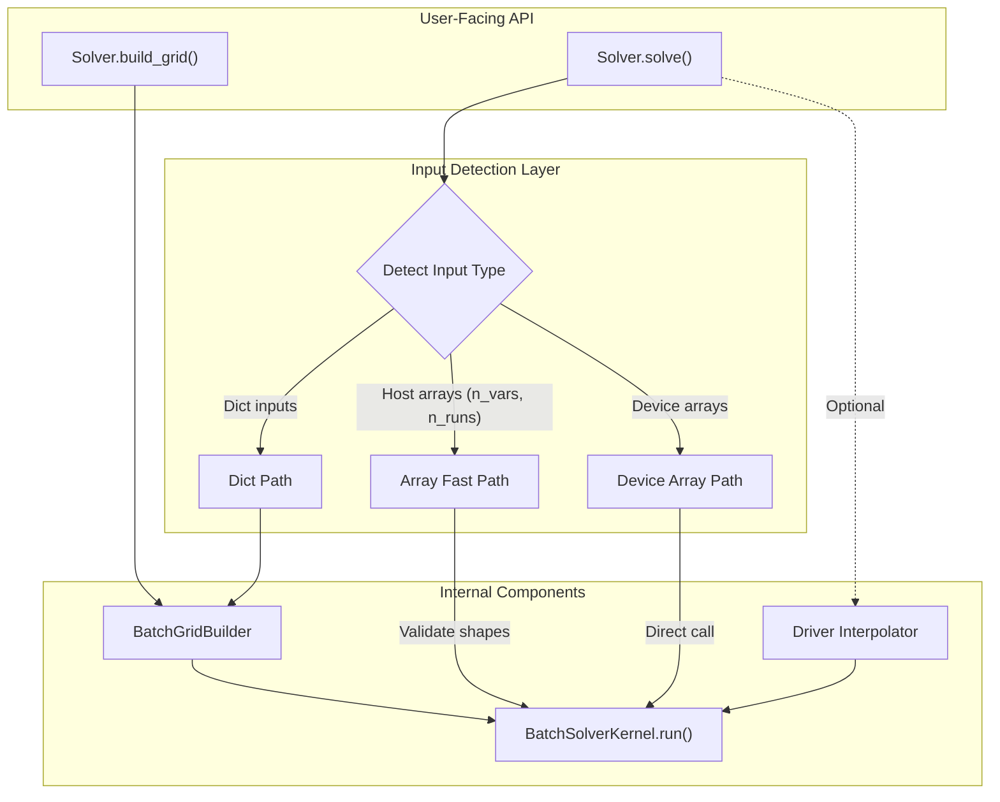
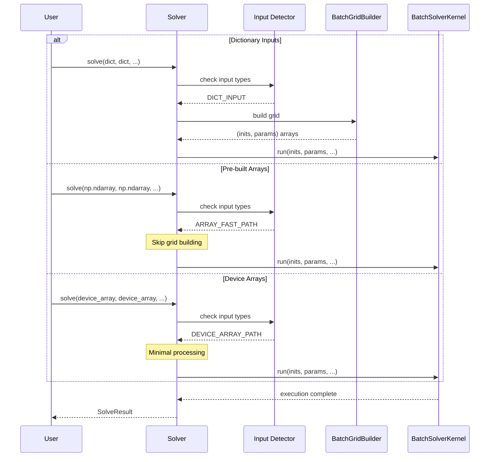

# Solver API Redesign: Human Overview

## User Stories

### US-1: Single Entry Point for Batch Solving
**As a** CuBIE user  
**I want** a single `solve()` method as my primary interface  
**So that** I don't have to learn multiple API methods for different use cases

**Acceptance Criteria:**
- `Solver.solve()` is the only user-facing method needed for all solving scenarios
- The method auto-detects input types and routes to optimal paths internally
- No need for users to call separate methods based on input format
- BatchSolverKernel methods remain internal (not part of user API)

### US-2: Automatic Fast Path for Pre-built Arrays
**As a** performance-conscious user  
**I want** the solver to automatically skip grid-building when I pass ready-to-use arrays  
**So that** I can re-use pre-computed grids without manual API changes

**Acceptance Criteria:**
- When `solve()` receives `np.ndarray` inputs with shape `(n_vars, n_runs)` and matching run counts, grid building is skipped
- When arrays with correct dtype and contiguity are passed, minimal processing occurs
- Fast path behavior is automatic; no special flags or methods needed
- Device arrays (if passed) route to kernel with minimal overhead

### US-3: External Grid Creation Helper
**As an** advanced user  
**I want** a helper method to create reusable grids externally  
**So that** I can pre-compute grid arrays and use them across multiple solve calls

**Acceptance Criteria:**
- `Solver.build_grid()` method accepts dict inputs (like current `solve()`)
- Returns `(initial_values, parameters)` tuple as `(n_vars, n_runs)` arrays
- Returned arrays can be passed directly to `solve()` for fast-path execution
- Grid building logic is shared between `solve()` and `build_grid()`

### US-4: Backward-Compatible Dictionary API
**As an** existing CuBIE user  
**I want** to continue using dictionary inputs for sweep definitions  
**So that** my existing code continues to work without modifications

**Acceptance Criteria:**
- Dictionary inputs to `solve()` work exactly as before
- Grid type ("combinatorial" vs "verbatim") behaves identically
- Default values are filled for unspecified variables as before
- No breaking changes to existing dictionary-based workflows

---

## Executive Summary

This redesign consolidates the solver API around a single, intelligent `solve()` method that automatically detects input types and takes optimal paths. The key principles are:

1. **Single Entry Point**: `Solver.solve()` handles all cases through smart input detection
2. **Automatic Optimization**: Fast paths are taken transparently based on input characteristics
3. **Helper for Advanced Users**: `Solver.build_grid()` exposes grid creation for reusable workflows
4. **Internal Kernel**: `BatchSolverKernel` methods remain internal implementation details

---

## Architecture Diagram

---

## Data Flow Diagram

---

## Key Technical Decisions

### Decision 1: Input Detection via Type Checking
**Rationale**: Use Python's `isinstance()` and NumPy shape checking to distinguish input types at the start of `solve()`. This is efficient and unambiguous.

**Detection Logic:**
1. If inputs are `dict` → full grid building path
2. If inputs are `np.ndarray` with shape `(n_vars, n_runs)` and matching runs → fast path
3. If inputs have `__cuda_array_interface__` → device array path

### Decision 2: No Separate User-Facing Methods
**Rationale**: The original rejected approach used `solve_arrays()` and `execute()` as separate methods. This new design keeps a single `solve()` entry point with internal branching.

**Trade-off**: Slight complexity in `solve()` method, but dramatically simpler user experience.

### Decision 3: build_grid() as External Helper
**Rationale**: Advanced users who want to pre-compute grids for reuse need a way to generate arrays without actually solving. `build_grid()` exposes the grid creation logic without executing the kernel.

### Decision 4: BatchSolverKernel Remains Internal
**Rationale**: Users should not need to know about or interact with `BatchSolverKernel`. It is an implementation detail. All kernel interactions go through `Solver.solve()`.

---

## Expected Impact on Existing Architecture

### solver.py Changes
- `solve()` method gains input detection logic at entry
- New private helper method for input type classification
- New public `build_grid()` method (wrapper around `grid_builder()`)
- No changes to other methods

### BatchGridBuilder.py Changes
- No structural changes needed
- Existing fast-path logic in `__call__` (lines 563-582) already handles arrays
- May need minor adjustments for edge cases

### BatchSolverKernel.py Changes
- No changes needed
- `run()` method remains as-is (already accepts arrays)
- Stays internal; not exposed to users

---

## Trade-offs Considered

| Approach | Pros | Cons |
|----------|------|------|
| **Single solve() with detection** (chosen) | Simple API, automatic optimization | Slightly more complex implementation |
| Multiple methods (solve, solve_arrays, execute) | Clear separation of concerns | User must choose correct method |
| Always build grid | Consistent code path | Wastes CPU cycles for pre-built arrays |
| Expose kernel methods | Maximum flexibility | Leaky abstraction, harder to maintain |

---

## Research References

- Current `solve()` implementation: lines 325-408 in solver.py
- BatchGridBuilder fast paths: lines 563-582 in BatchGridBuilder.py
- Kernel run interface: lines 215-371 in BatchSolverKernel.py
- Existing test patterns: test_solver.py shows current usage
