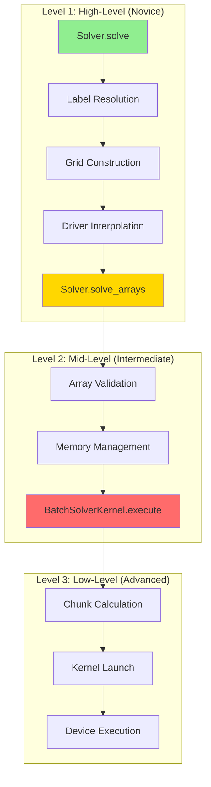
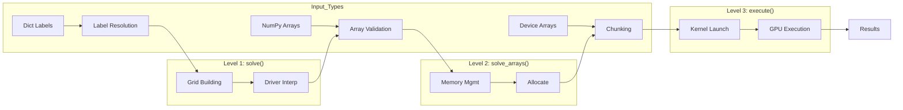

# Solver API Stratification - Human Overview

## User Stories

### US-1: Novice User - Maximum Convenience
**As a** researcher new to CuBIE  
**I want to** call `solver.solve()` with labeled dictionaries for initial values and parameters  
**So that** I can run batch integrations without understanding array layouts or GPU memory management

**Acceptance Criteria:**
- Can pass dictionaries with variable names as keys
- Grid construction (combinatorial/verbatim) handled automatically
- Driver interpolation setup handled automatically
- All validation and sanitisation performed
- Returns a complete `SolveResult` with labeled outputs

### US-2: Intermediate User - Pre-Built Arrays
**As a** developer running many iterations in a loop  
**I want to** bypass grid construction by providing pre-built arrays in the correct format  
**So that** I can reduce per-call overhead while still getting memory management and chunking

**Acceptance Criteria:**
- Can pass numpy arrays directly in (variable, run) format
- Skips label resolution and grid building
- Still handles memory allocation, chunking, and host/device transfers
- Validates array shapes and precision match system expectations
- Returns same `SolveResult` format as high-level API

### US-3: Advanced User - Pre-Allocated Memory
**As a** performance-critical application developer  
**I want to** provide my own pre-allocated device arrays and call the kernel directly  
**So that** I can eliminate all Python overhead in tight integration loops

**Acceptance Criteria:**
- Can provide pre-allocated device arrays for inputs and outputs
- Skips all host-side array management
- Minimal validation (shape compatibility only)
- Kernel executes with provided arrays
- Status codes and results written directly to provided buffers

### US-4: Consistent Experience Across Levels
**As a** user transitioning between API levels  
**I want to** have consistent naming conventions and return types  
**So that** I can incrementally optimise my code without complete rewrites

**Acceptance Criteria:**
- Lower-level methods are called by higher-level methods (not duplicated)
- Parameter names consistent across levels
- Documentation clearly indicates what each level handles vs. skips
- Type hints and docstrings accurate for each level

---

## Overview

### Executive Summary

This plan stratifies the `Solver.solve()` and `BatchSolverKernel.run()` methods into three distinct API levels, following patterns established by SciPy's `solve_ivp()` / solver classes and Julia's DifferentialEquations.jl dispatch architecture. Each level provides progressively less "help" in exchange for reduced overhead, enabling users to choose their optimal trade-off between convenience and performance.

### Proposed Architecture

### Data Flow Diagram

### Key Technical Decisions

1. **Three-Tier Strategy**: Matches user expertise levels and common use cases
   - Level 1 (solve): Dictionary inputs, full processing, maximum convenience
   - Level 2 (solve_arrays): NumPy arrays, memory management, moderate overhead
   - Level 3 (execute): Pre-allocated device arrays, minimal overhead

2. **Cascading Implementation**: Higher levels call lower levels
   - Avoids code duplication
   - Ensures consistency
   - Simplifies maintenance

3. **Naming Convention**: Following SciPy patterns
   - `solve()` - highest level (like `solve_ivp()`)
   - `solve_arrays()` - array-based (like instantiating solver class directly)
   - `execute()` - lowest level (like `step()` on solver)

4. **Validation Granularity**
   - Level 1: Full validation with helpful error messages
   - Level 2: Shape/dtype validation only
   - Level 3: Minimal/no validation (trust the caller)

### Trade-offs Considered

| Approach | Pros | Cons | Decision |
|----------|------|------|----------|
| Boolean flags (build_grid=False) | Simple API | Combinatorial explosion | Rejected |
| Separate methods | Clear intent | More methods to learn | **Selected** |
| Subclassing | Full customization | Complex inheritance | Rejected |
| Context managers | Pythonic patterns | Overhead per call | Considered for future |

### References

- Related Issues: #273 (Remove helper noise), #270 (Separate grid construction)
- SciPy Pattern: `solve_ivp()` + individual solver classes (`RK45`, `BDF`)
- Julia Pattern: `ODEProblem` + `solve()` with algorithm dispatch

### Impact on Existing Architecture

1. **Solver class**: Adds `solve_arrays()` method between current `solve()` and kernel
2. **BatchSolverKernel**: Adds `execute()` method called by `run()`
3. **Backward Compatibility**: Existing `solve()` and `run()` signatures unchanged
4. **Tests**: New test cases for each level, existing tests remain valid

---

## Method Responsibilities Matrix

| Responsibility | Level 1 (solve) | Level 2 (solve_arrays) | Level 3 (execute) |
|---------------|-----------------|------------------------|-------------------|
| Label resolution | ✓ | ✗ | ✗ |
| Grid construction | ✓ | ✗ | ✗ |
| Driver interpolation | ✓ | ✗ | ✗ |
| Update kwargs | ✓ | ✓ | ✗ |
| Array validation | ✓ (full) | ✓ (shape only) | ✗ |
| Memory allocation | ✓ | ✓ | ✗ |
| Host→Device transfer | ✓ | ✓ | ✗ |
| Chunking calculation | ✓ | ✓ | ✓ |
| Kernel launch | ✓ | ✓ | ✓ |
| Device→Host transfer | ✓ | ✓ | ✗ |
| Result construction | ✓ | ✓ | ✗ |
