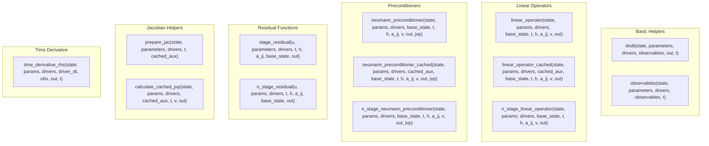
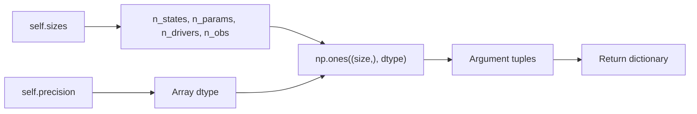

# Solver Helper Dummy Arguments Implementation

## User Stories

### US1: Complete Dummy Argument Coverage for Solver Helpers
**As a** CuBIE developer using compile-time measurement tools  
**I want** `_generate_dummy_args` to return valid dummy arguments for all solver helper functions  
**So that** compile-time analysis tools can exercise every generated device function

**Acceptance Criteria:**
- `_generate_dummy_args()` returns entries for all solver helpers defined in `ODECache`
- Each entry's argument tuple matches the exact signature of the corresponding codegen template
- n-stage helpers have appropriate sizing based on a default stage count (e.g., 2 stages)
- The returned dictionary covers: `dxdt`, `observables`, `linear_operator`, `linear_operator_cached`, `neumann_preconditioner`, `neumann_preconditioner_cached`, `stage_residual`, `n_stage_residual`, `n_stage_linear_operator`, `n_stage_neumann_preconditioner`, `prepare_jac`, `calculate_cached_jvp`, `time_derivative_rhs`

### US2: Signature Consistency with Codegen Templates
**As a** developer maintaining the symbolic ODE subsystem  
**I want** dummy arguments to exactly match the device function signatures from codegen templates  
**So that** I can trust that compile-time measurements reflect actual function behavior

**Acceptance Criteria:**
- Each dummy argument tuple has correct arity matching the template signature
- Array arguments have correct shapes (n_states, n_params, n_drivers, n_obs, etc.)
- Scalar arguments use the correct precision type
- Cached variants include the `cached_aux` buffer argument
- n-stage variants use flattened sizes (`n_stages * n_states`)

---

## Overview

This feature extends the `_generate_dummy_args` method in `SymbolicODE` to provide dummy argument tuples for all solver helper functions available via `get_solver_helper`. Currently, only `dxdt` and `observables` have dummy arguments; the remaining helpers (linear operators, preconditioners, residuals, Jacobian preparation, etc.) are missing.

### Solver Helper Function Signatures

Based on analysis of the codegen templates, here are all solver helpers and their device function signatures:

### Key Implementation Points

1. **System Sizes**: All dummy arrays derive from `self.sizes` which provides `states`, `parameters`, `drivers`, `observables`

2. **Precision Handling**: All arrays and scalars use `self.precision` dtype

3. **n-Stage Variants**: Use a default stage count (2) and multiply state/output dimensions accordingly

4. **Cached Auxiliary Buffer**: The `cached_aux_count` property (or a sensible default) determines the aux buffer size

5. **Scratch Buffers**: Preconditioners require an additional `jvp` scratch buffer

### Data Flow

### Trade-offs Considered

1. **Default Stage Count**: Using 2 stages for n-stage helpers provides minimal testing without excessive memory. Could be parameterized in future.

2. **Cached Aux Size**: For simplicity, use a fixed reasonable default (e.g., n_states * 2) rather than computing exact Jacobian aux count. The `jacobian_aux_count` property requires generating the prepare_jac code first.

3. **Driver Count Handling**: When `n_drivers=0`, still create 1-element arrays to avoid empty array edge cases.

### Expected Impact

- **No breaking changes**: This only adds new entries to the returned dictionary
- **Minimal code changes**: Single method modification in `symbolicODE.py`
- **Enables testing**: Compile-time measurement tools can now exercise all helper types
