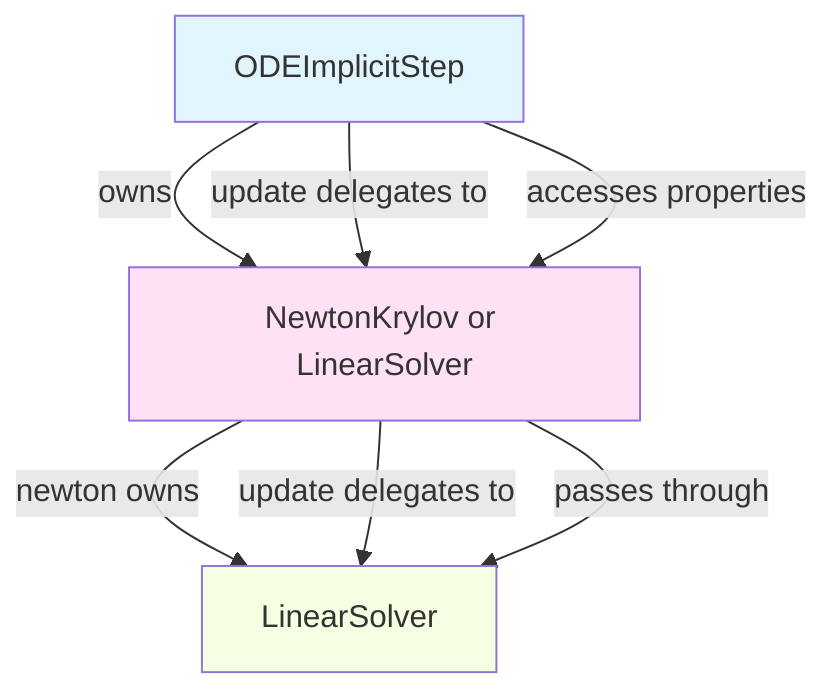

# Solver Ownership Pattern Refinement

## User Stories

### Story 1: Consistent Constructor Parameter Handling
**As a** developer maintaining solver classes  
**I want** constructor parameters to only be included in config if explicitly provided  
**So that** default values are managed centrally in config classes, not scattered across constructors

**Acceptance Criteria:**
- LinearSolver.__init__ uses conditional kwargs pattern (only add if not None)
- Pattern matches NewtonKrylov.__init__ implementation
- No fallback logic with ternary operators in config instantiation
- All solver constructors follow same pattern

### Story 2: Consistent Update Method Pattern
**As a** developer maintaining nested CUDAFactory objects  
**I want** update methods to follow a standard delegation pattern  
**So that** updates flow correctly through the ownership hierarchy

**Acceptance Criteria:**
- LinearSolver.update follows same pattern as NewtonKrylov.update
- Delegates to nested objects with full dict
- Updates device function references before calling update_compile_settings
- Calls buffer_registry.update last (doesn't contribute to recognized set)
- Uses `|=` operator for set accumulation
- Pattern consistent across all solvers and algorithm steps

### Story 3: Clean Property Pass-through
**As a** user of ODEImplicitStep  
**I want** to access linear solver properties uniformly  
**So that** I don't need to know whether the step uses LinearSolver or NewtonKrylov

**Acceptance Criteria:**
- NewtonKrylov has properties that pass through to linear_solver (krylov_tolerance, max_linear_iters, correction_type)
- ODEImplicitStep can access linear properties via self.solver.krylov_tolerance for both solver types
- ODEImplicitStep uses getattr with default=None for nonlinear-only properties
- No hasattr checks or clumsy conditional delegation
- All property accesses are direct and clean

### Story 4: Complete Pattern Replication
**As a** developer maintaining the codebase  
**I want** all related files to follow the established patterns  
**So that** the codebase is consistent and maintainable

**Acceptance Criteria:**
- All algorithm files follow update pattern if they have update methods
- All instrumented test files match their source counterparts
- No inconsistencies between similar components
- Documentation comments describe current behavior, not historical changes

## Overview

This is a follow-up refinement to PR #389 (solver ownership refactor). The user has manually updated two files to establish desired coding patterns and wants them replicated across related files.

### What Changed

The user modified:
1. **newton_krylov.py** - Established constructor parameter handling and update delegation pattern
2. **ode_implicitstep.py** - Established update method pattern for algorithm steps

### What Needs to Change

1. **Add pass-through properties to NewtonKrylov** for linear solver properties
2. **Simplify ODEImplicitStep properties** to use direct access after pass-through properties exist
3. **Update LinearSolver.__init__** to match NewtonKrylov's conditional parameter pattern
4. **Update LinearSolver.update** to match delegation pattern
5. **Review algorithm files** for any update methods needing pattern application
6. **Update instrumented test files** to mirror source changes

### Architecture Context

### Key Technical Decisions

**Decision 1: Conditional kwargs vs ternary operators**
- **Chosen:** Conditional kwargs (if param is not None: kwargs[key] = param)
- **Rationale:** More explicit, easier to read, matches existing NewtonKrylov pattern
- **Alternative:** Ternary operators (param if param is not None else default) - rejected as less clean

**Decision 2: Pass-through properties vs double delegation**
- **Chosen:** Add properties to NewtonKrylov that forward to linear_solver
- **Rationale:** Simplifies ODEImplicitStep, uniform interface regardless of solver type
- **Alternative:** Keep hasattr checks in ODEImplicitStep - rejected as clumsy per review comment

**Decision 3: Update pattern ordering**
- **Chosen:** Delegate first, update device function refs, call update_compile_settings, call buffer_registry.update last
- **Rationale:** Device function must be updated before compile settings to trigger cache invalidation
- **Alternative:** Different ordering - would miss cache invalidations

### Expected Impact

**Minimal changes:**
- This is a pattern refinement, not a feature addition
- Only constructor logic and update methods change
- No new functionality, just cleaner code organization

**Affected components:**
- LinearSolver (constructor + update)
- NewtonKrylov (add 3 properties)
- ODEImplicitStep (simplify properties)
- Instrumented test files (mirror source changes)

**No impact on:**
- Public API
- Test behavior
- Performance
- Cache invalidation logic (preserves existing behavior)

### Trade-offs

**Pro:**
- Consistent patterns across all solvers
- Cleaner property access
- More maintainable code
- Follows established CUDAFactory patterns

**Con:**
- Slightly more code in NewtonKrylov (3 new properties)
- Must update multiple files to maintain consistency

### References

- PR #389: Solver ownership refactor
- Review comments #2636867756, #2636917364
- User-modified files: newton_krylov.py lines 200-226, 495-538; ode_implicitstep.py lines 157-199, 348-405
