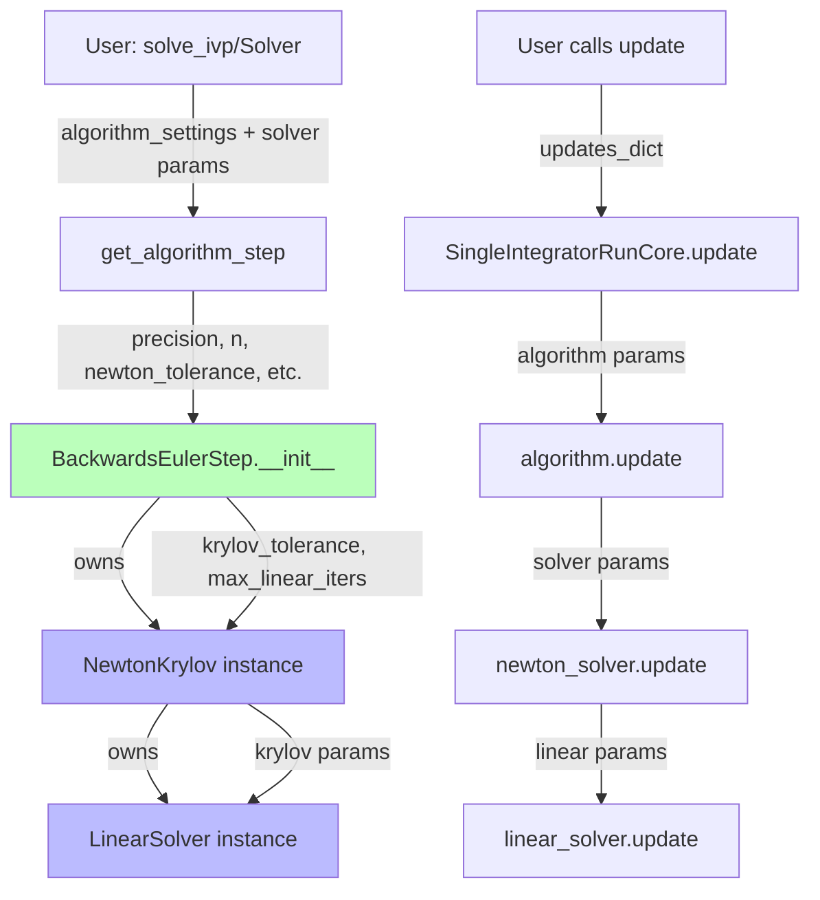
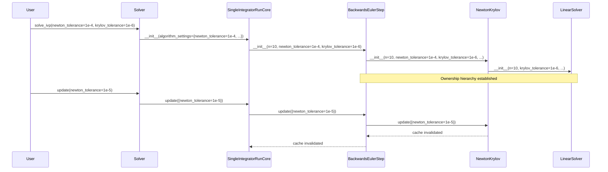

# Solver Ownership Refactor - Human Overview

## User Stories

### User Story 1: Solver Ownership in Algorithm Steps
**As a** developer working with implicit integration algorithms  
**I want** each implicit algorithm step to own and manage its solver objects  
**So that** the solver lifecycle is properly coupled to the algorithm that uses it, improving modularity and eliminating configuration antipatterns

**Acceptance Criteria:**
- Implicit algorithm steps (BackwardsEuler, CrankNicolson, DIRK, FIRK) own a NewtonKrylov solver instance
- Rosenbrock steps own a LinearSolver instance  
- Solver parameters (newton_tolerance, krylov_tolerance, etc.) are passed as kwargs to algorithm constructors
- Algorithm steps call solver.update() when their own update() is called
- Algorithm steps call solver.init() with appropriate kwargs during initialization
- Algorithm steps invalidate their cache when solver parameters change
- Solvers are no longer stored in config objects

### User Story 2: Nested Solver Ownership
**As a** developer working with Newton-Krylov solvers  
**I want** the NewtonKrylov solver to own its LinearSolver instance  
**So that** the linear solver lifecycle is properly coupled to its parent nonlinear solver

**Acceptance Criteria:**
- NewtonKrylov owns a LinearSolver instance as a member variable
- LinearSolver parameters (krylov_tolerance, max_linear_iters, correction_type) are passed to NewtonKrylov constructor
- NewtonKrylov passes these parameters to its LinearSolver during initialization
- When NewtonKrylov.update() is called with linear solver params, it updates its child LinearSolver
- Linear solver is no longer stored in config objects

### User Story 3: Parameter Flow from User Interface
**As a** user calling solve_ivp or Solver  
**I want** to pass solver parameters as keyword arguments  
**So that** they flow naturally to the appropriate solver objects without special handling in config classes

**Acceptance Criteria:**
- Solver parameters (newton_tolerance, krylov_tolerance, etc.) can be passed as kwargs to Solver() or solve_ivp()
- These parameters flow through algorithm_settings to the algorithm constructor
- Algorithm constructors accept these parameters and pass them to their owned solver objects
- Parameter handling matches the pattern used for step controller parameters (e.g., 'kp')
- No special default-setting logic exists in config classes like ODEImplicitSettings

### User Story 4: Automatic Cache Invalidation
**As a** developer modifying solver parameters  
**I want** algorithm and solver caches to automatically invalidate when parameters change  
**So that** I get correctly recompiled kernels without manual cache management

**Acceptance Criteria:**
- Changing newton_tolerance invalidates NewtonKrylov cache and parent algorithm cache
- Changing krylov_tolerance invalidates LinearSolver cache and parent NewtonKrylov cache  
- Cache invalidation propagates up the ownership hierarchy
- build_step() no longer accepts solver_fn argument; it fetches from child_object.device_function
- Compile settings are updated when solver device functions change

### User Story 5: Clean Separation of Concerns
**As a** developer maintaining the codebase  
**I want** solver configuration to be separate from algorithm configuration  
**So that** each component has clear responsibilities and the code is easier to understand and modify

**Acceptance Criteria:**
- ImplicitStepConfig does not contain solver default values in settings_dict property
- Algorithm __init__ methods accept solver params as optional kwargs with defaults
- Config objects only store compile-critical algorithm parameters
- Solver ownership is clear: algorithm owns newton, newton owns linear
- No solver_fn parameter exists in build_step methods

## Executive Summary

This refactor addresses structural issues introduced during the buffer registry refactor where solvers were converted from factory functions to CUDAFactory subclasses. The current implementation incorrectly stores solvers in config objects and has parameter handling antipatterns.

The solution establishes proper ownership hierarchy:
- **Implicit steps** own NewtonKrylov solvers
- **Rosenbrock steps** own LinearSolver instances
- **NewtonKrylov** owns LinearSolver instances

Parameters flow from user → Solver → algorithm_settings → algorithm constructor → solver objects, matching the pattern used for step controller parameters.

## Key Technical Decisions

### Decision 1: Solver Storage Location
**Chosen:** Store solvers as instance variables on algorithm step classes  
**Rationale:** Follows CUDAFactory ownership pattern; enables proper lifecycle management and cache invalidation propagation

**Alternative Considered:** Keep solvers in config objects  
**Rejected Because:** Config objects are frozen attrs classes meant for compile settings comparison, not dynamic state management

### Decision 2: Parameter Flow Pattern
**Chosen:** Match step controller parameter flow (kwargs → constructor → owned object)  
**Rationale:** Provides consistency with existing patterns; users already understand this flow

**Alternative Considered:** Special handling via settings_dict property  
**Rejected Because:** Creates antipattern where config objects have hardcoded defaults for owned object parameters

### Decision 3: build_step Signature Change
**Chosen:** Remove solver_fn parameter; fetch from self._newton_solver.device_function or self._linear_solver.device_function  
**Rationale:** Enables automatic cache invalidation when solver parameters change; solver is owned by step, not passed in

**Alternative Considered:** Keep solver_fn parameter but pass self._solver.device_function  
**Rejected Because:** Doesn't enable automatic rebuild; requires manual tracking of solver changes

### Decision 4: Update Method Responsibility
**Chosen:** Algorithm update() calls solver.update() with solver-specific parameters  
**Rationale:** Maintains ownership hierarchy; parent manages child updates

**Alternative Considered:** Direct solver updates from SingleIntegratorRunCore  
**Rejected Because:** Violates encapsulation; parent shouldn't bypass child to update grandchild

## Architecture Diagrams

### Parameter Flow Diagram

### Cache Invalidation Cascade

## Expected Impact on Existing Architecture

### Minimal Changes Required
- **Algorithm __init__ methods:** Add optional solver parameter kwargs with defaults
- **Algorithm build() methods:** Change solver_fn from parameter to self._solver.device_function
- **Algorithm update() methods:** Add solver parameter filtering and delegation
- **ImplicitStepConfig.settings_dict:** Remove hardcoded solver defaults
- **ODEImplicitStep.__init__:** Create solver instances with parameters from constructor kwargs

### No Changes Required
- Buffer registry integration (already correct)
- Solver build() methods (already correct)
- Test fixtures (will work with new parameter flow)
- Public API surface (parameters already supported, just flow changes)

## Trade-offs and Alternatives Considered

### Trade-off: Constructor Complexity
**Chosen Approach:** Algorithm constructors accept many optional solver parameters  
**Pro:** Explicit, type-checkable, discoverable via IDE autocomplete  
**Con:** Long parameter lists in constructor signatures  
**Mitigation:** Most parameters have sensible defaults; users rarely override

**Alternative:** **kwargs passthrough to solvers  
**Rejected:** Less discoverable, harder to type-check, obscures which parameters are accepted

### Trade-off: Update Propagation
**Chosen Approach:** Parent calls child.update() with filtered parameters  
**Pro:** Clear ownership hierarchy, encapsulation maintained  
**Con:** Requires parameter filtering at each level  
**Mitigation:** Uses existing split_applicable_settings pattern

## Research Findings

### Existing Patterns to Follow
1. **Step Controller Ownership:** Controllers are owned by SingleIntegratorRunCore, similar to how solvers should be owned by steps
2. **OutputFunctions Ownership:** OutputFunctions is owned by SingleIntegratorRunCore, demonstrating the factory-owns-factory pattern
3. **Update Pattern:** SingleIntegratorRunCore.update() already filters and delegates to child components
4. **Buffer Registry:** get_child_allocators() already establishes parent-child relationships for buffer management

### Current Antipatterns Identified
1. **ImplicitStepConfig.settings_dict:** Returns hardcoded solver defaults that should live in solver __init__
2. **build_step(solver_fn):** Accepts solver as parameter instead of accessing owned instance
3. **Solver in Config:** Config object shouldn't hold solver instances (violates frozen attrs pattern)
4. **Default Weirdness:** ODEImplicitSettings mentioned in prompt (not found in current code, may be legacy reference)

### Files Requiring Changes
**Core Changes:**
- `src/cubie/integrators/algorithms/ode_implicitstep.py`
- `src/cubie/integrators/algorithms/backwards_euler.py`
- `src/cubie/integrators/algorithms/backwards_euler_predict_correct.py`
- `src/cubie/integrators/algorithms/crank_nicolson.py`
- `src/cubie/integrators/algorithms/generic_dirk.py`
- `src/cubie/integrators/algorithms/generic_firk.py`
- `src/cubie/integrators/algorithms/generic_rosenbrock_w.py`

**Instrumented Test Copies:**
- `tests/integrators/algorithms/instrumented/backwards_euler.py`
- `tests/integrators/algorithms/instrumented/crank_nicolson.py`
- `tests/integrators/algorithms/instrumented/generic_dirk.py`
- `tests/integrators/algorithms/instrumented/generic_firk.py`
- `tests/integrators/algorithms/instrumented/generic_rosenbrock_w.py`
- `tests/integrators/algorithms/instrumented/backwards_euler_predict_correct.py`

**Parameter Set Updates:**
- `src/cubie/integrators/algorithms/base_algorithm_step.py` (ALL_ALGORITHM_STEP_PARAMETERS already includes solver params)

### Integration Points
- **SingleIntegratorRunCore:** Already has update() method that delegates to components
- **BatchSolverKernel:** Passes settings through to SingleIntegratorRunCore
- **Solver public API:** Already accepts solver parameters, flow just needs correction
- **Buffer Registry:** Already correctly handles nested factory relationships via get_child_allocators()
