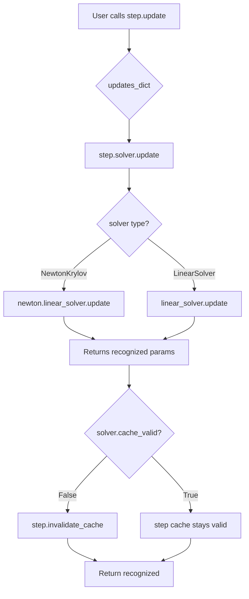
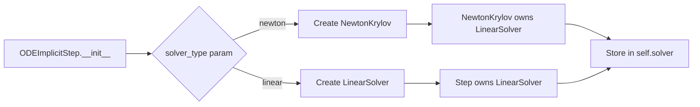
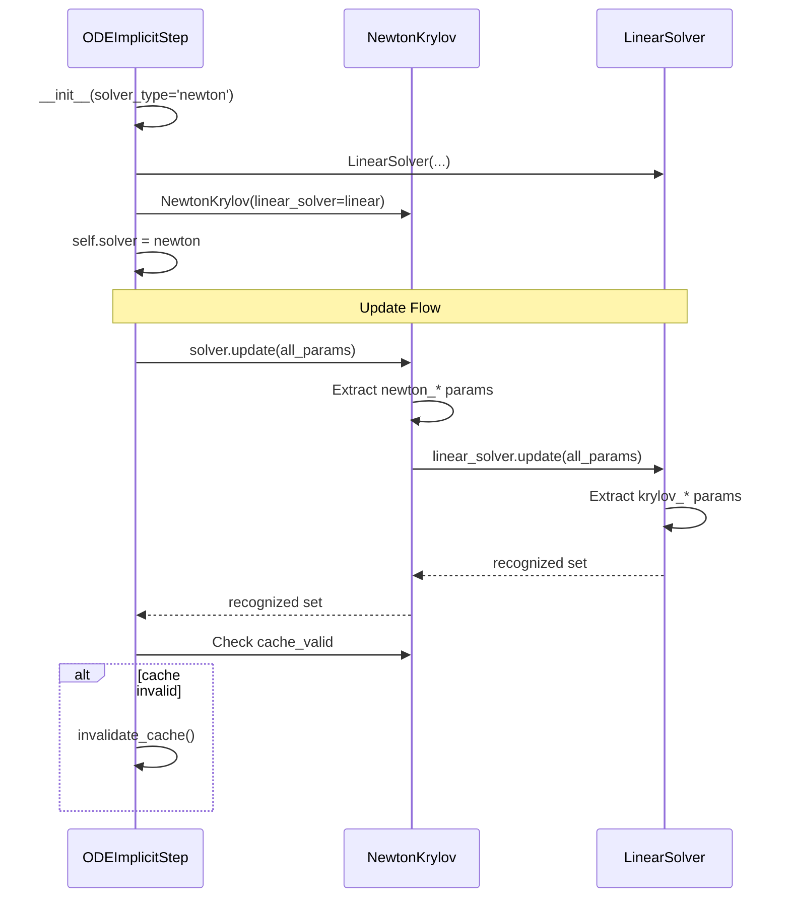

# Solver Ownership Refinement - Architectural Overview

## User Stories

### US-1: Single Solver Attribute Per Step
**As a** developer maintaining algorithm step classes  
**I want** each step to own a single `self.solver` attribute  
**So that** the ownership hierarchy is clear and consistent across all implicit methods  

**Acceptance Criteria:**
- ODEImplicitStep owns `self.solver` (not both `self._newton_solver` and `self._linear_solver`)
- For Newton-based methods: `self.solver` is a NewtonKrylov instance
- For Rosenbrock methods: `self.solver` is a LinearSolver instance directly
- NewtonKrylov internally owns its LinearSolver instance
- `solver_type` parameter in ODEImplicitStep.__init__ determines which solver to create

### US-2: Uniform Update Interface
**As a** user updating solver parameters at runtime  
**I want** all CUDAFactory.update() methods to accept the full updates dictionary  
**So that** I can pass all parameters without knowing which component needs which parameter  

**Acceptance Criteria:**
- All CUDAFactory.update() methods accept complete updates dict
- update() returns set of recognized parameter names
- Unrecognized parameters are ignored when silent=True
- Step calls `self.solver.update(updates)` with full dict
- NewtonKrylov calls `self.linear_solver.update(updates)` with full dict
- No manual parameter splitting at step level

### US-3: Conditional Cache Invalidation
**As a** performance-conscious user  
**I want** algorithm caches to invalidate only when solver parameters actually change  
**So that** unnecessary recompilation is avoided  

**Acceptance Criteria:**
- Step cache invalidates only if solver parameters changed
- Check `self.solver.cache_valid` or equivalent property
- If solver cache is still valid, step cache stays valid
- If solver cache was invalidated, step cache invalidates

### US-4: Clean Import Organization
**As a** developer reading the code  
**I want** all imports at module top  
**So that** dependencies are immediately visible  

**Acceptance Criteria:**
- No imports inside method bodies
- All imports appear at top of module
- Import organization follows PEP8

### US-5: Cached Auxiliaries for Rosenbrock
**As a** Rosenbrock method user  
**I want** the linear solver to use cached Jacobian auxiliaries  
**So that** Jacobian evaluations are not repeated unnecessarily  

**Acceptance Criteria:**
- Rosenbrock sets `use_cached_auxiliaries=True` on LinearSolver
- LinearSolver compiles appropriate device function signature
- Cached auxiliaries buffer passed through solve chain
- prepare_jacobian called once per step, results cached

## Overview

This architectural refinement addresses review feedback from the initial solver ownership refactor. The changes fix ownership hierarchy, standardize update interfaces, optimize cache invalidation, and improve code organization.

### Key Architectural Changes

#### 1. Ownership Hierarchy Restructuring

**Current (Incorrect):**
```
ODEImplicitStep
├── _newton_solver: NewtonKrylov
└── _linear_solver: LinearSolver
```

**New (Correct):**
```
ODEImplicitStep
└── solver: NewtonKrylov | LinearSolver
    └── (if NewtonKrylov) linear_solver: LinearSolver
```

The step owns exactly one solver. For Newton-based methods, that solver is NewtonKrylov which internally owns LinearSolver. For Rosenbrock methods, the step owns LinearSolver directly.

#### 2. Update Pattern Standardization

All CUDAFactory subclasses adopt a uniform update() signature:
```python
def update(self, updates_dict=None, silent=False, **kwargs) -> Set[str]:
    """Accept full updates dict, return recognized parameter names."""
```

Parameter delegation flows naturally through ownership:
- Step → solver.update(all_params)
- NewtonKrylov → linear_solver.update(all_params)
- Each component extracts relevant params, ignores the rest

#### 3. Conditional Cache Invalidation

Steps check solver cache status before invalidating:
```python
# In ODEImplicitStep.update()
recognized = self.solver.update(updates)
if not self.solver.cache_valid:
    self.invalidate_cache()
```

This prevents unnecessary recompilation when only non-solver parameters change.

## Data Flow Diagram



## Solver Type Selection



## Component Interaction Pattern



## Technical Decisions

### Decision 1: NewtonKrylov Constructor Ownership
**Question:** Should NewtonKrylov create its own LinearSolver or receive one as parameter?

**Decision:** Receive as constructor parameter.

**Rationale:**
- Allows step to configure LinearSolver before passing to NewtonKrylov
- Maintains consistency with current buffer registration pattern
- Step can register buffers for both solvers before creating ownership chain
- Clearer dependency injection for testing

### Decision 2: Update Signature
**Question:** What should update() return?

**Decision:** Return `Set[str]` of recognized parameter names.

**Rationale:**
- Caller can verify which parameters were recognized
- Supports delegation pattern (accumulate recognized params from children)
- Enables logging/debugging of unrecognized parameters
- Consistent with attrs pattern

### Decision 3: Cache Validity Property
**Question:** How should steps check if solver cache is valid?

**Decision:** Use `self.solver.cache_valid` property (inherited from CUDAFactory).

**Rationale:**
- CUDAFactory already provides `cache_valid` property
- No new infrastructure needed
- Consistent across all CUDAFactory subclasses
- Clean boolean check

### Decision 4: Parameter Namespace
**Question:** How to distinguish Newton vs Linear parameters?

**Decision:** Use prefixed parameter names in update dicts.

**Parameters:**
- Newton: `newton_tolerance`, `max_newton_iters`, `newton_damping`, `newton_max_backtracks`
- Linear: `krylov_tolerance`, `max_linear_iters`, `linear_correction_type`, `correction_type`
- Each solver recognizes its own prefixes

**Rationale:**
- Clear semantic meaning
- No ambiguity in parameter ownership
- Already established in current code
- Natural for delegation (each solver filters by prefix)

### Decision 5: Solver Type Flow
**Question:** Where does `solver_type` parameter originate?

**Decision:** Added to ODEImplicitStep.__init__, defaults to 'newton', Rosenbrock overrides to 'linear'.

**Rationale:**
- Explicit control at step level
- Rosenbrock can override in super().__init__ call
- Future solver types can be added easily
- Type checking/validation at construction time

## Expected Impact

### Files Modified
- `src/cubie/integrators/algorithms/ode_implicitstep.py` - Major restructuring
- `src/cubie/integrators/algorithms/generic_rosenbrock_w.py` - Override solver_type
- `src/cubie/integrators/matrix_free_solvers/newton_krylov.py` - Update signature changes
- `src/cubie/integrators/matrix_free_solvers/linear_solver.py` - Update signature changes
- All implicit algorithm steps - Adjust to new solver ownership
- Test instrumented versions - Mirror source changes

### Behavioral Changes
- Single solver attribute instead of two
- Update calls pass full dicts, rely on recognition filtering
- Cache invalidation only on actual parameter changes
- Rosenbrock uses cached auxiliaries

### Performance Impact
- Reduced recompilation from conditional cache invalidation
- Rosenbrock: fewer Jacobian evaluations via caching
- No runtime performance regression expected

## Trade-offs

### Chosen Approach
**Pros:**
- Clean ownership hierarchy
- Consistent update interface
- Optimal cache invalidation
- Natural delegation pattern

**Cons:**
- Breaks compatibility with direct solver access patterns
- Requires update to all implicit algorithm steps
- More complex NewtonKrylov construction (receives LinearSolver)

### Alternative: Keep Dual Ownership
**Pros:**
- Minimal code changes
- Direct access to both solvers

**Cons:**
- Violates single responsibility
- Unclear ownership semantics
- Inconsistent with Rosenbrock (which only needs linear solver)
- Complicates update delegation

**Verdict:** Chosen approach is architecturally superior despite larger refactor scope.

## References

### Review Comments
- File: ode_implicitstep.py:128 - "don't own a linear solver in the step"
- File: ode_implicitstep.py:170 - "All CUDAFactory subclasses should take a dict"
- File: ode_implicitstep.py:215-220 - "step should just call update on its own .solver"
- File: generic_rosenbrock_w.py:274 - "introduce a parameter...solver_type"
- File: generic_rosenbrock_w.py:278 - "rosenbrock needs to use cached auxiliaries"
- File: generic_rosenbrock_w.py:330 - "should only invalidate on a change in solver params"
- File: generic_rosenbrock_w.py:334 - "don't ever import in code body"

### Related Architecture
- CUDAFactory pattern: src/cubie/CUDAFactory.py
- Buffer registry: src/cubie/buffer_registry.py (assumed to exist)
- Compile settings: attrs classes with comparison support
