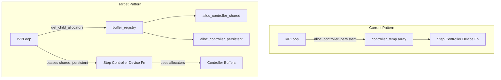

# Step Controller Buffer Allocation Refactor

## User Stories

### US-1: Consistent Buffer Allocation Interface
**As a** CuBIE developer  
**I want** step controllers to use the same buffer allocation pattern as algorithms and solvers  
**So that** the codebase has a unified memory management approach across all components

**Acceptance Criteria:**
- All step controllers accept `shared` and `persistent_local` array arguments in their device functions
- Controllers register their buffers through the central buffer_registry
- Buffer location (shared vs local) is configurable via compile settings
- The pattern matches what is used by IVPLoop, generic_dirk, and newton_solver

### US-2: Configurable Memory Location
**As a** CuBIE user  
**I want** to specify where step controller memory is allocated (shared vs local)  
**So that** I can optimize memory usage for different system sizes and GPU architectures

**Acceptance Criteria:**
- A `timestep_memory` configuration option with default='local' exists
- The setting is included in `ALL_STEP_CONTROLLER_PARAMETERS` 
- Changing the location triggers cache invalidation and recompilation
- The setting is accessible from the solver API level

### US-3: Minimal Controller-Specific Implementation
**As a** CuBIE maintainer  
**I want** buffer allocation logic centralized in parent classes  
**So that** adding new controllers doesn't require duplicating boilerplate code

**Acceptance Criteria:**
- Base classes handle buffer registration via `register_buffers()` method
- Individual controllers only specify their required buffer size
- The `local_memory_elements` property is replaced/augmented with buffer registry queries
- Child allocator pattern from IVPLoop is reused

---

## Executive Summary

This refactor aligns step controller memory management with the established buffer registry pattern used by IVPLoop, generic_dirk, and newton_solver. Currently, step controllers use a `local_temp` array passed from the loop but don't properly register their buffer requirements with the central registry.

### Current State
- Controllers receive a `local_temp` array from IVPLoop
- Each controller defines `local_memory_elements` property (0, 1, or 2 elements)
- No buffer registration or configurable memory location
- IVPLoop allocates `controller_temp` via `alloc_controller_persistent`

### Target State
- Controllers register buffers through `buffer_registry`
- Memory location configurable via `timestep_memory` config option
- Device functions receive `shared_scratch` and `persistent_local` arrays
- Controllers use allocators from the registry

---

## Architecture Overview



### Buffer Registration Flow

```mermaid
sequenceDiagram
    participant User
    participant SIR as SingleIntegratorRunCore
    participant Loop as IVPLoop
    participant Ctrl as StepController
    participant Reg as buffer_registry
    
    User->>SIR: Create integrator
    SIR->>Ctrl: get_controller()
    Ctrl->>Ctrl: __init__ + setup_compile_settings
    Ctrl->>Ctrl: register_buffers()
    Ctrl->>Reg: register('timestep_buffer', self, size, location)
    SIR->>Loop: instantiate_loop()
    SIR->>Reg: get_child_allocators(Loop, Ctrl, 'controller')
    Loop->>Loop: build()
    Loop->>Reg: get_allocator('controller_shared', self)
    Loop->>Reg: get_allocator('controller_persistent', self)
```

---

## Key Technical Decisions

### 1. Buffer Naming Convention
Use `timestep_memory` as the configuration parameter name (consistent with task requirements). The internal buffer name in the registry will be `timestep_buffer` to distinguish it from the location setting.

### 2. Parent Class Buffer Registration
The `register_buffers()` method will be added to `BaseStepController` with a default implementation that registers a buffer of size `self.local_memory_elements`. Controllers can override if needed.

### 3. Signature Changes
Device functions change from:
```python
def controller_fn(dt, state, state_prev, error, niters, accept_out, local_temp)
```
to:
```python
def controller_fn(dt, state, state_prev, error, niters, accept_out, 
                  shared_scratch, persistent_local)
```

The controller then uses an allocator internally to get its buffer.

### 4. IVPLoop Integration
IVPLoop already calls `buffer_registry.get_child_allocators()` for algorithm and controller. The controller's `register_buffers()` ensures the size is correctly registered before this call.

---

## Trade-offs Considered

### Option A: Minimal Change (Controller-level allocators only)
- Keep device function signature unchanged
- Add allocator call inside device function
- **Rejected**: Inconsistent with algorithm pattern

### Option B: Full Pattern Match (Selected)
- Change device function signature to match algorithm step
- Pass shared and persistent arrays from loop
- Controller uses allocators internally
- **Selected**: Maintains consistency with established patterns

### Option C: External Buffer Allocation
- Loop allocates and passes buffer directly
- Controller doesn't manage its own allocation
- **Rejected**: Loses flexibility for future controller enhancements

---

## Impact on Existing Architecture

### Files Modified
1. `base_step_controller.py` - Add `register_buffers()`, update config
2. `adaptive_step_controller.py` - Add config field, update parent call
3. `fixed_step_controller.py` - Update config and device function
4. `adaptive_I_controller.py` - Update device function
5. `adaptive_PI_controller.py` - Update device function  
6. `adaptive_PID_controller.py` - Update device function
7. `gustafsson_controller.py` - Update device function
8. `ode_loop.py` - Update controller call signature

### No Changes Required
- `buffer_registry.py` - Already supports the pattern
- `SingleIntegratorRunCore.py` - Already calls `get_child_allocators`

---

## References

- **IVPLoop pattern**: `/src/cubie/integrators/loops/ode_loop.py` lines 246-313
- **Newton solver pattern**: `/src/cubie/integrators/matrix_free_solvers/newton_krylov.py` lines 256-291
- **DIRK pattern**: `/src/cubie/integrators/algorithms/generic_dirk.py` lines 287-344
- **Buffer registry**: `/src/cubie/buffer_registry.py`
