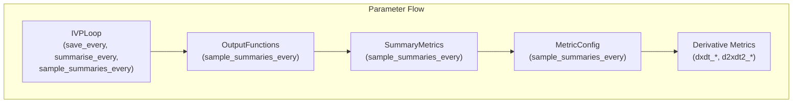
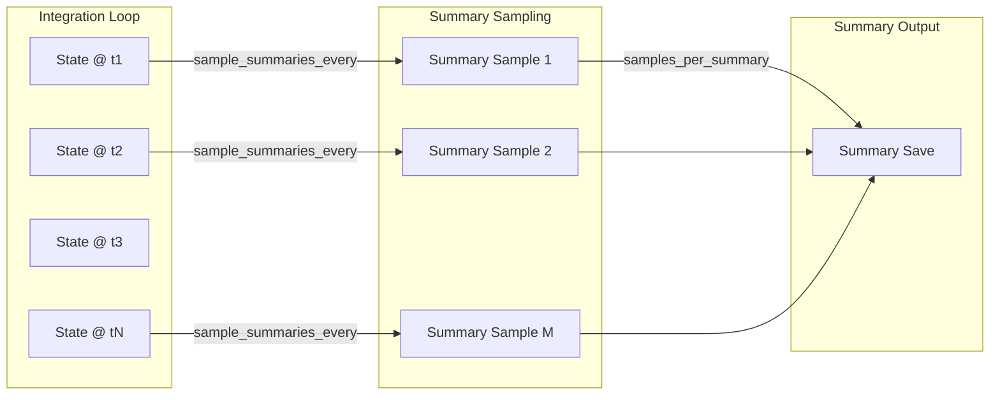

# Summary Metric Timing Refactor - Human Overview

## User Stories

### US1: As an integrator developer, I want summary metrics to use `sample_summaries_every` instead of `save_every` for derivative calculations
**Acceptance Criteria:**
- MetricConfig class uses `sample_summaries_every` parameter instead of `dt_save`
- SummaryMetric classes receive and use `sample_summaries_every` for derivative scaling
- Derivative metrics (dxdt_*, d2xdt2_*) correctly scale based on the summary sampling interval
- The rename is propagated through all summary metric implementations

### US2: As a test author, I want `calculate_expected_summaries` to use consistent naming
**Acceptance Criteria:**
- `summarise_every` parameter renamed to `samples_per_summary`
- `dt_save` parameter renamed to `sample_summaries_every`
- Parameter names match the source code conventions

### US3: As a test author, I want the CPU reference loop to correctly handle different save/summary sampling intervals
**Acceptance Criteria:**
- Reference loop correctly computes `samples_per_summary` from `summarise_every / sample_summaries_every`
- When `sample_summaries_every != save_every`, summaries are computed from correctly sampled data
- The reference implementation generates valid comparison data for all timing configurations

---

## Executive Summary

This refactor separates the timing parameters for state saving and summary metric sampling. Previously, derivative-based summary metrics used `dt_save` (the state save interval) for scaling finite differences. The new architecture introduces `sample_summaries_every` as the time interval between summary metric samples, which may differ from the state save interval.

### Key Changes

1. **MetricConfig/SummaryMetric**: Rename `dt_save` → `sample_summaries_every`
2. **OutputFunctions**: Update `ALL_OUTPUT_FUNCTION_PARAMETERS` and `build()` method
3. **Derivative Metrics**: Update all dxdt_* and d2xdt2_* metrics to use new parameter
4. **Test Utilities**: Rename parameters in `calculate_expected_summaries`
5. **CPU Reference Loop**: Handle separate save/summary sampling cadences

---

## Architecture Overview

### Parameter Semantics

| Parameter | Meaning | Used By |
|-----------|---------|---------|
| `save_every` | Time between state/observable saves | IVPLoop, state output |
| `summarise_every` | Time between summary saves | IVPLoop, summary output |
| `sample_summaries_every` | Time between summary metric samples | Derivative metrics for scaling |
| `samples_per_summary` | Number of samples per summary period | Summary calculation loops |

### Data Flow for Summary Calculations

---

## Technical Decisions

### 1. Parameter Naming Convention
- `sample_summaries_every`: Time-based interval (seconds) matching `save_every` pattern
- `samples_per_summary`: Integer count matching existing loop counter semantics

### 2. Backward Compatibility
The prompt explicitly states "no backwards compatibility enforcement". This refactor will break code using the old parameter names.

### 3. CPU Reference Loop Enhancement
When `sample_summaries_every != save_every`, the reference loop cannot simply use the saved state history for summary calculations. Two options were considered:

**Option A (Selected)**: Use existing save_every data and pass sample_summaries_every to calculate_expected_summaries
- Simpler implementation
- Works when sample_summaries_every == save_every (common case)
- Requires test constraints when intervals differ

**Option B**: Generate second set of outputs at sample_summaries_every cadence
- More accurate for all timing configurations
- Significant loop refactoring required
- Not selected for this phase

---

## References

- Issue context describes partial refactor of IVPloop timing
- `.github/context/cubie_internal_structure.md` section on CUDAFactory and compile settings
- Existing implementation in `src/cubie/outputhandling/summarymetrics/`

---

## Trade-offs Considered

1. **Naming consistency**: `sample_summaries_every` chosen over `summary_dt` to match existing `save_every` pattern
2. **Test utility refactoring**: Renamed parameters rather than introducing aliases to maintain clarity
3. **Scope limitation**: Excludes batchsolver and ODE_loop level changes per requirements
