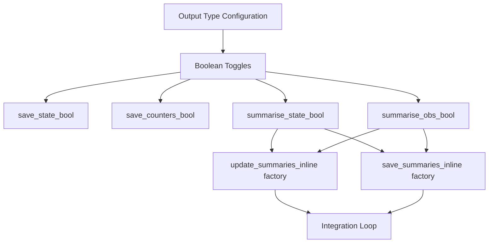

# Summary Metrics Integration for all_in_one.py Debug Script

## User Stories

### Story 1: Inline Summary Metrics Factory
**As a** developer using NVIDIA profiler tools  
**I want** complete inline implementations of summary metrics functions in all_in_one.py  
**So that** the profiler can trace through the complete execution without external dependencies

**Acceptance Criteria:**
- [ ] all_in_one.py contains inline implementations of `update_summaries` factory
- [ ] all_in_one.py contains inline implementations of `save_summaries` factory
- [ ] Inline implementations match the package source code verbatim
- [ ] All summary metric update functions are inlined (mean, max, rms, etc.)
- [ ] All summary metric save functions are inlined
- [ ] Chaining functions are implemented inline

### Story 2: Configuration System for Output Types
**As a** developer configuring the debug script  
**I want** a configuration section that accepts output type lists  
**So that** I can easily control which outputs are generated

**Acceptance Criteria:**
- [ ] Configuration section accepts a list of output types (state, observables, summaries, time, counters)
- [ ] Boolean toggles are set based on output type list
- [ ] save_state_bool toggle correctly flows through to loop
- [ ] save_counters_bool toggle correctly flows through to loop
- [ ] save_obs_bool toggle correctly flows through to loop
- [ ] summarise_state_bool and summarise_obs_bool toggles correctly flow through

### Story 3: Summary Metric Chaining Integration
**As a** developer running the debug script  
**I want** summary metrics to be properly chained and called in the loop  
**So that** summary statistics are collected during integration

**Acceptance Criteria:**
- [ ] Chaining function creates combined summary update function
- [ ] Chaining function creates combined summary save function
- [ ] update_summaries_inline is called at appropriate points in loop
- [ ] save_summaries_inline is called when summary window is complete
- [ ] Summary buffers are properly sized and allocated
- [ ] Summary outputs are properly sized and allocated

## Overview

The all_in_one.py debug script is a specialized file for NVIDIA profiler debugging that contains inline versions of CuBIE components. Currently, the summary metrics integration is a stub. This task involves creating complete inline implementations of the summary metrics system to enable profiling of summary metric calculations.

### Key Architecture Decisions

1. **Verbatim Copying**: All summary metric implementations must match package source exactly - no modifications allowed except for removing imports
2. **Factory Pattern**: Use the same chaining factory pattern as the package (update_summary_factory, save_summary_factory)
3. **Configuration Integration**: Leverage existing factory-scope config parameters at the top of all_in_one.py
4. **Output Type System**: Introduce a list-based output type configuration that sets boolean toggles

### Technical Approach

### Data Flow

1. User specifies output types in configuration: `output_types = ['state', 'summaries']`
2. Configuration logic sets toggles: `summarise_state_bool = 'summaries' in output_types`
3. Factories build chained functions based on toggles and metrics list
4. Loop allocates buffers based on toggles
5. Loop calls update/save functions at appropriate integration points

### Memory Layout

Summary buffers follow the same pattern as the package:
- State summary buffer: `n_states * buffer_size_per_metric * num_metrics`
- Observable summary buffer: `n_observables * buffer_size_per_metric * num_metrics`
- Output arrays sized based on `saves_per_summary` interval

## Research Findings

### Package Source Structure

**Update Summaries** (`src/cubie/outputhandling/update_summaries.py`):
- `do_nothing`: Base case for empty metric chains
- `chain_metrics`: Recursive function building metric chain
- `update_summary_factory`: Factory generating the update function

**Save Summaries** (`src/cubie/outputhandling/save_summaries.py`):
- Same pattern as update_summaries with buffer→output operations
- Includes buffer reset after save

**Summary Metrics** (`src/cubie/outputhandling/summarymetrics/`):
- Each metric is a CUDAFactory subclass with `update` and `save` device functions
- Mean metric example: accumulate sum in update, divide and reset in save
- Metrics register via decorator `@register_metric(summary_metrics)`

### Integration Pattern from ode_loop.py

The loop integrates summary metrics at two points:
1. **Initial save** (line 1106): Saves initial summary state (typically zeros)
2. **During integration** (lines 1272-1290):
   - Calls `update_summaries` after each saved state
   - Calls `save_summaries` every `saves_per_summary` interval
   - Increments summary index after save

## Expected Impact

### Changes to all_in_one.py

1. **New sections**:
   - Summary metric inline implementations (mean.py verbatim)
   - Chain factory implementations (update_summaries.py, save_summaries.py verbatim)
   - Output type configuration system

2. **Modified sections**:
   - Output configuration to use output_types list
   - Loop buffer allocation to include summary buffers
   - Loop function to call update/save at correct points

3. **No changes to**:
   - Existing algorithm implementations
   - Existing controller implementations
   - Driver interpolation
   - Step functions

### Compatibility Considerations

- Must work with existing memory location configuration system
- Must respect existing compile-time branching patterns
- Must maintain compatibility with both fixed and adaptive modes
- Must work with all algorithm types (ERK, DIRK, FIRK, Rosenbrock)

## Alternatives Considered

### Option 1: Import from Package (Rejected)
- **Pros**: Less duplication, automatic updates
- **Cons**: Defeats purpose of all_in_one.py for profiler debugging
- **Decision**: Must inline everything for profiler visibility

### Option 2: Simplified Stub Implementation (Rejected)
- **Pros**: Easier to maintain
- **Cons**: Doesn't match production behavior, defeats debugging purpose
- **Decision**: Must match package verbatim

### Option 3: Configurable Metrics (Deferred)
- **Pros**: More flexible, can test different metrics
- **Cons**: Increases complexity
- **Decision**: Start with mean metric only, can expand later

## Trade-offs

**Duplication vs Debuggability**
- Accept code duplication to achieve profiler compatibility
- Document requirement to keep all_in_one.py in sync with package

**Simplicity vs Flexibility**
- Start with minimal metric set (mean only)
- Architecture supports adding more metrics later
- Configuration system designed for future expansion

**Performance vs Clarity**
- Maintain same performance characteristics as package
- Predicated commit patterns match package exactly
- No shortcuts or simplifications
