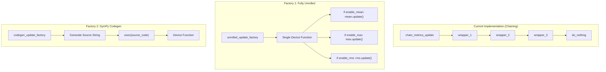
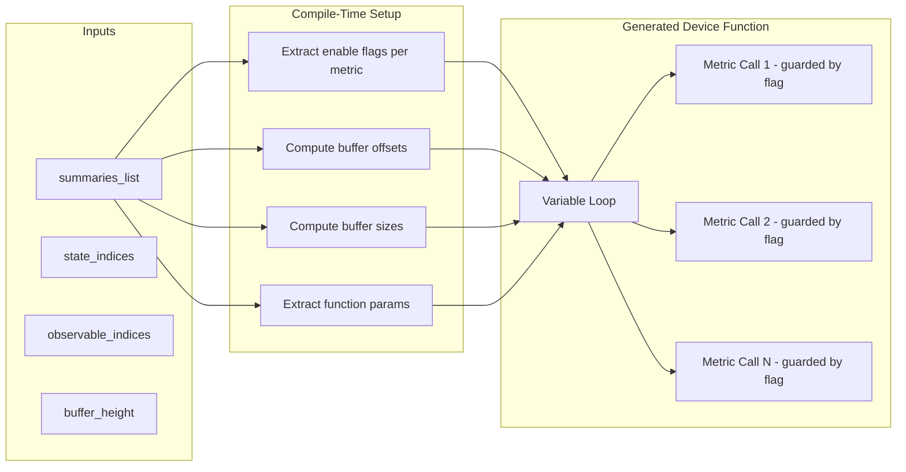
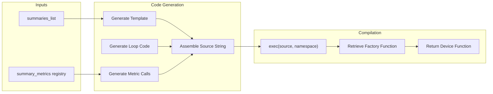

# Summary Metrics Unrolled Factories - Human Overview

## User Stories

### US-1: Compiler-Friendly Update Factory
**As a** CuBIE developer optimizing CUDA kernel compilation  
**I want** a summary metrics update factory that uses compile-time boolean flags instead of recursive chaining  
**So that** the Numba/LLVM compiler can more easily analyze and unroll the metric execution path

**Acceptance Criteria:**
- [ ] Factory produces a single device function that conditionally executes each metric
- [ ] Each metric is guarded by a compile-time boolean flag captured in closure
- [ ] Single loop over variable indices iterates through all summarized variables
- [ ] Buffer indexing uses either marching base pointer or explicit offset calculation
- [ ] Function signature matches existing `update_summary_metrics_func` interface
- [ ] Produces identical results to the existing chaining implementation

### US-2: Compiler-Friendly Save Factory
**As a** CuBIE developer optimizing CUDA kernel compilation  
**I want** a summary metrics save factory that uses compile-time boolean flags instead of recursive chaining  
**So that** the Numba/LLVM compiler can more easily analyze and unroll the metric save path

**Acceptance Criteria:**
- [ ] Factory produces a single device function that conditionally executes each metric save
- [ ] Each metric is guarded by a compile-time boolean flag captured in closure
- [ ] Single loop over variable indices iterates through all summarized variables
- [ ] Buffer and output indexing uses clear offset calculation
- [ ] Function signature matches existing `save_summary_metrics_func` interface
- [ ] Produces identical results to the existing chaining implementation

### US-3: SymPy Codegen Update Factory
**As a** CuBIE developer exploring code generation approaches  
**I want** a summary metrics update factory that uses SymPy-style code generation  
**So that** the generated device function is a single flat function with no runtime dispatch

**Acceptance Criteria:**
- [ ] Factory generates Python source code as a string
- [ ] Generated code follows the pattern established in `odesystems/symbolic/codegen/dxdt.py`
- [ ] Source code is compiled via `exec()` to produce the device function
- [ ] Generated function includes all metric update calls inline
- [ ] No runtime function dispatch or closure-based chaining
- [ ] Produces identical results to the existing chaining implementation

### US-4: SymPy Codegen Save Factory
**As a** CuBIE developer exploring code generation approaches  
**I want** a summary metrics save factory that uses SymPy-style code generation  
**So that** the generated device function is a single flat function with no runtime dispatch

**Acceptance Criteria:**
- [ ] Factory generates Python source code as a string
- [ ] Generated code follows the pattern established in `odesystems/symbolic/codegen/dxdt.py`
- [ ] Source code is compiled via `exec()` to produce the device function
- [ ] Generated function includes all metric save calls inline
- [ ] No runtime function dispatch or closure-based chaining
- [ ] Produces identical results to the existing chaining implementation

---

## Executive Summary

This feature implements two alternative factory approaches for generating summary metric update and save functions in `tests/all_in_one.py`. The current chaining approach recursively wraps metric functions, which may hinder compiler optimization. The two alternatives provide different strategies for producing compiler-friendly device code:

1. **Fully Unrolled Factory**: Uses compile-time boolean flags to conditionally execute each metric within a single function body
2. **SymPy Codegen Factory**: Generates source code strings that are `exec()`'d to produce flat, inline device functions

Both approaches aim to produce code that is easier for the Numba/LLVM compiler to analyze and optimize.

---

## Architecture Overview

---

## Data Flow Diagrams

### Factory 1: Fully Unrolled Pattern

### Factory 2: SymPy Codegen Pattern

---

## Key Technical Decisions

### Decision 1: Boolean Toggle Pattern for Unrolled Factory
**Choice**: Use compile-time boolean flags captured in closure to guard each metric execution

**Rationale**:
- Boolean flags are evaluated at compile time when captured in closure
- The compiler can eliminate dead code paths for disabled metrics
- Maintains a single, predictable control flow structure
- Avoids runtime function pointer dispatch

**Alternative Considered**: Using index-based dispatch with function arrays
- Rejected because runtime array indexing prevents compile-time optimization

### Decision 2: String-Based Codegen Following dxdt.py Pattern
**Choice**: Generate Python source code as strings and use `exec()` for compilation

**Rationale**:
- Proven pattern already used successfully in `odesystems/symbolic/codegen/dxdt.py`
- Produces completely flat, inline code with no function dispatch
- Generated code can be inspected for debugging
- Allows maximum compiler optimization opportunities

**Alternative Considered**: AST manipulation
- Rejected as overly complex for this use case

### Decision 3: Template-Based Code Generation
**Choice**: Use Python string templates similar to `DXDT_TEMPLATE` in dxdt.py

**Rationale**:
- Clear separation between template structure and dynamic content
- Easy to maintain and modify
- Produces readable generated code

---

## Integration Points

1. **Summary Metrics Registry** (`summary_metrics`): Provides metric metadata (buffer sizes, offsets, params) and device functions
2. **Metric Device Functions**: Individual `update()` and `save()` functions from each metric class
3. **Existing Factory Functions**: `update_summary_factory()` and `save_summary_factory()` provide the interface pattern
4. **CUDA JIT Decorator**: `@cuda.jit(device=True, inline=True)` for device function compilation

---

## Expected Impact

### On Compilation
- Both factories should produce code that is easier for Numba/LLVM to optimize
- Reduced function call overhead in the unrolled approach
- Eliminated runtime dispatch in the codegen approach

### On Existing Architecture
- Changes are isolated to `tests/all_in_one.py`
- No changes required to the main CuBIE source code
- Alternative implementations exist alongside current chaining approach

### On Testing
- Both new factories must produce identical numerical results to the chaining implementation
- Can be validated by running existing integration tests with the new factories

---

## Trade-offs

| Aspect | Chaining (Current) | Unrolled | Codegen |
|--------|-------------------|----------|---------|
| Code Complexity | Low | Medium | High |
| Compiler Friendliness | Low | High | Highest |
| Debugging | Easy | Medium | Hard (generated) |
| Flexibility | High | Medium | Low |
| Maintenance | Simple | Moderate | Complex |

---

## References

- Current chaining implementation: `tests/all_in_one.py` lines ~4104-4191 (update) and ~4267-4400 (save)
- SymPy codegen pattern: `src/cubie/odesystems/symbolic/codegen/dxdt.py`
- Metric function signatures: `src/cubie/outputhandling/summarymetrics/mean.py`
- CUDA device code patterns: `.github/copilot-instructions.md` (predicated commit pattern)
