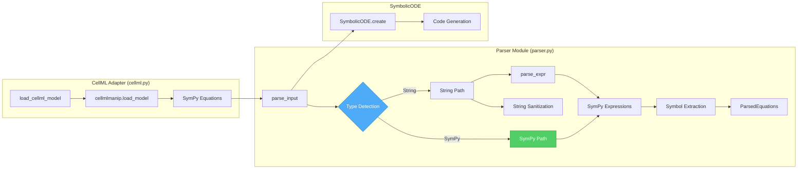

# SymPy-to-SymPy Input Pathway

## User Stories

### Story 1: Direct SymPy Input for ODE Systems
**As a** user building ODE systems programmatically with SymPy  
**I want to** pass SymPy equations directly to CuBIE without converting to strings  
**So that** I can avoid the overhead of string serialization and parsing

**Acceptance Criteria:**
- `SymbolicODE.create()` accepts `dxdt` parameter as either strings OR SymPy expressions
- When passed SymPy expressions, they are processed directly without string conversion
- Symbol extraction uses SymPy's built-in `free_symbols` method
- The resulting `SymbolicODE` object is functionally identical to string-based input
- All existing string-based tests continue to pass

### Story 2: Efficient CellML Import
**As a** user importing CellML models  
**I want to** the CellML adapter to pass SymPy expressions directly to the parser  
**So that** model loading is faster and more efficient

**Acceptance Criteria:**
- `load_cellml_model()` passes SymPy equations directly to parser instead of converting to strings
- CellML model load time is reduced (no performance-based test required)
- All existing CellML tests pass
- CellML models produce identical results to current implementation

### Story 3: Automatic Input Type Detection
**As a** developer maintaining the codebase  
**I want to** input type detection to happen automatically at the parser level  
**So that** users don't need to specify the input format explicitly

**Acceptance Criteria:**
- Parser automatically detects whether `dxdt` is string or SymPy-based input
- No user-facing API changes required for existing code
- Type detection is robust and handles edge cases (empty inputs, mixed types, etc.)
- Clear error messages when invalid input types are provided

### Story 4: Consistent Symbol and Equation Extraction
**As a** developer working with symbolic expressions  
**I want to** symbol and equation extraction to use SymPy built-in methods  
**So that** the code is more maintainable and leverages SymPy's capabilities

**Acceptance Criteria:**
- Symbol extraction uses `free_symbols` property for SymPy expressions
- Equation left-hand side (LHS) and right-hand side (RHS) extraction works for both strings and SymPy
- Parameter, constant, state, and driver symbol identification works for both input types
- User functions are compatible with SymPy input pathway

## Overview

### Executive Summary

This feature implements a direct SymPy-to-SymPy input pathway that eliminates the inefficient string conversion step in the current CellML adapter workflow. The current flow `cellml (xml) → cellmlmanip (sympy) → cubie cellml (str) → parser (sympy)` will become `cellml (xml) → cellmlmanip (sympy) → parser (sympy)`, cutting out the expensive string serialization and parsing step.

The implementation adds automatic input type detection at the parser level and leverages SymPy's built-in methods like `free_symbols` for symbol extraction. This provides users with an additional input channel while reducing CellML adapter complexity and improving load times.

### Data Flow Architecture

```mermaid
graph TB
    subgraph "Current Flow (String-based)"
        A1[User String Input] --> B1[parse_input]
        C1[CellML XML] --> D1[cellmlmanip]
        D1 --> E1[SymPy Equations]
        E1 --> F1[String Serialization]
        F1 --> B1
        B1 --> G1[parse_expr]
        G1 --> H1[SymPy Expressions]
        H1 --> I1[ParsedEquations]
    end
    
    subgraph "New Flow (SymPy-based)"
        A2[User String Input] --> B2[parse_input with type detection]
        C2[CellML XML] --> D2[cellmlmanip]
        D2 --> E2[SymPy Equations]
        E2 --> B2
        A3[User SymPy Input] --> B2
        B2 --> J2{Input Type?}
        J2 -->|String| K2[String Processing]
        J2 -->|SymPy| L2[SymPy Processing]
        K2 --> M2[Unified Processing]
        L2 --> M2
        M2 --> N2[ParsedEquations]
    end
    
    style F1 fill:#ff6b6b,stroke:#c92a2a,color:#fff
    style G1 fill:#ff6b6b,stroke:#c92a2a,color:#fff
    style J2 fill:#51cf66,stroke:#2f9e44,color:#fff
    style M2 fill:#51cf66,stroke:#2f9e44,color:#fff
```

### Component Interaction Diagram

### Key Technical Decisions

#### 1. Input Type Detection Strategy
- **Decision**: Detect input type by inspecting the first element of the `dxdt` parameter
- **Rationale**: 
  - Avoids adding new API parameters
  - Maintains backward compatibility
  - SymPy expressions have distinct type signatures (sp.Expr, sp.Equality, tuples)
- **Trade-offs**: Assumes homogeneous input (all strings or all SymPy), but this aligns with expected usage

#### 2. Unified Processing After Type-Specific Parsing
- **Decision**: Converge string and SymPy paths into a common processing pipeline after initial parsing
- **Rationale**:
  - Maximizes code reuse
  - Reduces testing surface area
  - Ensures consistent behavior regardless of input type
- **Trade-offs**: May require some normalization overhead, but this is minimal compared to parse_expr cost

#### 3. Symbol Extraction Using SymPy Built-ins
- **Decision**: Use `free_symbols` property for extracting symbols from SymPy expressions
- **Rationale**:
  - Leverages well-tested SymPy functionality
  - More robust than manual traversal
  - Automatically handles all SymPy expression types
- **Trade-offs**: None significant; this is strictly better than manual approaches

#### 4. Backward Compatibility
- **Decision**: Maintain complete backward compatibility with string-based input
- **Rationale**:
  - Existing user code must continue to work
  - String input is still valuable for simple use cases
  - No breaking changes to public API
- **Trade-offs**: Requires maintaining dual code paths, but they converge quickly

### Expected Impact

#### On CellML Adapter
- **Reduced Complexity**: Eliminates `_eq_to_equality_str` and related string formatting
- **Improved Performance**: No string serialization or parsing overhead
- **Cleaner Code**: Direct SymPy-to-SymPy transfer is more natural

#### On Parser Module
- **Enhanced Flexibility**: Supports multiple input formats seamlessly
- **Better Maintainability**: Uses SymPy built-in methods instead of regex/string manipulation
- **Future Extensibility**: Foundation for supporting other symbolic input sources

#### On User Experience
- **New Input Channel**: Programmatic SymPy input for advanced users
- **Faster CellML Loading**: Reduced overhead in adapter pathway
- **Transparent Operation**: No changes needed to existing code

### Research Findings

#### Current String-based Flow Analysis
The current `parse_input()` function in `parser.py` follows this sequence:
1. Accepts `dxdt` as string or list of strings
2. Normalizes indexed tokens (e.g., `x[0]` → `x0`)
3. Validates left-hand sides (LHS) via `_lhs_pass()`
4. Parses right-hand sides (RHS) via `_rhs_pass()` using `parse_expr()`
5. Builds `ParsedEquations` container with categorized equations

#### CellML Current Implementation
The `load_cellml_model()` function in `cellml.py`:
1. Uses `cellmlmanip.load_model()` to get SymPy equations
2. Converts SymPy expressions to strings via `_eq_to_equality_str()`
3. Passes strings to `SymbolicODE.create()` which calls `parse_input()`
4. Parser re-parses strings back to SymPy expressions

This round-trip conversion is the primary inefficiency to eliminate.

#### SymPy free_symbols Usage
CuBIE already uses `free_symbols` in multiple locations:
- `sym_utils.py`: Dependency analysis
- `jacobian.py`: Auxiliary symbol extraction
- `time_derivative.py`: Driver dependency detection
- `jvp_equations.py`: Symbol dependency mapping

This confirms that `free_symbols` is well-understood and trusted in the codebase.

### Alternatives Considered

#### Alternative 1: Create New API Method
- **Approach**: Add `SymbolicODE.create_from_sympy()` separate method
- **Rejected**: Unnecessary API proliferation; type detection is cleaner

#### Alternative 2: Require Explicit Type Parameter
- **Approach**: Add `input_type` parameter to `parse_input()`
- **Rejected**: Adds API complexity; automatic detection is user-friendly

#### Alternative 3: SymPy-Only Input
- **Approach**: Deprecate string input entirely
- **Rejected**: Breaking change; string input is valuable for simple cases
