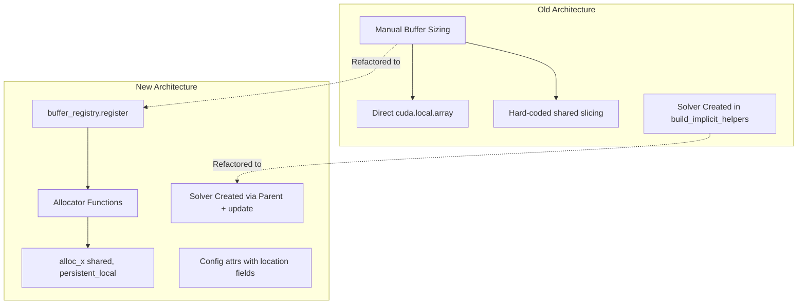
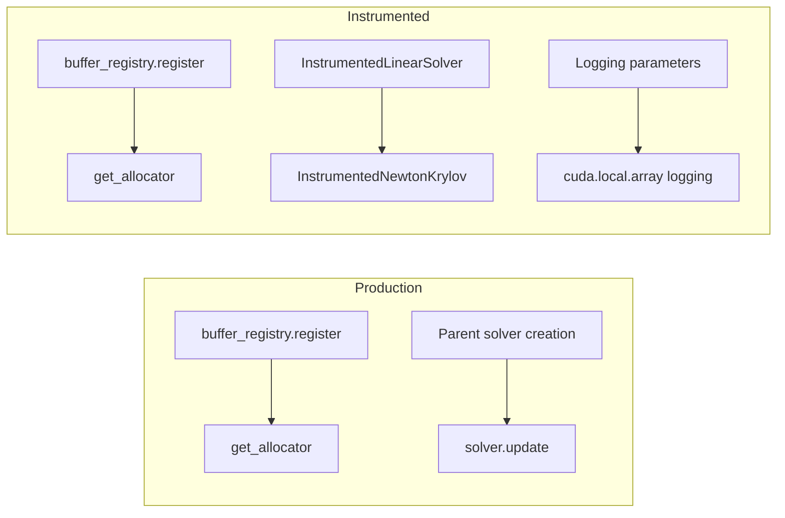

# Synchronize Instrumented Algorithm Tests with Production

## User Stories

### Story 1: Maintain Test Fidelity
**As a** CuBIE developer,
**I want** instrumented test counterparts to be exact copies of production algorithms,
**So that** I can trust that debugging/logging doesn't alter the numerical behavior being tested.

**Acceptance Criteria:**
- [ ] All 6 instrumented files have identical imports (except solver imports use `InstrumentedLinearSolver`/`InstrumentedNewtonKrylov`)
- [ ] Class definitions match production exactly (config classes, step classes)
- [ ] `__init__` methods match production logic with identical parameter handling
- [ ] `register_buffers()` methods (when present) match production
- [ ] `build_step()` methods have identical production logic with logging added
- [ ] Solver objects are instantiated identically to production patterns

### Story 2: Preserve Logging Capabilities
**As a** CuBIE developer,
**I want** instrumented versions to capture state at key algorithm points,
**So that** I can debug solver convergence and algorithm behavior.

**Acceptance Criteria:**
- [ ] Logging buffers use `cuda.local.array()` for hard-coded local memory
- [ ] Logging parameters are added to `step()` signature
- [ ] Logging code blocks record residuals, jacobians, stage values, etc.
- [ ] Instrumented solvers are properly connected and called with logging parameters

---

## Overview

The buffer allocation system in `src/cubie/integrators/algorithms/` has been refactored to use a centralized `buffer_registry` for dynamic buffer management. The instrumented test counterparts in `tests/integrators/algorithms/instrumented/` must be synchronized to match this new architecture exactly.

### Key Architectural Changes in Production



### Files to Synchronize

| Production File | Instrumented File | Status |
|----------------|-------------------|--------|
| `backwards_euler.py` | `backwards_euler.py` | Needs update |
| `crank_nicolson.py` | `crank_nicolson.py` | Needs update |
| `generic_dirk.py` | `generic_dirk.py` | Needs update |
| `generic_erk.py` | `generic_erk.py` | Needs update |
| `generic_firk.py` | `generic_firk.py` | Needs update |
| `generic_rosenbrock_w.py` | `generic_rosenbrock_w.py` | Needs update |

**Not modified:** `backwards_euler_predict_correct.py`

### Key Differences Pattern



### Solver Instantiation Pattern

**Production:**
```python
# In __init__:
super().__init__(config, defaults, **solver_kwargs)

# In build_implicit_helpers:
self.solver.update(
    operator_apply=operator,
    preconditioner=preconditioner,
    residual_function=residual,
)
```

**Instrumented (MUST follow same pattern but use instrumented solvers):**
```python
# In build_implicit_helpers:
linear_solver_config = LinearSolverConfig(...)
linear_solver_instance = InstrumentedLinearSolver(linear_solver_config)

newton_config = NewtonKrylovConfig(...)
newton_instance = InstrumentedNewtonKrylov(newton_config)
self.solver = newton_instance
```

### Trade-offs

1. **Verbatim Copy Requirement**: Forces manual synchronization when production changes, but ensures test fidelity
2. **InstrumentedSolver Usage**: Requires separate solver instantiation in instrumented code, breaking the "identical to production" rule slightly
3. **Logging Overhead**: Additional parameters and local arrays increase register pressure

---

## References

- Production algorithms: `src/cubie/integrators/algorithms/`
- Instrumented tests: `tests/integrators/algorithms/instrumented/`
- Buffer registry: `src/cubie/buffer_registry.py`
- Related issue: Buffer allocation refactoring
