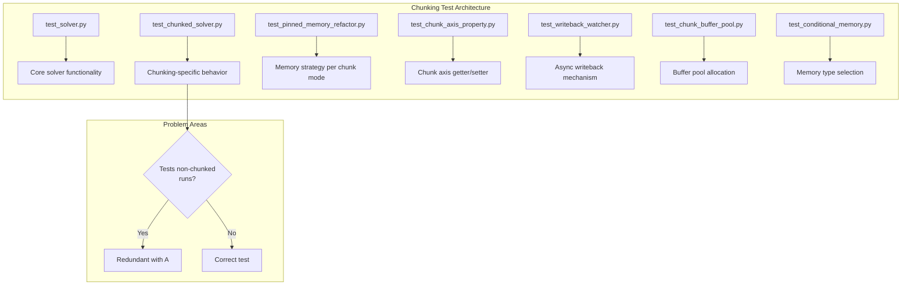

# Test Cleanup for Chunking System: Human Overview

## User Stories

### User Story 1: Clean Up Misnamed Tests
**As a** CuBIE maintainer  
**I want** tests to accurately reflect what they claim to test  
**So that** the test suite provides trustworthy documentation of system behavior

**Acceptance Criteria:**
- Tests claiming to test chunking behavior actually test chunking-specific functionality
- Tests that only verify "output is not zero" are either fixed to test chunking or removed
- Test names accurately describe the behavior being tested

### User Story 2: Remove Duplicate Tests
**As a** CuBIE maintainer  
**I want** redundant tests removed from the codebase  
**So that** the test suite is maintainable and runs efficiently

**Acceptance Criteria:**
- Tests that duplicate functionality already tested in `test_solver.py` are identified
- Duplicate tests are removed or consolidated
- No coverage gaps are introduced by removals

### User Story 3: Ensure Test Intent Matches Implementation
**As a** CuBIE developer  
**I want** tests to test their intended behavior without workarounds  
**So that** cudasim limitations don't mask real test failures

**Acceptance Criteria:**
- Tests that use cudasim workarounds are reviewed
- Tests that justify testing something else due to limitations are fixed or documented
- Each test has a clear, single purpose

---

## Executive Summary

This plan addresses technical debt in the CuBIE test suite following the chunking system refactor. The issue identifies that some tests:
1. Claim to test chunking but actually test non-chunked runs
2. Merely verify output arrays aren't zero (redundant with `test_solver.py`)
3. Work around cudasim limitations by testing different behavior than claimed

### Scope of Analysis

The following test files were reviewed for chunking-related tests:
- `tests/batchsolving/test_chunked_solver.py` - Main chunking integration tests
- `tests/batchsolving/test_pinned_memory_refactor.py` - Two-tier memory strategy tests
- `tests/batchsolving/test_chunk_axis_property.py` - Chunk axis property tests
- `tests/batchsolving/test_writeback_watcher.py` - Writeback watcher tests
- `tests/batchsolving/arrays/test_conditional_memory.py` - Conditional memory tests
- `tests/memory/test_chunk_buffer_pool.py` - Buffer pool tests

---

## Data Flow Diagram

---

## Key Technical Findings

### 1. `test_chunked_solver.py` Analysis

**`TestChunkedSolverExecution.test_chunked_solve_produces_valid_output`**
- Uses `low_mem_solver` fixture which creates a MockMemoryManager with only 32KB available
- Forces chunking to occur by using small memory limit
- **Assessment:** This test IS correctly testing chunked execution behavior

**`TestSyncStreamRemoval.test_chunked_solver_produces_correct_results`**
- Compares chunked vs non-chunked solver results
- **Assessment:** Valid chunking comparison test

**`TestSyncStreamRemoval.test_input_buffers_released_after_kernel`**
- Tests that `input_arrays._active_buffers` is empty after solve
- **Assessment:** Tests cleanup behavior, valid but could be more explicit about chunking context

### 2. `test_pinned_memory_refactor.py` Analysis

**`TestTwoTierMemoryStrategy.test_non_chunked_uses_pinned_host`**
- Tests that non-chunked runs use pinned memory
- Includes assertion `assert not np.any(np.isnan(result.time_domain_array))`
- **Assessment:** Valid - tests memory type selection for non-chunked mode, NOT redundant

**`TestTwoTierMemoryStrategy.test_chunked_uses_numpy_host`**
- Tests that chunked runs use regular numpy host arrays
- **Assessment:** Valid chunking-specific test

**`TestTwoTierMemoryStrategy.test_total_pinned_memory_bounded`**
- Verifies buffer pool usage in chunked mode
- **Assessment:** Valid chunking-specific test

**`TestChunkedVsNonChunkedResults.test_chunked_results_match_non_chunked`**
- **Potential duplicate** with `TestSyncStreamRemoval.test_chunked_solver_produces_correct_results`
- Both compare chunked vs non-chunked results
- **Assessment:** One of these should be removed

### 3. Potential Issues Identified

| Test File | Test Name | Issue | Recommendation |
|-----------|-----------|-------|----------------|
| `test_pinned_memory_refactor.py` | `test_chunked_results_match_non_chunked` | Duplicate of test in `test_chunked_solver.py` | **Remove** - consolidate to single location |
| `test_chunked_solver.py` | `test_chunked_solve_produces_valid_output` | Currently only tests "run" axis (time axis commented out) | **Fix** - investigate and enable time axis test or document why it's disabled |

### 4. Tests That Are NOT Redundant

The following tests were reviewed and found to provide unique coverage:

- **`test_chunk_axis_property.py`** - Tests getter/setter for chunk_axis property; no solver execution
- **`test_writeback_watcher.py`** - Tests async writeback mechanism at unit level
- **`test_chunk_buffer_pool.py`** - Tests buffer pool allocation at unit level
- **`test_conditional_memory.py`** - Tests memory type selection logic

---

## Trade-offs and Alternatives

### Alternative 1: Keep Duplicate Tests
**Pros:** More resilient to test breakage  
**Cons:** Slower test suite, confusion about authoritative test location  
**Decision:** Remove duplicates, consolidate to single location

### Alternative 2: Remove All "Output Not Zero" Assertions
**Pros:** Cleaner tests focused on specific behavior  
**Cons:** May miss regressions where computation produces valid-looking zeros  
**Decision:** Keep "not zero/NaN" assertions where they serve as quick sanity checks, but ensure each test has additional specific assertions

---

## Expected Impact

1. **Reduced test suite size** - Removing 1-2 duplicate tests
2. **Clearer test organization** - Each test tests one thing
3. **Better documentation** - Test names and docstrings accurately describe behavior
4. **Maintained coverage** - No functionality left untested

---

## References

- CuBIE internal structure: `.github/context/cubie_internal_structure.md`
- Test fixtures: `tests/conftest.py`
- Chunking architecture: `src/cubie/batchsolving/BatchSolverKernel.py`
