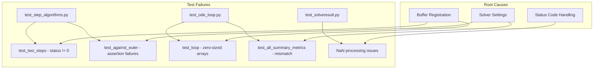

# Test Fixture Refactor Plan: Buffer Allocation & Test Compatibility

## User Stories

### US1: Test Fixtures Match New Buffer Registry Architecture
**As a** developer running the test suite  
**I want** test fixtures to correctly allocate buffers using the new buffer registry  
**So that** tests can verify integration behavior without zero-sized array errors

**Acceptance Criteria:**
- All implicit algorithm tests (backwards_euler, rosenbrock, etc.) pass without buffer allocation errors
- Test kernels receive correctly-sized shared memory arrays
- No "index out of bounds for axis 0 with size 0" errors

### US2: Implicit Algorithm Step Tests Validate Against CPU Reference
**As a** developer testing numerical accuracy  
**I want** implicit algorithm tests to produce valid numerical results  
**So that** I can verify GPU implementations match CPU reference implementations

**Acceptance Criteria:**
- `test_two_steps[backwards_euler]` returns status 0 on both CPU and GPU
- `test_two_steps[rosenbrock]` returns status 0 on both CPU and GPU
- `test_against_euler[backwards_euler]` passes numerical comparison
- `test_against_euler[rosenbrock]` passes numerical comparison

### US3: Summary Metrics Tests Produce Correct Results
**As a** developer testing output handling  
**I want** summary metric calculations to produce correct numerical values  
**So that** I can trust the loop's summary accumulation logic

**Acceptance Criteria:**
- `test_all_summary_metrics_numerical_check[no combos]` state summaries match reference
- No NaN values in successful integration runs

### US4: SolveResult NaN Processing Works Correctly
**As a** developer using batch solving features  
**I want** NaN processing to correctly identify and handle error trajectories  
**So that** I can distinguish successful from failed runs

**Acceptance Criteria:**
- `test_successful_runs_unchanged_with_nan_enabled` passes without spurious NaN values
- `test_multiple_errors_all_set_to_nan` correctly NaN's only error runs

---

## Executive Summary

This plan addresses test failures resulting from a buffer allocation refactor in CuBIE. The core implementation in `SingleIntegratorRun → IVPLoop → algorithms → solvers` is correct, but test fixtures have outdated call signatures and buffer allocation patterns causing zero-sized arrays.

### Root Cause Analysis

The buffer registry refactor centralized memory management but test fixtures weren't updated:

1. **Zero-sized arrays in implicit algorithms**: The `shared_memory_required` property returns 0 when buffers aren't properly registered or queried
2. **Buffer registration timing**: Some fixtures access buffer sizes before `SingleIntegratorRun` completes registration
3. **CPU reference configuration mismatch**: Test fixtures may pass inconsistent solver settings to CPU vs GPU paths

### Affected Test Categories



---

## Architecture Overview

### Buffer Flow in Test Context

```mermaid
sequenceDiagram
    participant Fixture as Test Fixture
    participant SIR as SingleIntegratorRun
    participant Loop as IVPLoop
    participant Registry as buffer_registry
    participant Kernel as Test Kernel
    
    Fixture->>SIR: Create with settings
    SIR->>Loop: Create with compile flags
    Loop->>Registry: register_buffers()
    Registry-->>Loop: Return slice indices
    Fixture->>SIR: Access shared_memory_bytes
    SIR->>Registry: Query total size
    Registry-->>SIR: Return size
    Fixture->>Kernel: Launch with shared_bytes
    Kernel->>Registry: Get allocators
    Registry-->>Kernel: Return slices
```

### Current vs Expected Behavior

| Component | Current Issue | Expected Behavior |
|-----------|---------------|-------------------|
| `step_object.shared_memory_required` | Returns 0 for implicit algorithms | Returns buffer size for Newton solver workspace |
| Test kernel shared memory | Allocates 0 bytes | Allocates sufficient bytes for algorithm buffers |
| CPU reference stepper | May use different tolerance/settings | Uses identical settings to GPU path |
| Status codes | Non-zero for implicit algorithms | Zero for successful convergence |

---

## Technical Decisions

### Decision 1: Fixture Access Pattern
**Choice**: Access buffer sizes through `single_integrator_run` properties, not direct algorithm queries

**Rationale**: `SingleIntegratorRun` aggregates buffer requirements from all components (loop, algorithm, controller) and provides the total via `shared_memory_bytes` and `local_memory_elements`.

### Decision 2: Test Kernel Shared Memory Allocation
**Choice**: Use `singleintegratorrun.shared_memory_bytes` for kernel launch configuration

**Rationale**: This property accounts for all registered buffers including algorithm-specific workspace (Newton solver scratch space, stage vectors, etc.).

### Decision 3: CPU Reference Parity
**Choice**: Extract all solver settings from `solver_settings` fixture consistently

**Rationale**: Ensures CPU and GPU paths use identical tolerance values, iteration limits, and algorithmic parameters.

---

## Impact Assessment

### Files Requiring Changes

```
tests/
├── _utils.py                    # run_device_loop buffer sizing
├── conftest.py                  # Fixture buffer access patterns
├── integrators/
│   ├── algorithms/
│   │   └── test_step_algorithms.py  # Step test kernel configuration
│   └── loops/
│       └── test_ode_loop.py     # Loop test verification
└── batchsolving/
    └── test_solveresult.py      # NaN processing test logic
```

### Minimal Change Strategy

1. **Do not modify source code** - the core implementation is correct
2. **Update test fixtures** to correctly access buffer sizes
3. **Ensure test kernels** receive proper shared memory allocation
4. **Align CPU reference** configuration with GPU settings

---

## Trade-offs Considered

### Alternative 1: Modify buffer_registry to auto-compute sizes
**Rejected**: Would require changes to working production code; increases complexity

### Alternative 2: Add explicit size parameters to test functions
**Rejected**: Violates DRY principle; fixtures already have access to sizes

### Selected Approach: Fix fixture buffer access patterns
**Accepted**: Minimal changes, maintains test isolation, aligns with current architecture
