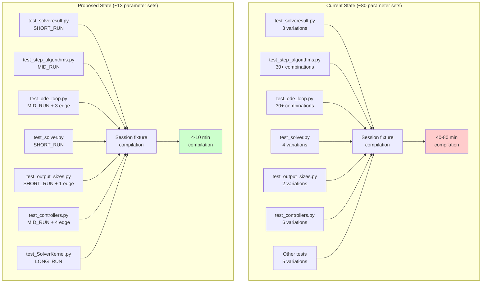
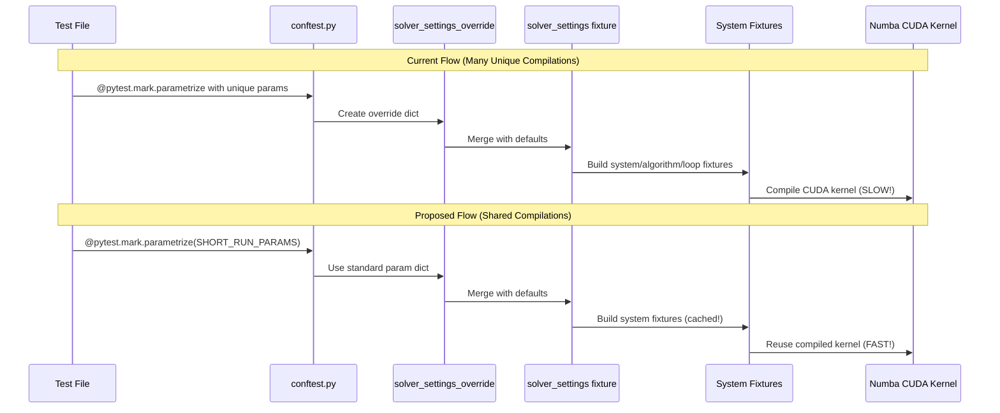

# Test Parameterization Restructure - Human Overview

## User Stories

### User Story 1: Reduce Test Compilation Time
**As a** developer running the test suite  
**I want** compilation time to be reduced from 40-80 minutes to under 10 minutes  
**So that** I can iterate faster during development and CI pipelines complete more quickly

**Acceptance Criteria:**
- Compilation time for full test suite is reduced by at least 60%
- Total unique parameter combinations reduced from ~80 to ~13
- Test suite completes in reasonable time on both local and CI environments

### User Story 2: Maintain Test Coverage
**As a** developer maintaining code quality  
**I want** all existing test coverage to be preserved during restructure  
**So that** numerical accuracy and edge case validation remain intact

**Acceptance Criteria:**
- All existing tests continue to pass with new parameter sets
- Edge cases (float32 accumulation, large t0, adaptive controllers, clamping) remain separately tested
- Numerical validation tests produce equivalent results within tolerance
- No test functionality is lost or weakened

### User Story 3: Clear Test Organization
**As a** developer reading and writing tests  
**I want** test parameter sets organized by purpose (SHORT/MID/LONG + edge cases)  
**So that** I can quickly understand test intent and choose appropriate parameters for new tests

**Acceptance Criteria:**
- Three standard parameter sets clearly defined in conftest.py with documentation
- Each parameter set has clear purpose and usage guidelines
- Edge case parameter sets remain identifiable and well-documented
- Test files use consistent naming and organization

## Executive Summary

The CuBIE test suite currently suffers from excessive compilation overhead due to ~80 unique parameter combinations triggering separate Numba CUDA kernel compilations for session-scoped fixtures. This restructure consolidates parameter sets into 3 standard configurations (SHORT_RUN, MID_RUN, LONG_RUN) plus ~10 edge cases, reducing compilation time by 60-75%.

The restructure maintains all test coverage while improving clarity by organizing tests according to their validation purpose: structural/API tests, numerical stability tests, and long-term accuracy tests.

## Architectural Overview



## Data Flow and Component Interaction



## Key Technical Decisions

### Decision 1: Three-Tier Standard Parameter System

**Rationale:** Test purposes naturally cluster into three categories based on integration duration and validation goals:

1. **SHORT_RUN**: Structural/API tests that verify object construction, data shapes, result formatting (0.05s duration)
2. **MID_RUN**: Numerical tests requiring error accumulation over multiple steps (0.2s duration, frequent saves)
3. **LONG_RUN**: Full accuracy validation over extended periods (0.3s+ duration)

**Trade-off:** Slight increase in test duration for SHORT tests (now all run 0.05s vs some at 0.0s), but massive compilation savings outweigh minimal runtime cost.

**Alternative Considered:** Two-tier system (SHORT/LONG) rejected because mid-duration tests with frequent saves serve distinct validation purpose.

### Decision 2: Preserve Edge Cases as Separate Parameter Sets

**Rationale:** Edge cases test specific failure modes and boundary conditions:
- Float32 accumulation errors
- Large t0 numerical stability
- Adaptive controller behavior
- dt and gain clamping limits

**Trade-off:** Retaining ~10 edge case parameter sets prevents consolidation to theoretical minimum of 3, but necessary for complete validation.

**Alternative Considered:** Attempting to merge edge cases into standard sets rejected because specific parameter values critical to triggering edge behaviors.

### Decision 3: Update Test Files Incrementally, Not Wholesale Rewrite

**Rationale:** Minimize risk by changing only parameterization, not test logic:
- Replace parameter dict literals with standard set references
- Keep all test assertion logic unchanged
- Maintain existing pytest markers and test organization

**Impact on Existing Architecture:**
- Zero changes to src/ codebase
- Zero changes to fixture instantiation logic
- Only changes: parameter override values in test files and new constants in conftest.py

## Implementation Phases

### Phase 1: Define Standard Parameters (conftest.py)
Add three constant dictionaries at module level in `tests/conftest.py`:

```python
SHORT_RUN_PARAMS = {...}
MID_RUN_PARAMS = {...}
LONG_RUN_PARAMS = {...}
```

### Phase 2: Update Test Files
Replace hardcoded parameter dicts with references to standard sets:

- test_solveresult.py: Use SHORT_RUN_PARAMS
- test_step_algorithms.py: STEP_OVERRIDES = MID_RUN_PARAMS
- test_ode_loop.py: DEFAULT_OVERRIDES = MID_RUN_PARAMS
- test_solver.py: Use SHORT_RUN_PARAMS
- test_output_sizes.py: Use SHORT_RUN_PARAMS + preserve edge case
- test_controllers.py: Use MID_RUN_PARAMS + preserve 4 edge cases
- test_SolverKernel.py: Verify using LONG_RUN_PARAMS

### Phase 3: Validation
- Run full test suite: `pytest`
- Run CUDA-free subset: `pytest -m "not nocudasim and not cupy"`
- Measure compilation time reduction
- Verify all tests pass with new parameters

## Expected Impact on Architecture

**No changes to:**
- Source code in src/cubie/
- Fixture building logic
- Test assertion logic
- CUDA kernel compilation mechanism

**Changes only to:**
- Test parameterization values (tests/*.py files)
- conftest.py constant definitions

**Benefits:**
- 60-75% reduction in compilation time
- Improved test readability (parameter sets have semantic names)
- Easier to add new tests (select appropriate standard set)
- Clearer separation of test purposes

## Research References

All findings documented in `test_parameterization_report.md`:
- Current parameter inventory (Appendix A)
- Test file summary (Appendix B)
- Default parameter values (Appendix C)
- Compilation overhead breakdown
- Consolidation strategy per test file
