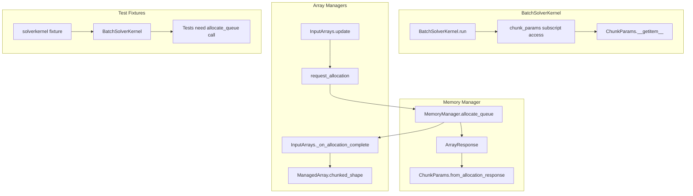
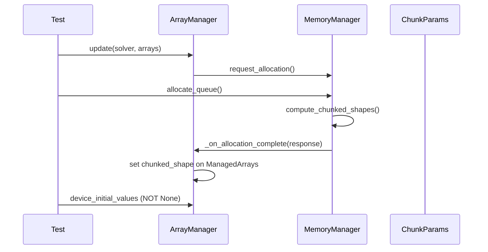

# Test Refactor Fixes - Human Overview

## User Stories

### US-1: Fix ChunkParams Subscript Access
**As a** developer running batch solver tests
**I want** the `ChunkParams` class to support subscript access (`chunk_params[0]`)
**So that** the solver kernel can retrieve per-chunk parameters correctly

**Acceptance Criteria:**
- `chunk_params[0]` returns first chunk parameters (not an error)
- `chunk_params[n]` returns nth chunk parameters
- All 50 tests with "ChunkParams object is not subscriptable" error pass

### US-2: Remove Obsolete chunk_run Tests
**As a** developer maintaining the codebase
**I want** tests referencing the removed `chunk_run` method to be deleted
**So that** the test suite reflects the current API

**Acceptance Criteria:**
- All 8 tests in `TestChunkRunFloorDivision` and `TestChunkLoopCoverage` are deleted
- No tests reference `BatchSolverKernel.chunk_run()`

### US-3: Fix Test Fixtures to Call allocate_queue
**As a** developer running array manager tests
**I want** test fixtures to call `allocate_queue()` after `update()`
**So that** device arrays are properly allocated before assertions

**Acceptance Criteria:**
- Tests checking device arrays call `allocate_queue()` before assertions
- 3 tests with "device_initial_values is None" error pass

### US-4: Fix needs_chunked_transfer Propagation
**As a** developer testing chunked transfers
**I want** chunked shape metadata to propagate correctly through allocation
**So that** `needs_chunked_transfer` returns True when appropriate

**Acceptance Criteria:**
- Tests asserting `needs_chunked_transfer` behavior pass
- 6 buffer pool integration tests pass

### US-5: Fix Low Memory Test Configuration
**As a** developer testing memory-constrained scenarios
**I want** the MockMemoryManager's memory limit to be large enough for minimum allocations
**So that** chunked execution tests complete successfully

**Acceptance Criteria:**
- "Can't fit a single run in GPU VRAM" errors are resolved
- 10 memory constraint tests pass

---

## Executive Summary

This plan addresses 76 test failures (55 failures + 21 errors) arising from a large refactor of chunking and array operations in CuBIE. The failures fall into distinct categories:

1. **ChunkParams API Issue (50 tests)**: The `ChunkParams` class uses `__getattr__` when the code expects `__getitem__` for subscript access
2. **Removed chunk_run Method (8 tests)**: Tests reference a `chunk_run()` method that no longer exists
3. **Missing allocate_queue Calls (3+ tests)**: Test fixtures call `update()` without `allocate_queue()`
4. **needs_chunked_transfer Logic (6 tests)**: Chunked shape metadata not propagating correctly
5. **Memory Limit Too Low (10 tests)**: MockMemoryManager's 4KB limit is too small for minimum allocations

---

## Architecture Diagram

## Data Flow: Chunked Allocation

---

## Technical Decisions

### Decision 1: Fix ChunkParams with __getitem__
Change `__getattr__` to `__getitem__` in `ChunkParams` class. The current implementation mistakenly uses `__getattr__` which is called for attribute access, not subscript access.

### Decision 2: Delete Obsolete Tests
The `chunk_run()` method was removed during the refactor. Tests that test this method should be deleted rather than updated, as the functionality now lives in `ChunkParams.from_allocation_response()`.

### Decision 3: Increase MockMemoryManager Limit
The 4KB limit in `MockMemoryManager.get_memory_info()` is too restrictive. Increase to ~64KB to allow minimum single-run allocations while still forcing chunking for multi-run scenarios.

### Decision 4: Add allocate_queue to Fixtures
Test fixtures that call `update()` and then check device arrays need to call `allocate_queue()` between those operations.

---

## Impact Assessment

| Category | # Tests | Source File Changes | Test File Changes |
|----------|---------|---------------------|-------------------|
| ChunkParams subscript | 50 | 1 line fix in BatchSolverKernel.py | 0 |
| Remove chunk_run tests | 8 | 0 | Replace test file content |
| Memory limit increase | 10 | 0 | 2 files, increase limits |
| Buffer pool/allocation | 9 | 0 | Add allocate_queue calls |
| Memory type mismatch | 1 | 0 | Fix test assertions |
| Shape mismatch | 1 | 1 line fix in mem_manager.py | 0 |
| NoneType errors | 2 | 0 | Add allocate_queue calls |

---

## Trade-offs Considered

1. **Fixing ChunkParams vs Changing Call Sites**: Fixing `__getitem__` is the correct solution since subscript notation is the intended API. Changing all call sites to attribute access would be more invasive.

2. **Deleting vs Updating chunk_run Tests**: The `chunk_run()` method was intentionally removed as part of the refactor. The tests should be deleted, not updated to a different API.

3. **Mock Memory Limit**: Increasing from 4KB to 64KB allows minimum allocations while still testing chunking behavior with modest batch sizes.
