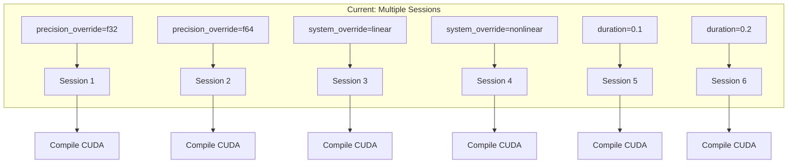
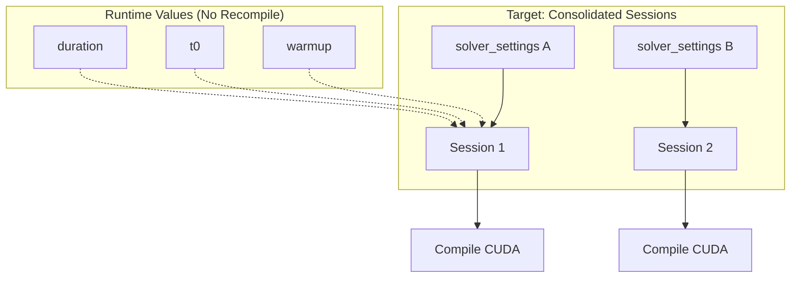
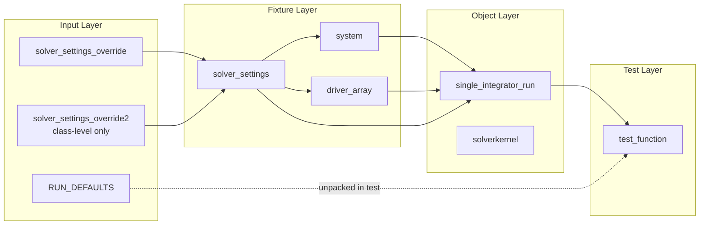
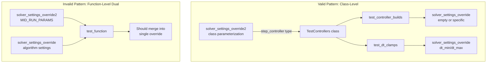

# Test Parameterization Refactoring: Human Overview

## User Stories

### US-1: Consolidate Runtime Parameters
**As a** test developer,  
**I want** runtime parameters (duration, t0, warmup) to be separated from compile-time parameters,  
**So that** different test run durations don't cause unnecessary recompilation sessions.

**Acceptance Criteria:**
- A `RUN_DEFAULTS` constant dict exists in `tests/_utils.py`
- Tests unpack runtime values inside test functions, not via fixtures
- Changing duration/t0/warmup values does not create new compilation sessions

### US-2: Remove precision_override and system_override Fixtures
**As a** test maintainer,  
**I want** precision and system to be drawn from `solver_settings` dict,  
**So that** we reduce fixture complexity and avoid unnecessary session duplication.

**Acceptance Criteria:**
- `precision_override` fixture is removed
- `system_override` fixture is removed  
- Precision is drawn from `solver_settings['precision']`
- System selection is configurable via `solver_settings`
- Tests that previously used these overrides are updated

### US-3: Rationalize System Parameterization
**As a** test developer,  
**I want** tests to use the default nonlinear system unless explicitly testing system-specific behavior,  
**So that** we reduce unnecessary system variations that cause recompilation.

**Acceptance Criteria:**
- Most tests use the default nonlinear system
- System-specific tests are clearly marked and justified
- Unnecessary `system_override` parameterization is removed

### US-4: Consolidate Precision Testing Strategy
**As a** test maintainer,  
**I want** precision testing to be strategic rather than exhaustive,  
**So that** we reduce compilation sessions while maintaining coverage.

**Acceptance Criteria:**
- Base tests for float32 compatibility at low end
- Representative tests for float64 at high end
- Avoid redundant multi-precision testing

### US-5: Eliminate Duplicate Step Count Testing
**As a** test developer,  
**I want** to always test with two back-to-back steps (covering cache reuse),  
**So that** we eliminate redundant single-step tests while maintaining coverage.

**Acceptance Criteria:**
- All step tests execute two consecutive steps
- Single-step tests are removed
- Cache reuse behavior is tested in all relevant tests

### US-6: Rationalize solver_settings_override2 Usage
**As a** test maintainer,  
**I want** `solver_settings_override2` to be used purposefully for class-level parameterization,  
**So that** we maintain its value for separate class/method parameterization while eliminating redundant function-level dual parameterization.

**Acceptance Criteria:**
- `solver_settings_override2` is RETAINED for class-level parameterization (e.g., `TestControllers`, `TestControllerEquivalence`)
- Function-level uses of `solver_settings_override2` are merged into single `solver_settings_override`
- Clear documentation of the intended pattern: class uses override2, methods use override
- Tests that used dual overrides at function level are refactored to use single merged override

---

## Executive Summary

This refactoring addresses excessive CUDA compilation sessions in the test suite by restructuring how test fixtures and parameters are organized. The core insight is that pytest creates a new session for each unique combination of session-scoped fixtures, triggering a full CUDA compilation cycle.

### Current Architecture Issues

### Target Architecture

### Key Technical Decisions

1. **Runtime vs Compile-Time Separation**: `duration`, `t0`, `warmup` are runtime values passed to the loop function, not compile-time settings. Moving these out of fixtures eliminates false session boundaries.

2. **Fixture Consolidation**: Replace `precision_override` + `system_override` with `solver_settings` keys. Keep `solver_settings_override2` for class-level parameterization but merge function-level dual parameterization.

3. **solver_settings_override2 Strategy**: 
   - **KEEP for class-level parameterization** where it allows the class to be parameterized once (e.g., by controller type) and methods to have individual overrides (e.g., specific dt_min/dt_max values)
   - **MERGE at function level** where dual parameterization doesn't serve a structural purpose
   - Pattern: Classes use `override2`, methods use `override`

4. **Default System Strategy**: The nonlinear 3-state system provides sufficient complexity for most tests. Only tests specifically verifying system-specific behavior (stiffness, large systems, drivers) should use alternative systems.

5. **Dual-Step Testing**: The loop already tests integration behavior. Step-level tests can use dual-step execution to verify both initial and cached behavior in one test.

### Data Flow: Test Setup

### solver_settings_override2 Usage Pattern

### Impact Analysis

| Area | Before | After | Reduction |
|------|--------|-------|-----------|
| Override fixtures | 4 | 2 | 50% |
| Session sources | 6+ | 2-3 | ~60% |
| Step tests per algo | 2 (single + dual) | 1 (dual only) | 50% |
| System variations | Many unnecessary | Targeted | ~60% |
| Function-level dual overrides | Many | 0 | 100% |

### Trade-offs Considered

1. **Fixture Simplicity vs Flexibility**: Consolidating fixtures reduces session count but may require more verbose test parameterization. Accepted trade-off for faster tests.

2. **solver_settings_override2 Retention**: Keeping override2 for class-level parameterization preserves a useful pattern while eliminating the confusing function-level dual-override pattern.

3. **Test Coverage Strategy**: Removing single-step tests means relying on dual-step tests for both scenarios. The first step of a dual-step execution tests the same code path, so no coverage is lost.

4. **Precision Testing Depth**: Strategic precision testing over exhaustive testing may miss edge cases at specific precisions. Mitigated by careful selection of which tests use which precision.

### Files Affected by solver_settings_override2 Changes

| File | Current Usage | Action |
|------|--------------|--------|
| `test_controllers.py` | Class-level for controller types | **KEEP** - valid pattern |
| `test_controller_equivalence_sequences.py` | Class-level for controller types | **KEEP** - valid pattern |
| `test_step_algorithms.py` | Function-level for MID_RUN_PARAMS | **MERGE** into single override |
| `test_instrumented.py` | Function-level for MID_RUN_PARAMS | **MERGE** into single override |
| `test_ode_loop.py` | Function-level for DEFAULT_OVERRIDES | **MERGE** into single override |

### References

- `tests/conftest.py`: Current fixture implementation showing layered override pattern
- `tests/_utils.py`: SHORT_RUN_PARAMS, MID_RUN_PARAMS, LONG_RUN_PARAMS definitions
- pytest session scoping documentation: Session-scoped fixtures create new sessions on parameter changes
