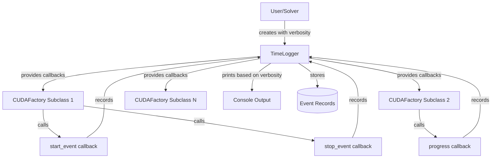
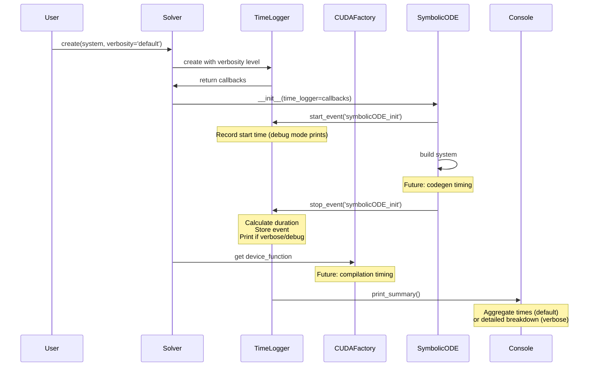
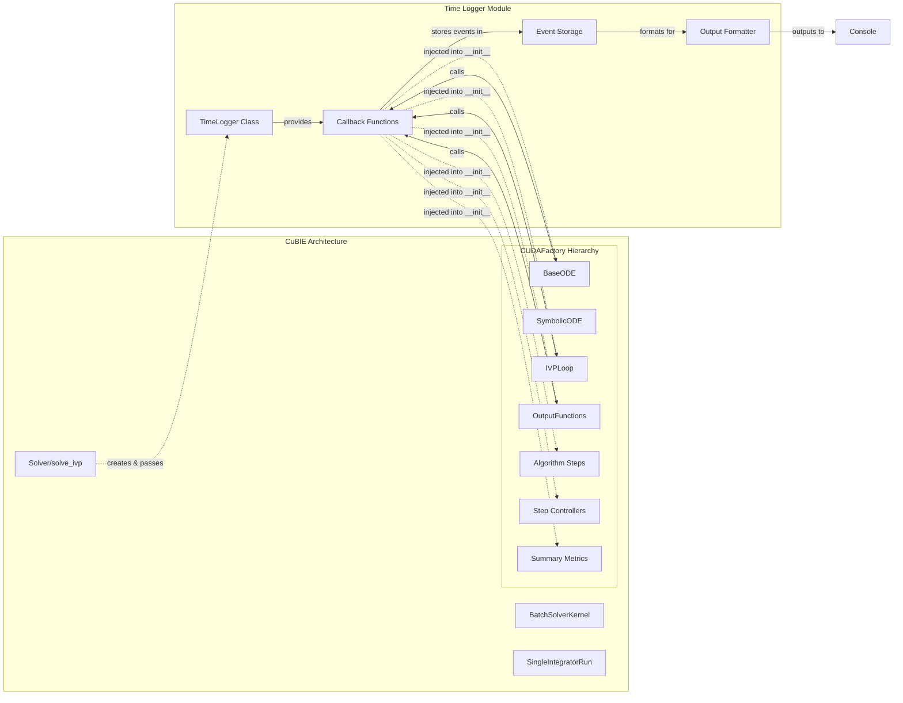

# Time Logging Infrastructure - Human Overview

## User Stories

### Story 1: Visibility During Model Import
**As a** CuBIE user importing a CellML model  
**I want** to see what stage the compilation is at and how long each stage takes  
**So that** I know the import is progressing and can estimate when it will complete

**Acceptance Criteria:**
- User can see when codegen starts and finishes
- User can see when compilation starts and finishes
- User can see individual component durations during verbose mode
- No silent "click, wait, hope" periods exceeding 1 second without feedback

### Story 2: Performance Analysis
**As a** CuBIE developer or power user  
**I want** to measure time spent in different compilation phases  
**So that** I can identify bottlenecks and optimize the system

**Acceptance Criteria:**
- Aggregate timing data available for codegen, compilation, and runtime
- Component-level timing available in verbose mode
- Debug mode captures start/stop/progress for all tracked events
- Timing data uses wall-clock time for user-facing durations

### Story 3: Configurable Verbosity
**As a** CuBIE user  
**I want** to control how much timing information is displayed  
**So that** I can get the level of detail appropriate for my current task

**Acceptance Criteria:**
- Default mode shows aggregate times only (codegen, compile, runtime)
- Verbose mode shows component-level breakdown
- Debug mode shows all events including starts, progress updates, and stops
- Verbosity level is user-configurable at solver creation time

## Executive Summary

This feature adds comprehensive time logging infrastructure to CuBIE to address the "click, wait, hope for the best" problem when importing CellML models. The solution introduces a callback-based timing system that threads through the CUDAFactory hierarchy and symbolic ODE code generation pipeline.

**Phase 1 Scope (This Implementation):**
- Create `time_logger` module with callback system
- Thread time logger callbacks through all CUDAFactory subclass `__init__` methods
- Establish infrastructure for future codegen and compilation tracking

**Future Phases (Separate PRs):**
- Phase 2: Implement JIT compilation time tracking with dummy runs
- Phase 3: Add timing callbacks to symbolic codegen pipeline

## Architecture Diagram

## Data Flow Diagram

## Component Interaction Flow

## Key Technical Decisions

### 1. Callback-Based Architecture
**Decision:** Use callback functions rather than decorator-based timing  
**Rationale:** 
- CUDAFactory subclasses need explicit control over when timing starts/stops
- Some operations span multiple methods (e.g., codegen → file I/O → import)
- Callbacks allow timing complex workflows without instrumentation overhead
- Enables conditional timing based on verbosity without performance cost

### 2. Thread Through `__init__` Parameters
**Decision:** Add `time_logger` parameter to all CUDAFactory `__init__` methods  
**Rationale:**
- Consistent pattern across entire factory hierarchy
- Allows each factory to decide what events to track
- No global state or singleton required
- Optional parameter (defaults to no-op callbacks) for backward compatibility

### 3. Three-Tier Verbosity System
**Decision:** Default, Verbose, and Debug levels  
**Rationale:**
- Default: Minimal output for production use (aggregate times only)
- Verbose: Useful for optimization work (component breakdown)
- Debug: Complete visibility for development and troubleshooting
- Maps to standard logging patterns users expect

### 4. Wall-Clock Time Measurement
**Decision:** Use `time.perf_counter()` for all measurements  
**Rationale:**
- User-facing feature focused on perceived duration
- Includes I/O and system overhead which users experience
- More relevant than CPU time for compilation/import workflows
- Monotonic and high-resolution across platforms

### 5. Phase 1 Infrastructure Only
**Decision:** Create plumbing without full implementation in first phase  
**Rationale:**
- Threading callbacks through 10+ CUDAFactory subclasses is significant refactor
- Establishes patterns before tackling complex codegen/compilation tracking
- Allows testing callback infrastructure independently
- Reduces PR size and review complexity

## Expected Impact on Existing Architecture

### Minimal Breaking Changes
- All `__init__` methods gain optional `time_logger` parameter
- Default value is `None`, triggering no-op behavior
- Existing code continues to work without modification
- Only affects instantiation sites (primarily in Solver and test fixtures)

### New Dependencies
- Standard library only: `time`, `dataclasses` (or `attrs`)
- No external package dependencies
- No GPU/CUDA dependencies in timing module

### Integration Points
**Immediate (Phase 1):**
- `Solver.__init__` creates TimeLogger and passes to system
- `BaseODE.__init__` accepts and stores callbacks
- All CUDAFactory subclass `__init__` methods accept optional parameter
- Test fixtures updated to pass `time_logger=None` explicitly

**Future (Phases 2-3):**
- `SymbolicODE` codegen methods call timing callbacks
- `CUDAFactory` compilation tracking via dummy runs
- Progress callbacks in JVP build loops

## Trade-offs and Alternatives Considered

### Alternative: Decorator-Based Timing
**Rejected because:**
- Cannot time operations spanning multiple methods
- Adds overhead even when timing is disabled
- Difficult to thread through factory hierarchy
- Less flexible for complex workflows

### Alternative: Context Manager API
**Rejected because:**
- More verbose at call sites
- Requires `with` blocks that may not align with logical boundaries
- Still requires threading through `__init__` for access
- No significant advantage over callbacks for this use case

### Alternative: Global Singleton Logger
**Rejected because:**
- Creates hidden dependencies
- Complicates testing (shared state between tests)
- Makes verbosity level less explicit
- Harder to trace data flow

### Trade-off: Performance Overhead
**Accepted overhead:**
- Function call overhead for callbacks (nanoseconds)
- `time.perf_counter()` call overhead (microseconds)
- Event storage in memory (minimal for ~100 events)

**Mitigation:**
- No-op callbacks when logger is `None`
- No string formatting until print time
- Verbosity checks before expensive operations

## References to Research

### CUDAFactory Pattern Analysis
Reviewed all CUDAFactory subclasses in repository:
- `src/cubie/odesystems/baseODE.py` - BaseODE
- `src/cubie/integrators/loops/ode_loop.py` - IVPLoop  
- `src/cubie/outputhandling/output_functions.py` - OutputFunctions
- `src/cubie/outputhandling/summarymetrics/metrics.py` - Summary metrics
- `src/cubie/integrators/algorithms/base_algorithm_step.py` - Algorithm steps
- `src/cubie/integrators/step_control/base_step_controller.py` - Controllers
- `src/cubie/batchsolving/BatchSolverKernel.py` - Batch kernel
- `src/cubie/integrators/SingleIntegratorRunCore.py` - Integrator core
- `src/cubie/integrators/array_interpolator.py` - Array interpolator

Common pattern: `__init__` methods already accept multiple configuration objects and closures. Adding `time_logger` follows established convention.

### Numba Compilation Timing Research
From CuBIE architecture notes:
- Numba JIT compilation happens on first call with specific types
- `CUDAFactory.build()` returns device functions that aren't compiled yet
- Need "dummy run" with proper signatures to trigger compilation
- Dispatcher objects contain signature information needed for typed calls

This informs Phase 2 implementation (not part of current scope).

### SymPy Codegen Pipeline Research
Reviewed symbolic ODE code generation:
- `src/cubie/odesystems/symbolic/symbolicODE.py` - Entry point
- `src/cubie/odesystems/symbolic/codegen/` - Multiple code generators
- `src/cubie/odesystems/symbolic/parsing/` - CellML and equation parsing
- `src/cubie/odesystems/symbolic/solver_helpers.py` - Helper generation

Multiple codegen stages with expensive SymPy operations. Future timing points identified for Phase 3.
